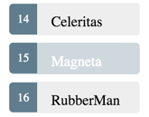

# Exercício 04

## Objetivos

* Implementar a listagem de heróis no padrão mestre/detalhe.

## Duração

45 minutos

## Preparando o ambiente

>Esse exercício evolui o Exercício 3. Se não conseguiu terminá-lo, use a versão que está na pasta `./workspace/exercicio-03-tour-of-heroes/`

>Se estiver usando o GIT, para descartar alguma alteração local faça:
>```
>git reset && git checkout -- .
>```

Deixe a aplicação rodando:

```bash
cd app-exemplo
npm run start
```

O comando `npm run start` iniciará um servidor local para desenvolvimento em "_watch mode_", ou seja, qualquer edição nos arquivos, irá recompilar e recarregar a aplicação no browser. Acesse sua app no endereço local: [http://localhost:4200/](http://localhost:4200/).

## Exibindo a lista de heróis

Para exibir a lista de heróis, a primeira coisa a fazer é criar um array de heróis.

### Criando a lista de heróis

Crie o seguinte array no `app.component.ts`:

```javascript
const HEROES: Hero[] = [
  { id: 11, name: 'Spider-Man' },
  { id: 12, name: 'Captain America' },
  { id: 13, name: 'Hulk' },
  { id: 14, name: 'Thor' },
  { id: 15, name: 'Iron Man' },
  { id: 16, name: 'Luke Cage' },
  { id: 17, name: 'Doctor Strange' },
  { id: 18, name: 'Daredevil' },
  { id: 19, name: 'Ant-Man' },
  { id: 20, name: 'Wolverine' }
];
```

O array `HEROES` é do tipo `Hero`, a classe definida no exercício anterior.

Eventualmente, a aplicação irá recuperar a lista de heróis a partir de um Web Service; por enquanto, esse array de heróis *mock* é o suficiente.

### Expondo o array de heróis

Crie uma propriedade pública no `AppComponent` para expor o array de heróis. Dessa forma, podemos utilizá-lo para fazer data binding no template do componente.

```javascript
export class AppComponent {
  ...
  heroes = HEROES;
  ...
}
```

O tipo da propriedade `heroes` não precisa ser definido porque o TypeScript é capaz de inferir o tipo a partir do array `HEROES`.

Definimos o array `HEROES` fora do componente porque, no final das contas, os heróis serão recuperados a partir de um serviço.

### Exibindo o nome dos heróis

Para exibir o nome dos heróis em uma lista, adicione o seguinte trecho HTML abaixo do título e acima dos detalhes do herói:

```html
<h2>Meus heróis</h2>
<ul class="heroes">
  <li>
    <!-- cada herói virá aqui -->
  </li>
</ul>
```

Agora vamos preencher o template com o nome dos heróis.

### Listando os heróis com a diretiva `ngFor`

O nosso objetivo é fazer um bind entre o array de heróis (a propriedade `heroes`) no template do componente e exibir o nome de cada herói individualmente, iterando sobre o array.

Para isso, modifique a tag `<li>`, adicionando a diretiva `*ngFor`.

```html
<li *ngFor="let hero of heroes">
```

O asterisco (*) é uma parte crítica dessa sintaxe. Ele indica que o elemento `<li>` e seus filhos são um template.

A diretiva `ngFor` itera sobre o array e renderiza uma instância do template para cada herói.

O trecho `let hero` identifica a variável que guarda o valor do item corrente em cada iteração. Você pode referenciar essa variável no template.

Dentro da tag `<li>`, adicione uma tag `<span>` com o conteúdo abaixo:

```html
<li *ngFor="let hero of heroes">
  <span class="badge">{{hero.id}}</span> {{hero.name}}
</li>
```

Nesse `<span>`, estamos utilizando a variável `hero` definida na diretiva `ngFor` para exibir as propriedades do herói.

Quando o navegador recarregar, você deve ver a lista de heróis.

### Criando regras de estilos CSS

Pensando na usabilidade, vamos adicionar regras de estilo CSS para:

* Destacar o herói na navegação do ponteiro do mouse;
* Destacar o herói selecionado

Para adicionar regras de estilos CSS ao componente, defina a propriedade *styles* do decorador *@Component* como abaixo:
      
```javascript
styles: [`
  .selected {
    background-color: #CFD8DC !important;
    color: white;
  }
  .heroes {
    margin: 0 0 2em 0;
    list-style-type: none;
    padding: 0;
    width: 15em;
  }
  .heroes li {
    cursor: pointer;
    position: relative;
    left: 0;
    background-color: #EEE;
    margin: .5em;
    padding: .3em 0;
    height: 1.6em;
    border-radius: 4px;
  }
  .heroes li.selected:hover {
    background-color: #BBD8DC !important;
    color: white;
  }
  .heroes li:hover {
    color: #607D8B;
    background-color: #DDD;
    left: .1em;
  }
  .heroes .text {
    position: relative;
    top: -3px;
  }
  .heroes .badge {
    display: inline-block;
    font-size: small;
    color: white;
    padding: 0.8em 0.7em 0 0.7em;
    background-color: #607D8B;
    line-height: 1em;
    position: relative;
    left: -1px;
    top: -4px;
    height: 1.8em;
    margin-right: .8em;
    border-radius: 4px 0 0 4px;
  }
`]
```

Lembre-se de utilizar o *backtick* ( ` ) para definir strings com mais de uma linha.

Depois que adicionamos os estilos, você pode notar que o arquivo está ficando muito grande. Não se preocupe, vamos mover as regras de estilo CSS para um arquivo separado em um exercício posterior.

Por enquanto, é importante destacar que, quando você define regras de estilo CSS para um componente, essas regras têm o escopo do componente específico; isto é, elas não afetam o HTML externo ou de outros componentes.

Nesse momento, o template deve estar como abaixo:

```html
<h2>Meus heróis</h2>
<ul class="heroes">
  <li *ngFor="let hero of heroes">
    <span class="badge">{{hero.id}}</span> {{hero.name}}
  </li>
</ul>
```

## Selecionando um herói

Nesse momento, estamos exibindo uma lista de heróis e também os detalhes de um herói específico ao final da página. No entanto, não há ligação entre a lista e o herói exibido.

Nós queremos que ao se escolher um herói da lista, seja exibido o detalhe do herói selecionado.

Esse padrão visual é conhecido como "mestre/detalhe": a parte "mestre" é a lista de heróis, e a parte "detalhe" é o herói selecionado.

Vamos então conectar o mestre com o detalhe a partir de um evento de *click*.

### Capturando o evento de click

Para capturar o evento de click, adicione a expressão `(click)` no elemento `<li>` como abaixo:

```html
<li *ngFor="let hero of heroes" (click)="onSelect(hero)">
  ...
</li>
``` 

Os parênteses identificam que queremos capturar o evento *click* do elemento `<li>`. Poderíamos capturar outros eventos JavaScritp da mesma forma (keyup, keydown, keypress, focus, blur etc).

A expressão `onSelect(hero)` identifica que deve ser disparado o método `onSelect` do componente `AppComponent`, passando a variável `hero` do template (a mesma utilizada na diretiva `ngFor`) como parâmetro.

### Adicionando um click handler para expor o herói selecionado

Não precisamos mais da propriedade `hero` no `AppComponent`, porque agora não vamos mais exibir um único herói fixo. Vamos permitir que o usuário selecione um herói da lista. Por isso, troque a propriedade `hero` pela propriedade `selectedHero`:

```javascript
selectedHero: Hero;
```

Não vamos inicializar a propriedade `selectedHero` porque só vamos exibir os dados depois que o usuário selecionar um herói da lista.

Adicione o método `onSelect` para setar a propriedade `selectedHero`:

```javascript
onSelect(hero: Hero): void {
  this.selectedHero = hero;
}
```

Agora, atualize o template para não mais referenciar a propriedade `hero`. Faça o bind para a nova propriedade `selectedHero`:

```html
<h2>{{selectedHero.name}} details!</h2>
<div>id: {{selectedHero.id}}</div>
<div>
  <label for="hero-name">Nome:</label>
  <input id="hero-name" [(ngModel)]="selectedHero.name" placeholder="Nome do herói">
</div>
``` 

### Escondendo o herói vazio com a diretiva `ngIf`

Nesse momento, após o navegador recarregar a aplicação, você vai ver que a aplicação quebrou.

Como a propriedade `selectedHero` só será inicializada quando o usuário selecionar um herói, você deverá ver a seguinte mensagem no console do navegador:

```html
ERROR TypeError: _co.selectedHero is undefined
```

Portanto, só vamos exibir o HTML do herói selecionado se houver de fato um herói selecionado.

Para isso, mova o conteúdo do HTML do herói selecionado para dentro de um novo elemento `<div>` e adicione a diretiva `ngIf` ao `<div>` como abaixo:

```html
<div *ngIf="selectedHero">
  <h2>{{selectedHero.name}} details!</h2>
  <div>id: {{selectedHero.id}}</div>
  <div>
    <label for="hero-name">Nome:</label>
    <input id="hero-name" [(ngModel)]="selectedHero.name" placeholder="Nome do herói">
  </div>
</div>
```

Sem um herói selecionado, a diretiva `ngIf` remove o `<div>` (e seus filhos) da árvore DOM.

Quando o usuário seleciona um herói, a diretiva `ngIf` insere o `<div>` na árvore DOM, e o seu conteúdo é avaliado.

### Destacando o herói selecionado

Nesse momento, os detalhes do herói selecionado aparecem abaixo da lista, como esperado. No entanto, está difícil identificar na lista em si qual é o herói selecionado.

Nas regras de estilo CSS que definimos anteriormente, há uma classe CSS para destacar o herói selecionado: é a classe `.selected`.

Para destacar o herói selecionado na lista, vamos aplicar essa classe ao elemento `<li>` do herói selecionado. Dessa forma, quando o usuário clicar no herói "Magneta", por exemplo, veremos algo como:



Para isso, adicione a expressão `[class.selected]` ao elemento `<li>` como abaixo:

```html
[class.selected]="hero === selectedHero"
```

Essa sintaxe é interpretada como:

* Quando a expressão `hero === selectedHero` é avaliada como `true`, a classe CSS `selected` é adicionada
* Quando a expressão `hero === selectedHero` é avaliada como `false`, a classe CSS `selected` é removida

A versão final do elemento `<li>` é como abaixo:

```html
<li *ngFor="let hero of heroes"
  [class.selected]="hero === selectedHero"
  (click)="onSelect(hero)">
  <span class="badge">{{hero.id}}</span> {{hero.name}}
</li>
```

E essa é a versão completa do `app.component.ts` nesse momento:

```javascript
import { Component } from '@angular/core';

export class Hero {
  id: number;
  name: string;
}

const HEROES: Hero[] = [
  { id: 11, name: 'Spider-Man' },
  { id: 12, name: 'Captain America' },
  { id: 13, name: 'Hulk' },
  { id: 14, name: 'Thor' },
  { id: 15, name: 'Iron Man' },
  { id: 16, name: 'Luke Cage' },
  { id: 17, name: 'Doctor Strange' },
  { id: 18, name: 'Daredevil' },
  { id: 19, name: 'Ant-Man' },
  { id: 20, name: 'Wolverine' }
];

@Component({
  selector: 'app-root',
  templateUrl: './app.component.html',
  styleUrls: ['./app.component.css'],
  styles: [`
  .selected {
    background-color: #CFD8DC !important;
    color: white;
  }
  .heroes {
    margin: 0 0 2em 0;
    list-style-type: none;
    padding: 0;
    width: 15em;
  }
  .heroes li {
    cursor: pointer;
    position: relative;
    left: 0;
    background-color: #EEE;
    margin: .5em;
    padding: .3em 0;
    height: 1.6em;
    border-radius: 4px;
  }
  .heroes li.selected:hover {
    background-color: #BBD8DC !important;
    color: white;
  }
  .heroes li:hover {
    color: #607D8B;
    background-color: #DDD;
    left: .1em;
  }
  .heroes .text {
    position: relative;
    top: -3px;
  }
  .heroes .badge {
    display: inline-block;
    font-size: small;
    color: white;
    padding: 0.8em 0.7em 0 0.7em;
    background-color: #607D8B;
    line-height: 1em;
    position: relative;
    left: -1px;
    top: -4px;
    height: 1.8em;
    margin-right: .8em;
    border-radius: 4px 0 0 4px;
  }
`]
})
export class AppComponent {
  title = 'Tour of Heroes';
  selectedHero: Hero;
  heroes = HEROES;

  onSelect(hero: Hero): void {
    this.selectedHero = hero;
  }
}
```

## Revisando a estrutura da aplicação

Nesse momento, a sua aplicação deve ter a seguinte estrutura:

```
app-exemplo
├── node_modules
│   ├── ...
├── package.json
├── src
│   ├── app
│   │   ├── app.component.css
│   │   ├── app.component.html
│   │   ├── app.component.spec.ts
│   │   ├── app.component.ts
│   │   └── app.module.ts
│   ├── main.ts
│   ├── styles.css
│   ├── ...
```

## Resumo

* Utilizamos a diretiva `ngFor` para exibir uma lista de heróis.
* Fizemos o binding do evento *click* para a seleção de um herói da lista.
* Utilizamos a diretiva `ngIf` para controlar a exibição de elementos HTML na árvore DOM.

## Próximo passo

[Exercício 05](exercicio-05.md)
