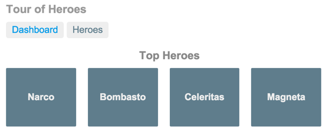

# Exercício 07

## Objetivos

* Usar o componente de roteamento e aprender a navegar entre as visões

## Duração

60 minutos

## Preparando o ambiente

>Esse exercício evolui o Exercício 6. Se não conseguiu terminá-lo, use a versão que está na pasta `./workspace/exercicio-06-services/`

>Se estiver usando o GIT, para descartar alguma alteração local faça:
>```
>git reset && git checkout -- .
>```

Deixe a aplicação rodando:

```bash
cd app-exemplo
npm run start
```

O comando `npm run start` iniciará um servidor local para desenvolvimento em "_watch mode_", ou seja, qualquer edição nos arquivos, irá recompilar e recarregar a aplicação no browser. Acesse sua app no endereço local: [http://localhost:4200/](http://localhost:4200/).

## Plano de ação

O _Tour of Heroes_ está fazendo um enorme sucesso! E, com o sucesso, vêm as mudanças. Os **novos requisitos** para a nossa aplicação são:

* Adicionar uma página de **Dashboard**, que deve mostrar os principais heróis do Tour of Heroes.
* Deve ser possível navegar entre a visão da lista de heróis e o **Dashboard**.
* Ao se clicar no nome do herói, devem ser exibidos os detalhes do herói em uma nova visão.
* Deve ser possível exibir a visão dos detalhes do herói a partir de um **deep link**.

> Um **deep link** é um link contextual que te leva diretamente a um conteúdo e que pode ser compartilhado via email, pode ser adicionado aos favoritos etc. Por exemplo: a URL "http://localhost:4200/heroes/10" é um deep link que exibe os detalhes do herói com id "10".

Quando finalizarmos, os usuários poderão navegar pela aplicação como no diagrama abaixo:


Para implementar esses requisitos, vamos adicionar o **Router** do Angular à aplicação.

O plano de ação, então, é:

* Transformar o `AppComponent` numa "casca" para lidar somente com a navegação da aplicação.
* Mover a lógica a respeito da listagem de heróis do `AppComponent` para um novo componente.
* Adicionar navegação.
* Criar um novo componente para o Dashboard.
* Incluir o Dashboard na estrutura de navegação da aplicação.

## Dividindo o `AppComponent`

A versão atual da aplicação está carregando e exibindo imediamente a lista de heróis.

Na nova versão, o `AppComponent` deve ser somente uma "casca" que lida com a navegação da aplicação entre a lista de heróis e o Dashboard.

Para isso, vamos mover a lógica da listagem de heróis para o seu próprio componente `HeroesComponent`.

### Criando o componente `HeroesComponent`

Como o `AppComponent` já está dedicado à exibição da lista de heróis, para facilitar, vamos simplesmente renomeá-lo para `HeroesComponent`:

* Renomeie o arquivo `app.component.ts` para `heroes.component.ts`.
* Renomeie o componente `AppComponent` para `HeroesComponent`.
* Renomeie o selector `app-root` para `app-heroes`
* Refatore os arquivos `app.component.{html,css,spec}` para `heroes.component.{html,css,spec}`.

Com as mudanças, o novo `HeroesComponent` deve ser como abaixo:

```javascript
// ... (imports omitidos)

@Component({
  selector: 'app-heroes',
  templateUrl: './heroes.component.html',
  styleUrls: ['./heroes.component.css']
})
export class HeroesComponent implements OnInit {
  title = 'Tour of Heroes';
  selectedHero: Hero;
  heroes: Hero[];

  // ... (construtor e método omitidos)
}
```

### Recriando o componente `AppComponent`

O novo `AppComponent` será a casca da aplicação. Ele deve mostrar os links de navegação no topo da página e, abaixo, terá uma área de exibição para os componentes filhos.

Siga os seguintes passos:

* Crie o arquivo `src/app/app.component.ts`.
* Defina a classe `AppComponent` (lembre-se de exportá-la).
* Adicione o decorador `@Component` com o selector `app-root`.
* Mova os seguintes trechos do `HeroesComponent` para o novo `AppComponent`:
  * A propriedade **title**.
  * O trecho do template com o `<h1>`.
* Adicione uma tag `<app-heroes>` no template, logo abaixo do `<h1>`.
* Adicione o `HeroesComponent` ao array **declarations** do `AppModule`. Dessa forma, o Angular reconhece a tag `<app-heroes>` em qualquer visão.
* Lembre-se de incluir as expressões import necessárias no `AppComponent`.

Agora, o `app.component.ts` deve estar como abaixo:

```javascript
import { Component } from '@angular/core';

@Component({
  selector: 'app-root',
  template: `
    <h1>{{title}}</h1>
    <app-heroes></app-heroes>
  `
})
export class AppComponent {
  title = 'Tour of Heroes';
}
```

E o `app.module.ts`:

```javascript
import { NgModule } from '@angular/core';
import { FormsModule } from '@angular/forms';
import { BrowserModule } from '@angular/platform-browser';
import { AppComponent } from './app.component';
import { HeroDetailComponent } from './hero-detail.component';
import { HeroesComponent } from './heroes.component';

@NgModule({
  declarations: [AppComponent, HeroesComponent, HeroDetailComponent],
  imports: [BrowserModule, FormsModule],
  providers: [],
  bootstrap: [AppComponent]
})
export class AppModule {}
```

Volte para o navegador e veja que a aplicação ainda está rodando e exibindo a lista de heróis.

<!-- TODO: agora sim é sobre navegação. Rever o material. Talvez os passos acima devessem ficar no exercício 05 ou 06. -->

## Adicionando navegação

Seguindo os nossos requisitos, o usuário deve poder navegar para a visão da lista de heróis a partir das outras visões que vamos construir.

Para configurar as **rotas** do _Tour of Heroes_, vamos usar o `RouterModule`, um módulo que provê serviços, diretivas e configurações relacionadas à navegação da aplicação.

### Elemento `<base href>`

Antes de configurar as rotas, abra o arquivo `index.html` e verifique se existe o elemento `<base href>` dentro da tag `head`:

```html
<head>
  ...
  <base href="/">
  ...
</head>
```

Esse elemento é usado como prefixo nas URLs relativas (para referenciar recursos como CSS, scripts e imagens).

### Configurando as rotas

Uma **rota** determina qual é a visão da aplicação que deve ser exibida quando um usuário clica num link ou quando o usuário digita (ou cola) a URL na barra de navegação do navegador.

Para definir uma rota da aplicação, vamos seguir a seguinte configuração:

```javascript
import { RouterModule }   from '@angular/router';

RouterModule.forRoot([
  {
    path: 'heroes',
    component: HeroesComponent
  }
])
```

As rotas da aplicação são definidas em um array, em que cada elemento possui as seguintes propriedades:

* **path**: o router checa esse caminho com a URL na barra de navegação do browser.
* **component**: define o componente que deve ser criado quando se navega para essa rota.

### Configurando o `RouterModule`

O `RouterModule` é um módulo Angular opcional e, por isso, deve ser importado para poder ser utilizado.

Configure o `app.module.ts` como abaixo:

```javascript
import { NgModule }       from '@angular/core';
import { BrowserModule }  from '@angular/platform-browser';
import { FormsModule }    from '@angular/forms';
import { RouterModule }   from '@angular/router'; // (1) <-- importe o símbolo "RouterModule"
  
import { AppComponent }        from './app.component';
import { HeroDetailComponent } from './hero-detail.component';
import { HeroesComponent }     from './heroes.component';
  
@NgModule({
  imports: [
    BrowserModule,
    FormsModule,
    RouterModule.forRoot([          // <-- (2) importe o "RouterModule" na nossa aplicação
      {                             // <-- (2.1) e configure a nossa primeira rota
        path: 'heroes',             
        component: HeroesComponent  
      }                             
    ])                              
  ],
  declarations: [
    AppComponent,
    HeroDetailComponent,
    HeroesComponent
  ],
  providers: [],
  bootstrap: [ AppComponent ]
})
export class AppModule {
}
```

### Router outlet

Se você colar o caminho "/heroes" ao final da URL na barra de endereço do navegador, o router deve identificar que essa URL se refere à rota que configuramos anteriormente e deve exibir o `HeroesComponent`. No entanto, você precisa dizer ao router onde o componente deve ser exibido na página.

Para isso, vamos adicionar um elemento `<router-outlet>` ao final do template do `AppComponent`.

É imediatamente abaixo do `<router-outlet>` que o router exibe cada componente à medida em que o usuário navega pela aplicação.

O elemento `<router-outlet>` refere-se à diretiva `RouterOutlet` do `RouterModule`. Nós conseguimos utilizá-lo nos templates dos nossos componentes porque já importamos o módulo `RouterModule` na aplicação anteriormente.

### Router links

Para navegar entre as visões, os usuários não deveriam ter que colar a URL na barra de navegação. Ao invés disso, vamos adicionar elementos `<a>` para que, quando clicados, disparem a navegação.

Reescreva o template do `AppComponent` como abaixo:

```javascript
template: `
   <h1>{{title}}</h1>
   <a routerLink="/heroes">Heroes</a>
   <router-outlet></router-outlet>
 `
```

Note que adicionamos ao elemento `<a>` a propriedade `routerLink`. A diretiva `RouterLink` (outra diretiva do `RouterModule`) recebe como valor a string que diz ao router para onde ele deve navegar quando o usuário clica no link.

Olhando na nossa configuração, podemos confirmar que o caminho '/heroes' refere-se à rota para o componente `HeroesComponent`.

Recarregue o navegador. Verifique que a lista de heróis não é mais exibida quando a aplicação é carregada. Você só deve ver o título da aplicação e o link para a lista de heróis.

Clique no link "Heroes". A barra de navegação muda para "/heroes" e a lista de heróis é exibida.

Revise o conteúdo do `AppComponent`, que deve estar como abaixo:

```javascript
import { Component } from '@angular/core';
  
@Component({
  selector: 'app-root',
  template: `
      <h1>{{title}}</h1>
      <a routerLink="/heroes">Heroes</a>
      <router-outlet></router-outlet>
    `
})
export class AppComponent {
  title = 'Tour of Heroes';
}
```

## Criando o `DashboardComponent`

Navegação só faz sentido se tivermos mais de uma visão.

Vamos, então, adicionar um novo componente para a visão do Dashboard.

Vamos utilizar o Angular CLI para gerar nosso componente:

```sh
ng generate component dashboard
```

O resultado no console deve ser algo como:

```sh
CREATE src/app/dashboard/dashboard.component.css (0 bytes)
CREATE src/app/dashboard/dashboard.component.html (28 bytes)
CREATE src/app/dashboard/dashboard.component.spec.ts (649 bytes)
CREATE src/app/dashboard/dashboard.component.ts (281 bytes)
UPDATE src/app/app.module.ts (771 bytes)
```

Tornaremos o componente mais útil depois.


### Configurando a rota do Dashboard

Para ensinar ao `app.module.ts` como navegar para a visão do Dashboard, adicione o objeto de configuração ao array de rotas da aplicação:

```javascript
{
  path: 'dashboard',
  component: DashboardComponent
},
```

Não esqueça de declarar o `DashboardComponent` no módulo `AppModule` (se já não estiver declarado):

```javascript
declarations: [
  AppComponent,
  HeroDetailComponent,
  HeroesComponent,
  DashboardComponent // (!) <-- adicione o DashboardComponent ao array declarations
],
```

### Redirecionando rotas

Nesse momento, não há nenhuma rota configurada para o caminho "/", e, quando o navegador carrega a aplicação, nenhum dos nossos componentes (`HeroesComponent` ou `DashboardComponent`) será exibido.

Para redirecionar o caminho "/" para o caminho "/dashboard" e, portanto, exibir o componente `DashboardComponent` por padrão quando a aplicação é carregada, vamos usar uma rota de **redirecionamento**.

Para isso, adicione uma nova definição de rota como abaixo:

```javascript
{
  path: '',
  redirectTo: '/dashboard',
  pathMatch: 'full'
},
```


### Adicionando um link de navegação para o Dashboard

Atualize o template do `AppComponent`, adicionando um link para o Dashboard logo acima do link para a lista de heróis:

```javascript
template: `
   <h1>{{title}}</h1>
   <nav>
     <a routerLink="/dashboard">Dashboard</a>
     <a routerLink="/heroes">Heroes</a>
   </nav>
   <router-outlet></router-outlet>
 `
```

Perceba que também adicionamos a tag `<nav>`. Nesse momento, ela não faz nada, mas ela será útil mais tarde para criar regras de estilo CSS.

No seu navegador, vá para a raiz da aplicação (/) e recarregue a página. A aplicação exibe o Dashboard e você pode navegar entre as visões usando os links de navegação.

## Adicionando heróis ao Dashboard

Vamos agora implementar de fato o Dashboard, que deve apresentar os 4 principais heróis do Tour of Heroes.

Altere o arquivo `dashboard.component.html` na pasta `src/app/dashboard` com o conteúdo abaixo

```html
<h3>Top Heroes</h3>
<div class="grid grid-pad">
  <div *ngFor="let hero of heroes" class="col-1-4">
    <div class="module hero">
      <h4>{{hero.name}}</h4>
    </div>
  </div>
</div>
```

A diretiva `*ngFor` é usada novamente para iterar sobre a lista de heróis e exibir seus nomes. Os elementos `<div>` extras serão úteis para os estilos CSS mais tarde.

### Compartilhando o serviço `HeroService`

Para popular o array de heróis do `DashboardComponent`, vamos reutilizar o `HeroService`.

No arquivo `dashboard.component.ts`, adicione os "import"s necessários:

```javascript
import { Component, OnInit } from '@angular/core';

import { Hero } from '../hero';
import { HeroService } from '../hero.service';
```

Reescreva a classe `DashboardComponent` como abaixo:

```javascript
export class DashboardComponent implements OnInit {

  heroes: Hero[] = [];

  constructor(private heroService: HeroService) { }

  ngOnInit(): void {
    this.heroService.getTopHeroes()
      .then(heroes => this.heroes = heroes);
  }
}
```
Adicioneo o método `getTopHeroes` no `HeroService`
```javascript
getTopHeroes(): Promise<Hero[]> {
  return Promise.resolve(HEROES.slice(0, 4));
}
```

Se você olhar com cuidado, verá que estamos usando a mesma estrutura do `HeroesComponent`:

* Definimos uma propriedade `heroes` do tipo array de `Hero`.
* Injetamos o `HeroService` no construtor da classe, guardando a instância numa propriedade privada `heroService`.
* Chamamos o serviço para recuperar a lista dos heróis tops no método `ngOnInit()`.

Recarregue o navegador e veja que os nomes dos 4 heróis no novo Dashboard.

## Navegando para os detalhes do herói

Nesse momento, quando o usuário seleciona um herói da lista do componente `HeroesComponent`, os detalhes do herói selecionado são exibidos ao final da página.

No entanto, o usuário deveria poder visualizar os detalhes do herói de outras maneiras. Isto é, também deveria ser possível navegar para o componente `HeroDetailComponent` nas seguintes formas:

* A partir do top 4 heróis do `DashboardComponent`;
* A partir da lista de heróis do `HeroesComponent`;
* A partir de um **deep link** digitado na barra de endereço do navegador.

Vamos, então, configurar uma nova rota para o `HeroDetailComponent`.

### Configurando a rota do `HeroDetailComponent`

Para configurar a rota para o componente `HeroDetailComponent`, vamos adicionar mais um item ao array de rotas configuradas no `app.module.ts`.

A configuração da nova rota é um pouco diferente das rotas que já configuramos porque, agora, precisamos dizer ao `HeroDetailComponent` qual é o herói que deve ser exibido. Nas outras rotas (seja para o `DashboardComponent`, seja para o `HeroesComponent`), não foi preciso dizer nada.

Nesse momento, para exibir os detalhes do herói no `HeroDetailComponent`, o componente pai `HeroesComponent` está fazendo um binding da propriedade `hero`:

```html
<hero-detail [hero]="selectedHero"></hero-detail>
```

No entanto, esse binding não irá funcionar para a navegação.
Para navegação, usamos as **rotas parametrizadas**.


### Rota parametrizada

Para indicar qual é o herói que deve ser exibido, vamos adicionar um parâmetro à URL: `id` do herói.

Por exemplo, quando quisermos navegar para o herói de `id` **11**, a URL esperada seria algo como: `/detail/11`

A parte `/detail` da URL é constante. O sufixo numérico que corresponde ao id muda de herói para herói.

Vamos, então, representar essa parte variável como um **parâmetro** da rota.


### Configurando uma rota parametrizada

Adicione a seguinte definição ao array de rotas no arquivo `app.module.ts`:

```javascript
, {
  path: 'detail/:id',
  component: HeroDetailComponent
}
```

Os dois-pontos ( : ) no **path** indicam que o `:id` é um parâmetro da navegação para o componente `HeroDetailComponent`.

Finalizamos as configurações de rota. Agora, vamos revisar o componente `HeroDetailComponent` para que ele esteja pronto para a rota parametrizada.

## Revisando o `HeroDetailComponent`

Essa é a implementação atual do componente `HeroDetailComponent`:

```javascript
import { Component, Input } from '@angular/core';
import { Hero } from './hero';

@Component({
  selector: 'hero-detail',
  templateUrl: './hero-detail.component.html'
})
export class HeroDetailComponent {
  @Input() hero: Hero;
}
```

Não iremos mudar nada no template (html), pois a forma de exibir os dados do herói irá continuar a mesma. A mudança será quanto à forma de recuperar os dados do herói.

Não iremos mais receber o herói a partir de um binding de um componente pai. Nessa nova forma de navegação, iremos receber o `id` do herói a ser exibido como parâmetro da rota e vamos usar o `HeroService` para recuperar o herói com esse `id`.

Para isso, adicione os seguintes imports no arquivo `hero-detail.component.ts`:

```javascript
// Pode manter o import do Input por enquanto... você removerá ele futuramente:
import { Component, Input, OnInit } from '@angular/core';
import { ActivatedRoute, ParamMap } from '@angular/router';
import { Location } from '@angular/common';
import { switchMap } from 'rxjs/operators';

import { HeroService } from './hero.service';
import { Hero } from './hero';
```

Em seguida, injete os serviços `ActivatedRoute`, `HeroService`, e `Location` em parâmetros privados no construtor:

```javascript
constructor(
  private heroService: HeroService,
  private route: ActivatedRoute,
  private location: Location
) {}
```

Adicione a interface `OnInit` na assinatura da classe:

```javascript
export class HeroDetailComponent implements OnInit {
```

No método `ngOnInit()`, use o `paramMap` do serviço `ActivatedRoute` para extrair o valor do parâmetro `id` e use o serviço `HeroService` para recuperar o herói com esse `id`:

```javascript
ngOnInit(): void {
  this.route.paramMap
    .pipe(
      switchMap((params: ParamMap) => this.heroService.getHero(+params.get('id')))
    )
    .subscribe(hero => this.hero = hero);
}
```

O operador `switchMap` mapeia o parâmetro `id` da rota (um `Observable`) em um resultado da chamada ao método `HeroService.getHero()` (outro `Observable`).

Se o usuário navegar para este componente enquanto a requisição ao `getHero` ainda estiver processando, o `switchMap` cancela a requisição anterior e faz uma nova chamada ao método `HeroService.getHero()`.

O operador JavaScript `+` converte o parâmetro da rota (que é uma String) em um número.

O operador `subscribe` registra uma função callback que será executada automaticamente após o resultado do método `HeroService.getHero()`.

### É preciso fazer o unsubscribe?

Normalmente, em se tratando de `Observables`, sempre que criamos uma "assinatura" (isto é, sempre que invocamos o método `subscribe` de um `Observable`), é importante registrar também o cancelamento da assinatura em um momento apropriado.

Essa boa prática evita problemas de *memory leak*, que pode degradar o desempenho da aplicação de forma "silenciosa".

No entanto, o `Router` é capaz de gerenciar seus próprios `Observables` e localizar as suas assinaturas, limpando-as automaticamente quando o componente é destruído.

Dessa forma, você não precisa fazer o `unsubscribe` dos parâmetros no `paramMap`.

### Adicionando o método `HeroService.getHero()`

No trecho de código anterior, nós incluímos uma chamada ao método `getHero()` do serviço `HeroService`. No entanto, nós ainda não implementamos esse método.

Por isso, adicione o método `getHero()` ao arquivo `hero.service.ts` como abaixo:

```typescript
getHero(id: number): Promise<Hero> {
  return this.getHeroes()
             .then(heroes => heroes.find(hero => hero.id === id));
}
```

Estamos reusando o método `getHeroes()` e filtrando o resultado para achar o herói com o `id` informado.

### Achando o caminho de volta

Como já vimos, o usuário terá várias formas de navegar para o `HeroDetailComponent`.

Para retornar um passo no histórico de navegação, implemente o método `goBack()`, que usa o serviço `Location` que injetamos anteriormente:

```javascript
goBack(): void {
  this.location.back();
}
```

Esse método será chamado a partir do clique no botão "Voltar" na página:

```html
<button type="button" (click)="goBack()">Voltar</button>
```

Vamos então, migrar o template do componente `HeroDetailComponent` para o seu próprio arquivo `hero-detail.component.html`:

```html
<div *ngIf="hero">
    <h2>{{hero.name}} details!</h2>
    <div>id: {{hero.id}}</div>
    <div>
        <label for="hero-name">Nome:</label>
        <input id="hero-name" [(ngModel)]="hero.name" placeholder="Nome do herói">
    </div>
    <button type="button" (click)="goBack()">Voltar</button>
</div>
```

Lembre-se de atualizar os metadados do componente para referenciar o novo arquivo na propriedade `templateUrl` (se ainda não estiver atualizado):

```javascript
@Component({
  selector: 'hero-detail',
  templateUrl: './hero-detail.component.html',
})
```

Recarregue o navegador e verifique os resultados.

## Selecionando um herói a partir do Dashboard

Quando um usuário clica em um herói no Dashboard, a aplicação deveria navegar para o `HeroDetailComponent` para a exibição dos detalhes do herói selecionado.

Apesar de os heróis do Dashboard terem a aparência de botões, eles devem se comportar como links de navegação. Quando o usuário passar o mouse por cima de um herói, a URL dos detalhes desse herói deveria aparecer na barra de status do navegador.

Para fazer isso, reabra o arquivo `dashboard.component.html` e troque a tag `<div *ngFor...>` pela tag `<a>`. O resultado esperado é:

```html
<a *ngFor="let hero of heroes"  [routerLink]="['/detail', hero.id]"  class="col-1-4">
```

Perceba como fizemos o binding com a propriedade `routerLink`. Dessa vez, estamos fazendo um binding com um array de parâmetros. Esse array tem duas partes:

* O caminho para a rota de destino; e
* O parâmetro da rota (nesse caso, o `id` do herói).

Os dois itens desse array estão "alinhados" com o caminho e o parâmetro da definição da rota que adicionamos anteriormente ao `app.module.ts`:

```javascript
{
  path: 'detail/:id',
  component: HeroDetailComponent
},
```

Recarregue o navegador e selecione um herói a partir do Dashboard. A aplicação deve navegar para os detalhes do herói selecionado.

## Criando um módulo de navegação

Se você olhar agora o código do arquivo `app.module.ts`, vai ver que quase 20 linhas estão dedicadas à configuração das rotas.

A maioria das aplicações possuem muito mais rotas que, além disso, podem conter configurações que previnem o acesso indesejado ou não autorizado.

As configurações de navegação podem rapidamente dominar o `AppModule`, obscurecendo seu propósito inicial, que é estabelecer os principais fatos sobre a aplicação como um todo para o compilador Angular.

É uma boa ideia, então, refatorar essas configurações para sua própria classe, que é conhecido como um **módulo de navegação**.

Por convenção, o nome do módulo de navegação deve conter a palavra `Routing` e estar alinhado com o nome do módulo que declara seus componentes navegáveis.

Crie, então, o arquivo `app-routing.module.ts` na pasta `src/app` (isto é, no mesmo nível do `app-module.ts`), com o seguinte conteúdo:

```javascript
import { NgModule } from '@angular/core';
import { RouterModule, Routes } from '@angular/router';

import { DashboardComponent } from './dashboard/dashboard.component';
import { HeroDetailComponent } from './hero-detail.component';
import { HeroesComponent } from './heroes.component';

const routes: Routes = [
  { path: '', redirectTo: '/dashboard', pathMatch: 'full' },
  { path: 'dashboard', component: DashboardComponent },
  { path: 'detail/:id', component: HeroDetailComponent },
  { path: 'heroes', component: HeroesComponent }
];

@NgModule({
  imports: [RouterModule.forRoot(routes)],
  exports: [RouterModule]
})
export class AppRoutingModule {}
```

As seguintes características são comuns em módulos de navegação:

* As configurações das rotas são definidas em uma variável, podendo ser exportadas e utilizadas por outras classes;
* O módulo adiciona o `RouterModule.forRoot(routes)` no `imports`;
* O módulo adiciona o `RouterModule` no `exports`, para que os componentes do módulo original tenham acesso às diretivas e serviços do `RouterModule` (como o `RouterLink` e o `RouterOutlet`);
* Não há um array de `declarations`, pois isso é de responsabilidade do módulo original;
* Se a aplicação implementa um controle de autorização de rotas, o módulo adiciona os serviços necessários (conhecidos como serviços de **route guards**) no array `providers`.

### Atualizando o `AppModule`

Volte ao `app-module.ts`, apague a configuração de rotas e importe o `AppRoutingModule`.

Essa é a versão revisada do `AppModule`:

```javascript
import { NgModule } from '@angular/core';
import { FormsModule } from '@angular/forms';
import { BrowserModule } from '@angular/platform-browser';

import { AppComponent } from './app.component';
import { HeroDetailComponent } from './hero-detail.component';
import { HeroesComponent } from './heroes.component';
import { DashboardComponent } from './dashboard/dashboard.component';
import { AppRoutingModule } from './app-routing.module';

@NgModule({
  declarations: [
    AppComponent,
    HeroesComponent,
    HeroDetailComponent,
    DashboardComponent
  ],
  imports: [
    BrowserModule,
    FormsModule,
    AppRoutingModule
  ],
  providers: [],
  bootstrap: [AppComponent]
})
export class AppModule {}
```

Essa versão revisada é focada em identificar os pedaços importantes da aplicação, delegando a navegação para o módulo de navegação `AppRoutingModule`.

## Selecionando um heróio no `HeroesComponent`

No componente `HeroesComponent`, o template (html) atual implementa o padrão mestre/detalhe, exibindo uma lista de heróis no topo da página e o herói selecionado abaixo dela.

```html
<h2>Meus heróis</h2>
<ul class="heroes">
  <li *ngFor="let hero of heroes"
    [class.selected]="hero === selectedHero"
    (click)="onSelect(hero)">
    <span class="badge">{{hero.id}}</span> {{hero.name}}
  </li>
</ul>

<hero-detail [hero]="selectedHero"></hero-detail>
```

Apague também a última linha do template, que contém o elemento `<hero-detail>`.

Não vamos mais exibir os detalhes completos do herói selecionado. Ao invés disso, vamos criar uma navegação para o componente `HeroDetailComponent`.

No entanto, quando o usuário selecionar um herói da lista, não vamos navegar diretamente para a página de detalhes. Antes disso, vamos mostrar uma seção resumida dos detalhes do herói junto com um botão de navegação. Quando esse botão for clicado, aí sim, será disparada a navegação para a página dos detalhes completos do herói.

### Adicionando a seção de detalhes resumidos

Adicione o seguinte fragmento HTML ao final do template (`heroes.component.html`), onde antes estava o elemento `<hero-detail>`:

```html
<div *ngIf="selectedHero">
  <h2>
    {{selectedHero.name | uppercase}} is my hero
  </h2>
  <button (click)="gotoDetail()">View Details</button>
</div>
```

Agora, ao clicar em um herói da lista, o usuário deverá ver algo como:


### O pipe `uppercase`

Perceba que o nome do herói selecionado está sendo exibido em letras maiúsculas.

Isso acontece porque o pipe `uppercase` foi incluído à interpolação, logo após o operador pipe ( | ).

```html
{{selectedHero.name | uppercase}} is my hero
```

Os pipes são úteis para formatar strings, valores monetários, datas e outros tipos de dados para exibição na tela. O Angular já fornece alguns pipes padrões, mas você também pode escrever seus próprios pipes.


### Atualizando o `HeroesComponent`

O componente `HeroesComponent` navega para o `HeroDetailComponent` em resposta a um clique de botão. O evento do clique do botão faz um binding com o método `gotoDetail()`, que diz ao `Router` para onde a aplicação deve navegar.

Para esssa abordagem, você deve:

* Importar o símbolo `Router` da biblioteca router do Angular;
* Injetar o serviço `Router` no construtor, junto com o `HeroService`;
* Implementar o método `gotoDetail()` para chamar o método `navigate()` do `Router`.

```javascript
gotoDetail(): void {
  this.router.navigate(['/detail', this.selectedHero.id]);
}
```

Perceba que estamos passando um array com dois elementos (um caminho e um parâmetro de rota) para o método `navigate()`, da mesma forma que fizemos com o binding `[routerLink]` no componente `DashboardComponent`.

Essa é a versão revisada da classe `HeroesComponent`:
 
```javascript
export class HeroesComponent implements OnInit {
  selectedHero: Hero;
  heroes: Hero[];

  constructor(private router: Router, private heroService: HeroService) {}

  ngOnInit() {
    this.getHeroes();
  }

  onSelect(hero: Hero): void {
    this.selectedHero = hero;
  }

  getHeroes(): void {
    this.heroService.getHeroes().then(heroes => (this.heroes = heroes));
  }

  gotoDetail(): void {
    this.router.navigate(['/detail', this.selectedHero.id]);
  }
}
```

Recarregue o navegador e comece a clicar!

Agora, o usuário pode navegar por toda a aplicação: a partir do Dashboard para os detalhes do herói e de volta; a partir da lista de heróis para os detalhes resumidos, e daí para os detalhes completos, e de novo para a lista de heróis.

Nesse ponto, implementamos todas os requisitos de navegação da aplicação.

## Criando estilos para a aplicação

A aplicação está funcionando, mas está precisando um pouco mais de estilo!

Com esse propósito, o designer da equipe criou 60 linhas de código CSS para você incluir à página do Dashboard.

Como já aprendemos, não vamos mais adicionar as regras de estilo ao `styles` do decorador `@Component`, pois iríamos obscurecer a lógica do componente. Ao invés disso, vamos criar um arquivo `.css` próprio (ou editar o já existente) para esse fim.

Crie, então, um arquivo `dashboard.component.css` à pasta `/src/app`, referenciando-o na propriedade `styleUrls` do `DashboardComponent`:

```javascript
styleUrls: [ './dashboard.component.css' ]
```

O conteúdo do arquivo `dashboard.component.css` é o seguinte:

```css
[class*='col-'] {
  float: left;
  padding-right: 20px;
  padding-bottom: 20px;
}
[class*='col-']:last-of-type {
  padding-right: 0;
}
a {
  text-decoration: none;
}
*, *:after, *:before {
  -webkit-box-sizing: border-box;
  -moz-box-sizing: border-box;
  box-sizing: border-box;
}
h3 {
  text-align: center; margin-bottom: 0;
}
h4 {
  position: relative;
}
.grid {
  margin: 0;
}
.col-1-4 {
  width: 25%;
}
.module {
  padding: 20px;
  text-align: center;
  color: #eee;
  max-height: 120px;
  min-width: 120px;
  background-color: #607D8B;
  border-radius: 2px;
}
.module:hover {
  background-color: #EEE;
  cursor: pointer;
  color: #607d8b;
}
.grid-pad {
  padding: 10px 0;
}
.grid-pad > [class*='col-']:last-of-type {
  padding-right: 20px;
}
@media (max-width: 600px) {
  .module {
    font-size: 10px;
    max-height: 75px; }
}
@media (max-width: 1024px) {
  .grid {
    margin: 0;
  }
  .module {
    min-width: 60px;
  }
}
```

### Criando estilos para os detalhes do herói

O designer se empolgou e também escreveu regras de estilo CSS para o componente `HeroDetailComponent`.

Crie o arquivo `hero-detail.component.css` à pasta `/src/app`, referenciando-o no `styleUrls` do `HeroDetailComponent`, com o conteúdo:

```css
label {
  display: inline-block;
  width: 3em;
  margin: .5em 0;
  color: #607D8B;
  font-weight: bold;
}
input {
  height: 2em;
  font-size: 1em;
  padding-left: .4em;
}
button {
  margin-top: 20px;
  font-family: Arial;
  background-color: #eee;
  border: none;
  padding: 5px 10px;
  border-radius: 4px;
  cursor: pointer; cursor: hand;
}
button:hover {
  background-color: #cfd8dc;
}
button:disabled {
  background-color: #eee;
  color: #ccc; 
  cursor: auto;
}
```

Ainda, no `hero-detail.component.ts`, já é possível remover o decorador `@Input` (e o seu import), pois já não são mais utilzados.

### Criando estilos para os links de navegação

Crie agora o arquivo `app.component.css` na pasta `/src/app`, com o seguinte conteúdo:

```css
h1 {
  font-size: 1.2em;
  color: #999;
  margin-bottom: 0;
}
h2 {
  font-size: 2em;
  margin-top: 0;
  padding-top: 0;
}
nav a {
  padding: 5px 10px;
  text-decoration: none;
  margin-top: 10px;
  display: inline-block;
  background-color: #eee;
  border-radius: 4px;
}
nav a:visited, a:link {
  color: #607D8B;
}
nav a:hover {
  color: #039be5;
  background-color: #CFD8DC;
}
nav a.active {
  color: #039be5;
}
```

#### Marcando um elemento de uma rota como "ativa"

O roteador do Angular provê a diretiva `routerLinkActive` para que você possa adicionar uma classe CSS ao elemento HTML quando a rota referenciada pelo elemento estiver ativa.

No nosso caso, queremos destacar o elemento `<a>` ativo com a classe `active`. Para isso, modifique o template do `AppComponent` como abaixo:

```javascript
template: `
  <h1>{{title}}</h1>
  <nav>
    <a routerLink="/dashboard" routerLinkActive="active">Dashboard</a>
    <a routerLink="/heroes" routerLinkActive="active">Heroes</a>
  </nav>
  <router-outlet></router-outlet>
`,
```

Inclua a propriedade `styleUrls` ao componente `AppComponent` para referenciar o novo arquivo CSS:

```javascript
styleUrls: ['./app.component.css'],
```

### Estilos globais

Quando adicionamos regras de estilo CSS a um componente, estamos juntando tudo o que o componente precisa - HTML, CSS e código - em um único lugar. Assim, é mais fácil empacotá-lo e reutilizá-lo em outros lugares.

No entanto, também é possível criar estilos no nível de aplicação, isto é, estilos não relacionados somente a um componente específico.

Essas regras de estilos globais devem ser definidas no arquivo `/src/styles.css`, que já foi criado automaticamente para a gente lá no começo dos exercícios, quando criamos a aplicação usando o Angular CLI.

Defina então o conteúdo do arquivo `styles.css` como abaixo:

```css
/* Master Styles */
h1 {
  color: #369;
  font-family: Arial, Helvetica, sans-serif;
  font-size: 250%;
}
h2, h3 {
  color: #444;
  font-family: Arial, Helvetica, sans-serif;
  font-weight: lighter;
}
body {
  margin: 2em;
}
body, input[text], button {
  color: #888;
  font-family: Cambria, Georgia;
}
a {
  cursor: pointer;
  cursor: hand;
}
button {
  font-family: Arial;
  background-color: #eee;
  border: none;
  padding: 5px 10px;
  border-radius: 4px;
  cursor: pointer;
  cursor: hand;
}
button:hover {
  background-color: #cfd8dc;
}
button:disabled {
  background-color: #eee;
  color: #aaa;
  cursor: auto;
}

/* Navigation link styles */
nav a {
  padding: 5px 10px;
  text-decoration: none;
  margin-right: 10px;
  margin-top: 10px;
  display: inline-block;
  background-color: #eee;
  border-radius: 4px;
}
nav a:visited, a:link {
  color: #607D8B;
}
nav a:hover {
  color: #039be5;
  background-color: #CFD8DC;
}
nav a.active {
  color: #039be5;
}

/* everywhere else */
* {
  font-family: Arial, Helvetica, sans-serif;
}
```

Veja que, agora, a aplicação está toda estilosa.



## Revisando a estrutura da aplicação

Nesse momento, a sua aplicação deve ter a seguinte estrutura:

```
angular-tour-of-heroes/
├── node_modules/
├── src/
|   ├── app/
|   |   ├── dashboard/
|   |   |   ├── dashboard.component.css
|   |   |   ├── dashboard.component.html
|   |   |   ├── dashboard.component.spec.ts
|   |   |   └── dashboard.component.ts
|   |   ├── app.component.css
|   |   ├── app.component.ts
|   |   ├── app.module.ts
|   |   ├── app-routing.module.ts
|   |   ├── hero.service.ts
|   |   ├── hero.ts
|   |   ├── hero-detail.component.css
|   |   ├── hero-detail.component.html
|   |   ├── hero-detail.component.ts
|   |   ├── heroes.component.css
|   |   ├── heroes.component.html
|   |   ├── heroes.component.ts
|   |   ├── mock-heroes.ts
|   ├── index.html
|   ├── main.ts
|   ├── styles.css
|   ├── ...
├── .angular-cli.json
├── package.json
├── ...
```

## Resumo

* Aprendemos a usar o `Router` para navegar entre diferentes componentes;
* Aprendemos a usar links estáticos e parametrizados;
* Reutilizamos um serviço entre vários componentes;
* Refatoramos os componentes para separar HTML e CSS;
* Usamos um pipe para formatar a saída de dados.

## Próximo passo

[Exercício 08](exercicio-08.md)
