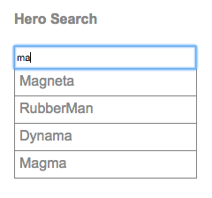

# Exercício 08

## Objetivos

* Refatorar a aplicação para recuperar (e salvar) dados de um servidor remoto.

## Duração

60 minutos

## Preparando o ambiente

>Esse exercício evolui o Exercício 7. Se não conseguiu terminá-lo, use a versão que está na pasta `./workspace/exercicio-07-routing/`

>Se estiver usando o GIT, para descartar alguma alteração local faça:
>```
>git reset && git checkout -- .
>```

Deixe a aplicação rodando:

```bash
cd app-exemplo
npm run start
```

O comando `npm run start` iniciará um servidor local para desenvolvimento em "_watch mode_", ou seja, qualquer edição nos arquivos, irá recompilar e recarregar a aplicação no browser. Acesse sua app no endereço local: [http://localhost:4200/](http://localhost:4200/).

## Provendo serviços HTTP

Aprendemos bastante até aqui e já temos as fundações para construir uma aplicação Angular. No entanto, ainda estamos trabalhando com dados mock de heróis.

Vamos, agora, substituir esses mocks por dados recuperados a partir de um API fazendo requisições HTTP a um servidor remoto.

Para realizar requisições HTTP, vamos usar o módulo `HttpClientModule`.

O módulo `HttpClientModule` é opcional e é implementado em uma biblioteca chamada `@angular/common/http`, externa ao módulo core do Angular. Por isso, para usar os serviços HTTP, precisamos incluir a biblioteca `@angular/common/http` no `package.json`, e declarar o módulo `HttpClientModule` no array de `imports` da nossa aplicação Angular.

Como nós criamos a nossa aplicação com o Angular CLI, a biblioteca `@angular/common/http` já está definida no `package.json` e já estamos prontos para importar o módulo `HttpClientModule` na nossa aplicação Angular.

## Importando o `HttpClientModule`

Para permitir o acesso aos serviços HTTP a partir de qualquer lugar na aplicação, inclua o módulo `HttpClientModule` ao array `imports` do `AppModule`:

```javascript
import { NgModule }      from '@angular/core';
import { BrowserModule } from '@angular/platform-browser';
import { FormsModule }   from '@angular/forms';
import { HttpClientModule } from '@angular/common/http';
  
import { AppRoutingModule } from './app-routing.module';
  
import { AppComponent }         from './app.component';
import { DashboardComponent }   from './dashboard.component';
import { HeroesComponent }      from './heroes.component';
import { HeroDetailComponent }  from './hero-detail.component';
import { HeroService }          from './hero.service';
  
@NgModule({
  imports: [
    BrowserModule,
    FormsModule,
    HttpClientModule, // <-- inclua o módulo "HttpClientModule" no imports
    AppRoutingModule
  ],
  declarations: [
    AppComponent,
    DashboardComponent,
    HeroDetailComponent,
    HeroesComponent,
  ],
  providers: [ HeroService ],
  bootstrap: [ AppComponent ]
})
export class AppModule { }
```

## Simulando a API

Na vida real, a aplicação irá utilizar o módulo `HttpModule` para se comunicar com um servidor web remoto.

> **Observação**:
>
> Para simularmos a existência de uma api para prover os dados vamos usar o [Json Server](https://github.com/typicode/json-server), você pode instalá-lo executando o comando:
>
> ```
> npm install -g json-server
>```
>
> Os dados serão colocados em um arquivo que o servidor fica monitorando.

```
echo '{ 
  "heroes": 
  [
    { "id": 0,  "name": "Zero" }, 
    { "id": 11, "name": "Mr. Nice" },
    { "id": 12, "name": "Narco" },
    { "id": 13, "name": "Bombasto" },
    { "id": 14, "name": "Celeritas" },
    { "id": 15, "name": "Magneta" },
    { "id": 16, "name": "RubberMan" },
    { "id": 17, "name": "Dynama" },
    { "id": 18, "name": "Dr IQ" },
    { "id": 19, "name": "Magma" },
    { "id": 20, "name": "Tornado" }
  ]
}' > db.json
```

Note que o Herói **Zero** não existia antes!

Para simular um contexto para a aplicação api vamos definir uma rota customizada com o nome de '/api'
```
echo '{
  "/api/*": "/$1"
}' > routes.json
```
  
Para executar o servidor execute o comando:

```
json-server --watch --routes routes.json db.json
```

Após a subida do servidor, pode-se fazer requisições do tipo:

`GET /api/heroes`
> Irá mostrar todos os heróis

`GET /api/heroes/19`
> Irá mostrar os dados do herói com "id" igual a 19

```
curl http://localhost:3000/api/heroes
```

```
curl http://localhost:3000/api/heroes/19
```

Esse arquivo substitui o arquivo `mock-heroes.ts`, que pode ser removido com segurança.

 O uso do **Json Server** só é útil no inicío do processo de desenvolvimento, para prototipagem e demonstrações (como é o caso do Tour of Heroes). Poderíamos até pular esse passo se tivéssemos uma API real.

## Heróis e HTTP

Na versão atual do `HeroService`, uma `Promise` com os heróis mock é retornada:

```javascript
getHeroes(): Promise<Hero[]> {
  return Promise.resolve(HEROES);
}
```

Isso foi feito já para antecipar a ideia de que  a recuperação dos heróis é feita com um cliente HTTP, que é uma operação assíncrona.

Converta, então, o método `getHeroes()` para usar HTTP:

```javascript
  private baseUrl = 'http://localhost:3000/api/heroes';  // URL to web api

  constructor(private http: HttpClient) { }

  getHeroes(): Promise<Hero[]> {
    const url = this.baseUrl;
    return this.http.get<Hero[]>(url).toPromise().catch(this.handleError);
  }

  private handleError(error: any): Promise<any> {
    console.error('An error occurred', error); // for demo purposes only
    return Promise.reject(error.message || error);
  }

```

Adicione os imports:

```javascript
import { HttpClient } from '@angular/common/http';
```

Ajuste o método `getTopHeroes()` para utilizar os dados vindos do servidor:

```javascript
getTopHeroes(): Promise<Hero[]> {
    return this.getHeroes().then(heroes => {
      return heroes.slice(0, 4);
    });
}
```

Recarregue o navegador. A lista de heróis agora foi recuperada a partir da API provida pelo Json Server.

### HTTP `Promise`

O método `http.get` retorna um `Observable` da biblioteca RxJS.

Os `Observables` são uma forma poderorsa de gerenciar fluxos de dados assíncronos. Vamos falar mais sobre `Observables` no decorrer desse exercício. Por enquanto, é suficiente entender que convertermos o `Observable` em um `Promise` usando o método `toPromise()`:

```
.toPromise()
```

A partir do RxJS 6 `toPromise` não é mais um operador, e sim faz parte da classe `Observables`.
Os operadores RxJS acrescentam funcionalidades aos `Observables`. Para usar essas funcionalidades, você tem que adicionar esses operadores. Para fazer isso, basta importá-los da biblioteca RxJS:

```javascript
import { map } from 'rxjs/operators';
```

### Extraindo os dados no callback

`HttpClient.get` retorna o corpo da resposta como um objeto JSON não tipado por default. Aplicando o especificador de tipos opcional, `<Hero[]>`, nos dá como resultado um objeto tipado: Nosso array de heróis.

A forma do dados JSON é dada pela API servidora de dados, no nosso caso o **Json Server**. Na vida real, a resposta da sua API pode ter um formato diferente, e você deverá usar as propriedades definidas no contrato dessa API.

### Tratamento de erros

Ao final do método `getHeroes()`, os possíveis erros estão sendo capturados no método `catch()`, e eles são repassados para o método `handleError`:

```javascript
.catch(this.handleError);
```

Essa é uma parte crítica da aplicação. Você deve se preparar para as falhas HTTP, pois elas acontecem frequentemente e por razões fora do nosso controle.

```javascript
private handleError(error: any): Promise<any> {
  console.error('An error occurred', error); // for demo purposes only
  return Promise.reject(error.message || error);
}
```

O nosso serviço simplesmente registra um log de erro no console do navegador. Na vida real, os erros devem ser tratados conforme a necessidade da aplicação.

O código também devolve o erro na forma de uma `Promise` rejeitada. Dessa forma, o componente que chamou o serviço tem a chance de agir e exibir uma mensagem de erro para o usuário, por exemplo.

### Recuperando o herói pelo id

Ainda no `HeroService`, perceba que a implementação atual do método `getHero` está reutilizando o método `getHeroes` para filtrar o herói procurado.

Isso até pode funcionar em simulações. Na vida real, no entanto, é ineficiente solicitar a um servidor a lista de todos os heróis, quando só se quer um único herói.

A maioria das APIs suportam uma requisição *get-by-id* na forma: `/api/heroes/:id`.

Atualize, então, o método `HeroService.getHero()` para fazer uma requisição get-by-id:

```javascript
getHero(id: number): Promise<Hero> {
  const url = `${this.baseUrl}/${id}`;
  return this.http.get<Hero>(url).toPromise().catch(this.handleError);
 }
```

A requisição é quase a mesma que implementamos em `getHeroes()`. A única diferença é que, aqui, o `id` na URL identifica qual é o herói que o servidor deve recuperar. Além disso, a resposta é um objeto único do tipo `Hero` (e não um array).

### API inalterada

Apesar de termos feitos várias mudanças no serviço `HeroService`, as alterações modificaram somente a implementação interna dos métodos `getHeroes()` e `getHero()`, e as assinaturas dos métodos não sofreram mudanças. Por isso, não será necessário alterar nenhum componente que usa o serviço.

## Atualizando os detalhes do herói

Volte ao navegador e tente editar o nome de um herói qualquer na página de detalhes.

Na medida que você digita, o nome do herói no cabeçalho é atualizado. Porém, se você clicar no botão de voltar, as atualizações são perdidas.

O que mudou?

Antes, estávamos usando uma lista de mocks compartilhada por toda a aplicação, e as atualizações eram aplicadas diretamente à lista de mocks.

Agora, estamos recuperando a lista a partir de um servidor remoto, e se quisermos persistir as atualizações, temos que enviá-las de volta ao servidor.

### Persistindo as alterações dos detalhes do herói

Para persistir as alterações feitas aos detalhes de um herói, adicione um botão ao final do template do `HeroDetailComponent`:

```html
<button (click)="save()">Save</button>
```

O botão faz um binding de evento de clique de forma que, ao ser clicado, irá invocar o novo método `save()` do componente.

Inclua, então, o método `save()` no `HeroDetailComponent`. O método irá persistir as alterações no nome do herói ao chamar o método `update()` do `HeroService` e, então, irá navegar para a visão anterior:

```javascript
save(): void {
  this.heroService.update(this.hero)
    .then(() => this.goBack());
}
```

### Adicionando o método `HeroService.update()`

A estrutura geral do método `update()` é semelhante à estrutura do `getHeroes()`, com algumas mudanças:

* É usado o método `put()` ao invés do método `get()`;
* Para identificar qual herói deve ser atualizado, o `id` é parametrizado na URL;
* O corpo da requisição, o herói informado, é passado como o segundo argumento do método `put`;

```javascript
update(hero: Hero): Promise<Hero> {
  const url = `${this.baseUrl}/${hero.id}`;
  const body = hero;
  return this.http.put<Hero>(url, body).toPromise().catch(this.handleError);
}
```

Volte ao navegador e teste a edição. Agora, as mudanças estão sendo persistidas no lado servidor.

## Adicionando heróis

Para criar um novo herói, precisamos de um formulário com uma caixa de texto para o nome do herói e com um botão para comandar a inclusão do novo herói.

Inclua o seguinte trecho HTML no template do `HeroesComponent` logo abaixo de `<h2>My Heroes</h2>`:

```html
<div>
  <label>Hero name:</label> <input #heroName />
  <button (click)="add(heroName.value); heroName.value=''">Add</button>
</div>
```

Em resposta ao evento de clique do botão, o template chama o método `add()` do componente e limpa a caixa de texto, preparando-a para um próximo nome.

O novo método `add()` do `HeroesComponent` deve ter o seguinte conteúdo:

```javascript
add(name: string): void {
  name = name.trim();
  if (!name) { return; }
  this.heroService.create(name)
    .then(hero => {
      this.heroes.push(hero);
      this.selectedHero = null;
    });
}
```

Quando o nome não é vazio, o método delega a criação do herói ao `HeroService`, e então adiciona o novo herói ao array.

Inclua o novo método `create()` ao `HeroService`:

```javascript
create(name: string): Promise<Hero> {
  const url = this.baseUrl;
  const body: Hero = {
    id: undefined,
    name: name
  };
  return this.http.post<Hero>(url, body).toPromise().catch(this.handleError);
}
```

Recarregue o navegador e crie alguns heróis.

## Deletando heróis

Associado a cada herói na página de listagem, deve existir um botão de *delete*, para permitir a exclusão dos heróis.

Para isso, adicione um elemento `<button>` ao template do `HeroesComponent` como abaixo:

```html
<button class="delete"
  (click)="delete(hero); $event.stopPropagation()">x</button>
```

O elemento `<li>`, então, deve estar como a seguir:

```html
<li *ngFor="let hero of heroes" (click)="onSelect(hero)"
    [class.selected]="hero === selectedHero">
  <span class="badge">{{hero.id}}</span>
  <span>{{hero.name}}</span>
  <button class="delete"
    (click)="delete(hero); $event.stopPropagation()">x</button>
</li>
```

Após chamar o método `delete()` do componente, o botão de delete interrompe a propagação do evento de clique ao chamar o `$event.stopPropagation()`. Isso impede que o *click handler* do elemento `<li>` seja disparado também (o que selecionaria o usuário a ser deletado).

O método `delete()` do componente `HeroesComponent` tem uma lógica um pouco mais complicada:

```javascript
delete(hero: Hero): void {
  this.heroService
      .delete(hero.id)
      .then(() => {
        this.heroes = this.heroes.filter(h => h !== hero);
        if (this.selectedHero === hero) { this.selectedHero = null; }
      });
}
```

Além de delegar a exclusão do herói para o `HeroService`, o método `delete()` também deve remover o herói deletado do array de heróis e resetar o herói selecionado, se for necessário.

Para alinhar o botão de delete à direita, adicione o seguinte CSS ao `heroes.component.css`:

```css
button.delete {
  float:right;
  margin-top: -2px;
  margin-right: .8em;
  background-color: gray !important;
  color:white;
}
```

### Adicionando o método `HeroService.delete()`

Adicione o seguinte método `delete()` ao `HeroService`, que usa o método HTTP `delete()` para excluir o herói no servidor:

```javascript
delete(id: number): Promise<void> {
  const url = `${this.baseUrl}/${id}`;
  return this.http.delete<void>(url).toPromise().catch(this.handleError);
}
```

Recarregue o navegador e teste a nova funcionalidade de exclusão de heróis.

## Observables

Se você prestar atenção, irá perceber que os métodos do serviço `Http` sempre retornam um `Observable` de objetos do tipo `Response`.

O `HeroService` está convertendo esse `Observable` em um `Promise`, devolvendo-o para o componente chamador.

Vamos agora entender como, quando e porque retornar o `Observable` diretamente.

### Background

`Promises` processam um único evento assíncrono, de forma que a função callback é chamada uma única vez.

`Observables`, por usa vez, processam um fluxo de eventos assíncronos, chamando a função callback uma vez para cada resultado desses eventos.

O Angular tem um suporte básico para `Observables`, mas os desenvolvedores podem adicionar operadores e extensões da biblioteca **RxJS** para incluir novas funcionalidades.

No `HeroService`, usamos a função `toPromise()` aos resultados dos métodos do serviço `Http` para converter o `Observable` em um `Promise`.

Essa conversão geralmente é uma boa opção, pois, tipicamente, nós chamamos o método `http.get()` para recuperar informações de um servidor remoto de uma única vez.

No entanto, nem sempre as requisições são feitas uma única vez. Você pode iniciar uma requisição e ela pode ser cancelada, antes mesmo que o servidor responda, dando lugar a uma nova requisição.

Essa sequência *request-cancel-new-request* é difícil de se implementar com `Promises`, mas é fácil com `Observables`.

### Pesquisando heróis pelo nome

Vamos adicionar uma nova funcionalidade ao Tour of Heroes: a pesquisa de heróis.

Nessa funcionalidade, vamos adicionar uma caixa de texto onde o usuário irá digitar o nome do herói. Na medida em que o usuário digita um nome, iremos enviar múltiplas requisições HTTP para o serviço de heróis, filtrando-os pelo nome digitado.

Vamos adicionar um novo método ao `HeroService`:

```javascript
  search(term: string): Observable<Hero[]> {
    const url = `${this.baseUrl}/?name_like=${term}`;
    return this.http.get<Hero[]>(url);
  }
```

Atualize os imports...

```javascript
import { Observable }     from 'rxjs';
import { map } from 'rxjs/operators';
```

A chamada ao método `http.get()` é semelhante à que fizemos anteriormente, só que aqui introduzimos um parâmetro `name` na query string da URL e usamos o sufixo `_like` que é como o **Json Server** especifica como fazer um filtro usando uma expressão, inclusive, uma expressão regular.

O mais importante a notar, no entanto, é que agora não estamos mais convertendo o resultado do `http.get()` para o tipo `Promise`. Ao invés disso, estamos devolvendo o tipo `Observable` diretamente.

### Criando o componente `HeroSearchComponent`

Para consumir o novo método, vamos criar o componente `HeroSearchComponent`.

Crie, então, o arquivo `hero-search.component.html` com o seguinte conteúdo:

```html
<div id="search-component">
  <h4>Hero Search</h4>
  <input #searchBox id="search-box" (keyup)="search(searchBox.value)" />
  <div>
    <div *ngFor="let hero of heroes | async"
         (click)="gotoDetail(hero)" class="search-result" >
      {{hero.name}}
    </div>
  </div>
</div>
```

O template do novo componente é simples: contém uma caixa de texto e uma lista com os resultados da pesquisa.

Vamos também adicionar estilos CSS para o novo componente. Crie, então, o arquivo `hero-search.component.css`:

```css
.search-result{
  border-bottom: 1px solid gray;
  border-left: 1px solid gray;
  border-right: 1px solid gray;
  width:195px;
  height: 16px;
  padding: 5px;
  background-color: white;
  cursor: pointer;
}
  
.search-result:hover {
  color: #eee;
  background-color: #607D8B;
}
  
#search-box{
  width: 200px;
  height: 20px;
}
```

Na medida em que o usuário digita, um binding de evento *keyup* chama o método `search()` passando como parâmetro o novo valor da caixa de texto.

Como esperado, o `*ngFor` cria um laço de repetição para cada item da propriedade `heroes`. No entanto, essa propriedade não mais é um array de heróis, mas sim um `Observable` de array de heróis.

Como o `*ngFor` não trabalha com `Observables`, temos que usar o pipe `async`, que traduz o `Observable` no array de heróis esperado pelo `*ngFor`.

Crie agora o arquivo `hero-search.component.ts` com o seguinte conteúdo:

```javascript
import { Component, OnInit } from '@angular/core';
import { Router }            from '@angular/router';
  
import { Observable, Subject, of }  from 'rxjs';
  
// Observable operators
import { catchError, debounceTime, distinctUntilChanged, switchMap } from 'rxjs/operators';
  
import { HeroService } from './hero.service';
import { Hero } from './hero';
  
@Component({
  selector: 'app-hero-search',
  templateUrl: './hero-search.component.html',
  styleUrls: [ './hero-search.component.css' ]
})
export class HeroSearchComponent implements OnInit {
  heroes: Observable<Hero[]>;
  private searchTerms = new Subject<string>();
  
  constructor(
    private heroService: HeroService,
    private router: Router) {}
  
  // Push a search term into the observable stream.
  search(term: string): void {
    this.searchTerms.next(term);
  }
  
  ngOnInit(): void {
    this.heroes = this.searchTerms
      .pipe(
        debounceTime(300),        // wait 300ms after each keystroke before considering the term
        distinctUntilChanged(),   // ignore if next search term is same as previous
        switchMap(term => term   // switch to new observable each time the term changes
          // return the http search observable
          ? this.heroService.search(term)
          // or the observable of empty heroes if there was no search term
          : of<Hero[]>([])),
        catchError(error => {
          // TODO: add real error handling
          console.log(error);
          return of<Hero[]>([]);
        })
      );
  }
  
  gotoDetail(hero: Hero): void {
    const link = ['/detail', hero.id];
    this.router.navigate(link);
  }
}
```

Vamos manter o foco agora no `searchTerms`:

```javascript
private searchTerms = new Subject<string>();

// Push a search term into the observable stream.
search(term: string): void {
  this.searchTerms.next(term);
}
```

Um `Subject` é um produtor de um fluxo de eventos observáveis, de forma que `searchTerms` produz um `Observable` de strings. É, então, o critério de pesquisa para a consulta de heróis.

Cada chamada ao método `search()` coloca uma nova string no fluxo de eventos ao chamar o método `next()`.

Temos agora que converter esse fluxo de strings (`searchTerms`) em um fluxo de array de heróis (`heroes`).

Vamos colocar nossa atenção, então, para o seguinte trecho:

```javascript
heroes: Observable<Hero[]>;
  
ngOnInit(): void {
  this.heroes = this.searchTerms
    .pipe(
      debounceTime(300),        // espera 300ms antes de criar um novo evento
      distinctUntilChanged(),   // ignora o evento se o termo de pesquisa é o mesmo do evento anterior
      switchMap(term => term   // muda para o novo observable toda vez que o termo de pesquisa mudar, descartando os eventos anteriores
        // devolve o observable do método http
        ? this.heroService.search(term)
        // ou um observable vazio, caso nenhum termo de pesquisa tenha sido informado
        : of<Hero[]>([])),
      catchError(error => {
        // TODO: adicionar tratamento de erro
        console.log(error);
        return of<Hero[]>([]);
      })
    );
}
```

Para diminuir a quantidade de requisições HTTP, usamos alguns operadores do `Observable`:

* `debounceTime`: espera pelo fluxo pausar por um tempo determinado, antes de criar um novo evento.  No nosso caso, nunca iremos criar requisições mais frequentes do que 300ms.
* `distinctUntilChanged`: só envia uma nova requisição caso o filtro tenha de fato mudado.
* `switchMap`: chama o serviço de pesquisa para cada evento do fluxo, e retorna somente o `Observable` mais recente, cancelando e descartando os anteriores.
* `catchError`: intercepta um `Observable` que tenha falhado. Em uma aplicação real, poderíamos ter um tratamento mais adequado.

### Importando os operadores RxJS

A maioria dos operadores RxJS não estão incluídos no Angular por padrão. Só está incluído o que o Angular usa de fato.

Quando você precisa de funcionalidades adicionais, você deve extender o `Observable`, importando as bibliotecas que definem os operadores que você deseja.

Esses são os imports que o componente `HeroSearchComponent` usa:

```javascript
import { Observable, Subject, of }   from 'rxjs';

// Observable operators
import { catchError, debounceTime, distinctUntilChanged, switchMap } from 'rxjs/operators';
```

### Adicionando o componente de pesquisa ao Dashboard

Adicione, então, o componente `HeroSearchComponent` ao final do template do `DashboardComponent`:

```html
<h3>Top Heroes</h3>
<div class="grid grid-pad">
  <a *ngFor="let hero of heroes"  [routerLink]="['/detail', hero.id]"  class="col-1-4">
    <div class="module hero">
      <h4>{{hero.name}}</h4>
    </div>
  </a>
</div>
<app-hero-search></app-hero-search>
```

Por fim, inclua o `HeroSearchComponent` ao array `declarations` do `AppModule`:

```javascript
import { HeroSearchComponent } from './hero-search.component';

//...

declarations: [
  //...
  HeroSearchComponent
],
```

Execute a aplicação novamente e verifique o comportamento da pesquisa no Dashboard. Você deverá ver algo como:



## Revisando a estrutura da aplicação

Nesse momento, a sua aplicação deve ter a seguinte estrutura:

```
angular-tour-of-heroes/
|
|-- node_modules/
|-- src/
|  |-- app/
|  |  |-- app.component.css
|  |  |-- app.component.ts
|  |  |-- app.module.ts
|  |  |-- app-routing.module.ts
|  |  |-- dashboard.component.css
|  |  |-- dashboard.component.html
|  |  |-- dashboard.component.ts
|  |  |-- hero.service.ts
|  |  |-- hero.ts
|  |  |-- hero-detail.component.css
|  |  |-- hero-detail.component.html
|  |  |-- hero-detail.component.ts
|  |  |-- hero-search.component.css
|  |  |-- hero-search.component.html
|  |  |-- hero-search.component.ts
|  |  |-- heroes.component.css
|  |  |-- heroes.component.html
|  |  |-- heroes.component.ts
|  |-- index.html
|  |-- main.ts
|  |-- styles.css
|  |-- ...
|-- .angular-cli.json
|-- package.json
|-- ...
```

## Resumo

* Adicionamos as dependências necessárias para usar HTTP.
* Refatoramos o `HeroService` para recuperar os heróis a partir de uma API.
* Adicionamos os métodos `post()`, `put()` e `delete()` ao `HeroService`.
* Atualizamos os componentes para permitir a criação, edição e deleção de heróis.
* Configuramos uma API usnado o **Json Service**.
* Aprendemos a usar `Observables`.

## Próximo passo

[Exercício 09](exercicio-09.md)
