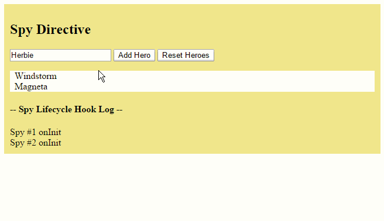

# Exercício 09

## Objetivos

* Demonstrar o uso dos lifecycle hooks em uma série de exercícios.

## Duração

30 minutos

## Preparando o ambiente

Crie uma nova aplicação chamada **exercicio-09-lifecycle-hooks** e deixe-a rodando:

```bash
ng new exercicio-09-lifecycle-hooks
cd exercicio-09-lifecycle-hooks
npm run start
```

O comando `npm run start` iniciará um servidor local para desenvolvimento em "_watch mode_", ou seja, qualquer edição nos arquivos, irá recompilar e recarregar a aplicação no browser. Acesse sua app no endereço local: [http://localhost:4200/](http://localhost:4200/).

## Introdução

Nesse exercício, iremos demonstrar os lifecycle hooks em uma série de exercícios.

Cada exercício segue um padrão comum: um *componente pai* serve como um teste para um *componente filho* que ilustra um (ou mais de um) método do lifecycle hook.

Aqui está uma breve descrição de cada um dos exercícios:

Componente | Descrição
--- | ---
Peek-a-boo | Demonstra todos os lifecycle hooks. Cada método hook escreve um registro de log na tela.
Spy | Diretivas também possuem lifecycle hooks. Vamos escrever uma `SpyDirective` para criar registros de log para quando o componente associado é criado ou destruído.
OnChanges | Vamos ver como o Angular chama o método `ngOnChanges()` toda vez que uma das propriedades de input de um componente é alterada.
DoCheck | Implementa o método `ngDoCheck()` com uma detecção de mudanças customizada.
AfterView | Mostra o que o Angular entende por *view*. Demostra os métodos `ngAfterViewInit()` e `ngAfterViewChecked()`.
AfterContent | Mostra como projetar um conteúdo dentro de um componente. Demonstra os método `ngAfterContentInit()` e `ngAfterContentChecked()`.

## Peek-a-boo

O componente `PeekABooComponent` demonstra todos os lifecycle hooks em um único componente.

Você raramente (ou nunca) vai implementar todos as interfaces desse jeito; mas esse exercício é útil para mostrar a ordem em que os métodos hooks são chamados.

### Criando o serviço `LoggerService`

O nosso objetivo é criar registros de log em cada um dos métodos hook do nosso componente.

Vamos, então, criar o serviço `LoggerService` para que o componente possa registrar esses logs (que eventualmente serão exibidos na tela).

Para isso, crie o serviço `LoggerService` na pasta `src/app` com o seguinte conteúdo:

```javascript
import { Injectable } from '@angular/core';

@Injectable()
export class LoggerService {
  logs: string[] = [];
  prevMsg = '';
  prevMsgCount = 1;

  log(msg: string)  {
    if (msg === this.prevMsg) {
      // Repeat message; update last log entry with count.
      this.logs[this.logs.length - 1] = msg + ` (${this.prevMsgCount += 1}x)`;
    } else {
      // New message; log it.
      this.prevMsg = msg;
      this.prevMsgCount = 1;
      this.logs.push(msg);
    }
  }

  clear() { this.logs.length = 0; }

  // schedules a view refresh to ensure display catches up
  tick() {  this.tick_then(() => { }); }
  tick_then(fn: () => any) { setTimeout(fn, 0); }
}
```

O serviço mantém os registros de log no array de strings `logs`. Esse array é uma propriedade pública e, portanto, pode ser acessada pelos componentes que usam esse serviço. É assim que, eventualmente, iremos exibir os registros de log na tela.

O serviço também disponibiliza o método `log()`, que será chamado pelo componente para registrar as mensagens de logs, incluindo-a na propriedade pública `logs`.

O serviço também faz um controle para evitar o registro de mensagens repetidas. Ao invés disso, é criado um sufixo indicando a quantidade de repetições, como, por exemplo: `AfterContentChecked (3x)`.

Além disso, o serviço também disponibiliza o método `clear()` para limpar os registros de logs.

### Criando o componente `PeekABooComponent`

Crie, agora, o arquivo `peek-a-boo.component.ts` na pasta `src/app` com o seguinte conteúdo:

```javascript
import { Component, Input } from '@angular/core';
import { LoggerService }    from './logger.service';

@Component({
  selector: 'peek-a-boo',
  template: '<p>Now you see my hero, {{name}}</p>'
})
export class PeekABooComponent {
  @Input()  name: string;
  
  constructor(private logger: LoggerService) {}  
}
```

Até aí, não há novidades. Criamos a estrutura básica do componente `PeekABooComponent`, com uma propriedade de input e uma injeção de dependência.

Eventualmente, a propriedade `name` será alvo de um **binding** de propriedade, e o seu valor será definido por outro componente (lembre-se que, no nosso padrão, sempre teremos um componente pai para testar o nosso componente filho).

Note também que estamos injetando o serviço `LoggerService` no construtor do componente. Ele será utilizado logo mais para o registro dos logs.

### Implementando os *lifecycle hooks*

Para interceptar cada um dos momentos do lifecycle hooks, o Angular disponibiliza, na biblioteca `@angular/core`, as interfaces do *lifecycle hooks*. Inclua, então, todas essas interfaces na assinatura do `PeekABooComponent`:

```javascript
import {
  AfterContentChecked,
  AfterContentInit,
  AfterViewChecked,
  AfterViewInit,
  DoCheck,
  OnChanges,
  OnDestroy,
  OnInit,
  SimpleChanges
} from '@angular/core'; // <-- não esqueça de incluir os imports

import { Component, Input } from '@angular/core';
import { LoggerService }    from './logger.service';

@Component({
  selector: 'peek-a-boo',
  template: '<p>Now you see my hero, {{name}}</p>'
})
export class PeekABooComponent implements  
             OnChanges, OnInit, DoCheck,
             AfterContentInit, AfterContentChecked,
             AfterViewInit, AfterViewChecked,
             OnDestroy { // <-- inclua as interfaces na assinatura da classe
  @Input()  name: string;
  
  constructor(private logger: LoggerService) {}  
}
```

Nesse momento, o compilador TypeScript irá levantar erros do tipo:

```javascript
Class 'PeekABooComponent' incorrectly implements interface 'OnInit'.
  Property 'ngOnInit' is missing in type 'PeekABooComponent'.
```

Para corrigir esse erro, vamos implementar o *stub* de cada um dos métodos das interfaces.

Por padrão, o método hook segue o nome da interface, com o sufixo **ng**. Por exemplo, a interface `OnInit` define o método `ngOnInit()`.

Inclua, então, os seguintes métodos ao componente:

```javascript
ngOnChanges(changes: SimpleChanges) {}

ngOnInit() { }

ngDoCheck() { }

ngAfterContentInit() { }

ngAfterContentChecked() { }

ngAfterViewInit() { }

ngAfterViewChecked() { }

ngOnDestroy() { }
```

O único método que recebe um parâmetro é o `ngOnChanges`. A cada mudança, esse parâmetro guarda os valores atual e anterior de todas as propriedades de input que foram alteradas (note que já fizemos o import do símbolo `SimpleChanges` junto com as interfaces anteriormente).

### Registrando os logs

Agora que temos a estrutura básica dos métodos, podemos finalmente incluir os registros de log no `LoggerService`. Crie, então, o seguinte método no `PeekABooComponent`:

```javascript
logIt(msg: string) {
  this.logger.log(`#${nextId++} ${msg}`);
}
```

O método `logIt` recebe como parâmetro a mensagem de log e, antes de direcioná-la para o serviço `LoggerService`, acrescenta um prefixo com um número sequencial (a variável `nextId`). Dessa forma, conseguiremos acompanhar a quantidade de logs registrados facilmente.

Inicialize a variável `nextId`, incluindo-a no arquivo `peek-a-boo.component.ts` antes da definição da classe `PeekABooComponent`:

```javascript
let nextId = 1; // <-- defina e inicialize a variável FORA da classe PeekABooComponent

@Component({ ... })
export class PeekABooComponent ...
```

Modifique então os métodos hook para invocar o novo método `logIt`:

```javascript
ngOnChanges(changes: SimpleChanges) {
  let changesMsgs: string[] = [];
  for (let propName in changes) {
    if (propName === 'name') {
      let name = changes['name'].currentValue;
      changesMsgs.push(`name ${this.verb} to "${name}"`);
    } else {
      changesMsgs.push(propName + ' ' + this.verb);
    }
  }
  this.logIt(`OnChanges: ${changesMsgs.join('; ')}`);
  this.verb = 'changed'; // next time it will be a change
}

ngOnInit() { this.logIt(`OnInit`); }

ngDoCheck() { this.logIt(`DoCheck`); }

ngAfterContentInit() { this.logIt(`AfterContentInit`);  }

ngAfterContentChecked() { this.logIt(`AfterContentChecked`); }

ngAfterViewInit() { this.logIt(`AfterViewInit`); }

ngAfterViewChecked() { this.logIt(`AfterViewChecked`); }

ngOnDestroy() { this.logIt(`OnDestroy`); }
```

Com exceção do método `ngOnChanges()`, todos os outros métodos hook simplesmente invocam o método `logIt()` com o nome da interface do lifecycle hook associada.

O método `ngOnChanges()` é um pouco mais complexo.

O parâmetro `changes` pode ser entendido como um mapa cujas **chaves** são os nomes das propriedades que sofreram mudanças e os valores são instâncias do tipo `SimpleChange`, uma interface que representa uma mudança simples (guardando o valor anterior e o valor atual da propriedade).

O método, então, percorre esse mapa criando um array com os registros das mudanças que aconteceram nessa chamada ao `ngOnChanges()`.

A primeira vez que o método `ngOnChanges()` é chamado antes do `ngOnInit()` para inicializar as propriedades de input do componente. As chamadas seguintes serão feitas nas alterações a essas propriedades. Para diferenciar, então, a inicialização da propriedade `name` das mudanças subsequentes, o método `ngOnChanges()` faz uso de uma nova propriedade `verb` do `PeekABooComponent`. Inclua essa nova propriedade entre antes do método construtor:

```javascript
private verb = 'initialized';
```

O resultado final do `PeekABooComponent` é como a seguir:

```javascript
import {
  AfterContentChecked,
  AfterContentInit,
  AfterViewChecked,
  AfterViewInit,
  DoCheck,
  OnChanges,
  OnDestroy,
  OnInit,
  SimpleChanges
} from '@angular/core';
import { Component, Input } from '@angular/core';
import { LoggerService }    from './logger.service';

let nextId = 1;

@Component({
  selector: 'peek-a-boo',
  template: '<p>Now you see my hero, {{name}}</p>'
})
// Don't HAVE to mention the Lifecycle Hook interfaces
// unless we want typing and tool support.
export class PeekABooComponent implements
             OnChanges, OnInit, DoCheck,
             AfterContentInit, AfterContentChecked,
             AfterViewInit, AfterViewChecked,
             OnDestroy {
  @Input()  name: string;

  private verb = 'initialized';

  constructor(private logger: LoggerService) {
    let is = this.name ? 'is' : 'is not';
    this.logIt(`name ${is} known at construction`);
  }

  logIt(msg: string) {
    this.logger.log(`#${nextId++} ${msg}`);
  }

  // only called for/if there is an @input variable set by parent.
  ngOnChanges(changes: SimpleChanges) {
    let changesMsgs: string[] = [];
    for (let propName in changes) {
      if (propName === 'name') {
        let name = changes['name'].currentValue;
        changesMsgs.push(`name ${this.verb} to "${name}"`);
      } else {
        changesMsgs.push(propName + ' ' + this.verb);
      }
    }
    this.logIt(`OnChanges: ${changesMsgs.join('; ')}`);
    this.verb = 'changed'; // next time it will be a change
  }

  ngOnInit() { this.logIt(`OnInit`); }
  
  // Beware! Called frequently!
  // Called in every change detection cycle anywhere on the page
  ngDoCheck() { this.logIt(`DoCheck`); }

  ngAfterContentInit() { this.logIt(`AfterContentInit`);  }

  // Beware! Called frequently!
  // Called in every change detection cycle anywhere on the page
  ngAfterContentChecked() { this.logIt(`AfterContentChecked`); }

  ngAfterViewInit() { this.logIt(`AfterViewInit`); }

  // Beware! Called frequently!
  // Called in every change detection cycle anywhere on the page
  ngAfterViewChecked() { this.logIt(`AfterViewChecked`); }

  ngOnDestroy() { this.logIt(`OnDestroy`); }
}
```

### Criando o componente `PeekABooParentComponent`

Para demonstrar o componente `PeekABooComponent`, vamos criar o componente pai `PeekABooParentComponent`.

O componente pai será responsável por controlar a exibição do componente filho e dos registros de log na tela.

Crie, então, o arquivo `peek-a-boo-parent.component.ts` na pasta `src/app` com o seguinte conteúdo:

```javascript
import { Component } from '@angular/core';

import { LoggerService } from './logger.service';

@Component({
  selector: 'peek-a-boo-parent',
  template: `
  <div class="parent">
    <button (click)="toggleChild()">
      {{hasChild ? 'Destroy' : 'Create'}} PeekABooComponent
    </button>
    <button (click)="updateHero()" [hidden]="!hasChild">Update Hero</button>

    <peek-a-boo *ngIf="hasChild" [name]="heroName">
    </peek-a-boo>

    <h4>-- Lifecycle Hook Log --</h4>
    <div *ngFor="let msg of hookLog">{{msg}}</div>
  </div>
  `,
  providers:  [ LoggerService ]
})
export class PeekABooParentComponent {

  hasChild = false;
  hookLog: string[];

  heroName = 'Windstorm';

  constructor(private logger: LoggerService) {
    this.hookLog = logger.logs;
  }

  toggleChild() {
    this.hasChild = !this.hasChild;
    if (this.hasChild) {
      this.heroName = 'Windstorm';
      this.logger.clear(); // clear log on create
    }
    this.logger.tick();
  }

  updateHero() {
    this.heroName += '!';
    this.logger.tick();
  }
}
```

Note as seguintes características do componente `PeekABooParentComponent`:

* O serviço `LoggerService` é injetado no construtor do componente. A propriedade pública `logs` do serviço é referenciada na propriedade `hookLog`, que por sua vez é utilizada no template para a exibição dos registros de log.
* A exibição do componente filho `PeekABooComponent` é controlada pela diretiva `*ngIf` e pela propriedade `hasChild` do componente `PeekABooParentComponent`. Sempre que o valor da propriedade `hasChild` mudar de `false` para `true`, o Angular irá incluir o componente `<peek-a-boo>` no DOM, criando uma nova instância do componente `PeekABooComponent`.
* O `PeekABooParentComponent` passa o valor do nome do herói para o componente filho através do binding de propriedade `[name]="heroName"`.
* O template do `PeekABooParentComponent` exibe dois botões:
  * Um botão para criar (ou destruir) o componente filho `PeekABooComponent`.
  * Um botão para alterar o nome do herói.
* Ao final do template, todas as mensagens de log são exibidas na iteração da diretiva `*ngFor`.

### Registrando os componentes

Para vermos tudo em ação, vamos incluir os componentes `PeekABooParentComponent` e `PeekABooComponent` no módulo `AppModule`:

```javascript
import { NgModule } from '@angular/core';
import { BrowserModule } from '@angular/platform-browser';
import { CommonModule } from '@angular/common';

import { AppComponent } from './app.component';

import { PeekABooParentComponent } from './peek-a-boo-parent.component'; // <-- importe o símbolo PeekABooComponent
import { PeekABooComponent } from './peek-a-boo.component'; // <-- importe o símbolo PeekABooComponent

@NgModule({
  imports: [
    CommonModule,
    BrowserModule
  ],
  declarations: [
    AppComponent,
    PeekABooParentComponent, // <-- declare o componente PeekABooParentComponent
    PeekABooComponent, // <-- declare o componente PeekABooComponent
  ],
  bootstrap: [ AppComponent ]
})
export class AppModule { }

```

Para separarmos na página os vários exemplos dos *Lifecycle Hooks* iremos criar cada exemplo numa seção separada.
Para isso usaremos da biblioteca [ngx-bootstrap](https://valor-software.com/ngx-bootstrap) o [*Accordion*](https://valor-software.com/ngx-bootstrap/#/accordion)

Para instalar a biblioteca execute o comando:
```
npm install ngx-bootstrap --save
```

Adicione o código abaixo no `index.html` na tag `head`
```
<link href="https://maxcdn.bootstrapcdn.com/bootstrap/3.3.7/css/bootstrap.min.css" rel="stylesheet">
```

Altere o `app.module.ts` com o objetivo de importar o módulo `Accordion`
```
import { AccordionModule } from 'ngx-bootstrap';
```

```
imports: [
    AccordionModule.forRoot(),
```

Por fim, modifique o arquivo `app.component.html` para incluir o novo elemento customizado `<peek-a-boo-parent>`:

```html
<h1>Lifecycle Hooks</h1>
<accordion>
    <accordion-group heading="Peek-a-boo: (most) lifecycle hooks">
        <peek-a-boo-parent></peek-a-boo-parent>
    </accordion-group>
</accordion>    
```

### Analisando o Peek-a-boo

A figura abaixo reflete o estado do log depois que o usuário clicou no botão `Create...` e então no botão `Destroy...`.


A sequência dos registros de log seguem a ordem de chamada prescrita para os métodos do lifecycle hook: `OnChanges`, `OnInit`, `DoCheck` (3x), `AfterContentInit`, `AfterContentChecked` (3x), `AfterViewInit`, `AfterViewChecked` (3x) e `OnDestroy`.

Se o usuário tivesse clicado no botão `Update Hero`, teríamos outro registro de `OnChanges` e mais duas chamadas ao trio `DoCheck`, `AfterContentChecked` e `AfterViewChecked`.

Podemos concluir, então, que esses três últimos hooks são chamados frequentemente. Por isso, mantenha a lógica nesses hooks a mais limpa possível.

## Spy

O Angular chama os métodos do lifecycle hook também para diretivas (e não só para componentes).

Vamos então criar uma diretiva `SpyDirective` para "espionar" um objeto DOM que não podemos alterar diretamente.

A diretiva é simples, e consiste basicamente nos métodos `ngOnInit()` e `ngOnDestroy()` que cria registros de logs usando o serviço `LoggerService`.

Crie, então, a diretiva usando o Angular CLI:

```bash
ng generate directive spy --no-spec
```

O comando acima cria o arquivo `spy.directive.ts` e já registra a diretiva `SpyDirective` no módulo `AppModule`, tornando-a disponível para uso na nossa aplicação.

Modifique o conteúdo do arquivo `spy.directive.ts` como abaixo:

```javascript
import { Directive, OnInit, OnDestroy } from '@angular/core';

import { LoggerService } from './logger.service';

let nextId = 1;

// Spy on any element to which it is applied.
// Usage: <div appSpy>...</div>
@Directive({selector: '[appSpy]'})
export class SpyDirective implements OnInit, OnDestroy {

  constructor(private logger: LoggerService) { }

  ngOnInit()    { this.logIt(`onInit`); }

  ngOnDestroy() { this.logIt(`onDestroy`); }

  private logIt(msg: string) {
    this.logger.log(`Spy #${nextId++} ${msg}`);
  }
}
```

Você pode utilizar a diretiva `SpyDirective` em qualquer elemento nativo ou customizado. A diretiva será inicializada e destruída ao mesmo tempo que o elemento.

No exemplo abaixo, a diretiva está anexada a cada elemento `<div>` da iteração do `*ngFor`:

```html
<div *ngFor="let hero of heroes" appSpy class="heroes">
  {{hero}}
</div>
```

### Criando o componente `SpyComponent`

Crie, então, o componente `SpyComponent` com o Angular CLI:

```bash
ng generate component spy --no-spec --flat
```

O comando acima cria os arquivos `spy.component.css`, `spy.component.html` e `spy.component.ts`, além de registrar o componente `SpyComponent` no módulo `AppModule`.

Modifique o conteúdo do arquivo `spy.component.html` como abaixo:

```html
<div class="parent">
  <h2>Spy Directive</h2>

  <input [(ngModel)]="newName" (keyup.enter)="addHero()">
  <button (click)="addHero()">Add Hero</button>
  <button (click)="reset()">Reset Heroes</button>

  <p></p>
  <div *ngFor="let hero of heroes" appSpy class="heroes">
    {{hero}}
  </div>
  <h4>-- Spy Lifecycle Hook Log --</h4>
  <div *ngFor="let msg of spyLog">{{msg}}</div>
</div>
```

Como usamos a diretiva `ngModel`, precisamos importar o `FormsModule`. Altere o AppModule
```
import { FormsModule } from '@angular/forms';

//...

@NgModule({
  imports: [
    FormsModule
```

Os conceitos por trás desse template são:

* Fizemos um *two-way data binding* do elemento `<input>` com a propriedade `newName`.
* Um binding do evento `keyup.enter` (isto é, quando o usuário pressionar e soltar a tecla `<ENTER>`) do elemento `<input>` dispara o método `addHero()` do componente.
* Dois outros bindings de eventos são registrados no evento `click` dos botões "Add Hero" e "Reset Heroes", que disparam os métodos `addHero()` e `reset()` do componente, respectivamente.
* A diretiva `*ngFor` cria um `<div>` para cada elemento do array `heroes`, que exibe o nome do herói.
* É incluída a diretiva `appSpy`, que definimos anteriormente, para espionar os eventos `ngOnInit` e `ngOnDestroy` de cada elemento `<div>` da iteração do `*ngFor`.
* Ao final do template, incluímos um `<div>` para exibir os logs da espionagem.

Para completar o exemplo, substitua o conteúdo do arquivo `spy.component.ts` pelo conteúdo abaixo:

```javascript
import { Component } from '@angular/core';

import { LoggerService }  from './logger.service';

@Component({
  selector: 'app-spy',
  templateUrl: './spy.component.html',
  styles: [
      '.parent {background: khaki;}',
      '.heroes {background: LightYellow; padding: 0 8px}'
    ],  
  providers:  [LoggerService]
})
export class SpyComponent {
  newName = 'Herbie';
  heroes: string[] = ['Windstorm', 'Magneta'];
  spyLog: string[];

  constructor(private logger: LoggerService) {
    this.spyLog = logger.logs;
  }

  addHero() {
    if (this.newName.trim()) {
      this.heroes.push(this.newName.trim());
      this.newName = '';
    }
  }
  reset() {
    this.logger.log('-- reset --');
    this.heroes.length = 0;
  }
}
```

Tire um momento para entender o componente:

* O decorador `@Component` não é novidade; definimos o seletor (`app-spy`), a referência para o arquivo do template HTML (`templateUrl`). O serviço `LoggerService` é incluído também no array `providers` do componente, pois queremos criar uma nova instância do serviço de log para o nosso componente.
* As propriedades `newName`, `heroes` e `spyLog` são definidas e inicializadas. Essas propriedades são referenciadas com bindings no template do componente.
* O serviço `LoggerService` é injetado no construtor do componente. A propriedade pública `logs` do serviço é referenciada na propriedade `spyLog`, que por sua vez é utilizada no template para a exibição dos registros de log.
* Se o nome informado não estiver vazio, o método `addHero()` inclui um novo herói ao array `heroes` e reseta a propriedade `name` com uma string vazia, para uma nova inclusão.
* O método `reset()` limpa o array de heróis.

Para testar o exemplo, modifique o arquivo `app.component.html` e inclua o novo elemento customizado `<app-spy>`:

```html
<h1>Lifecycle Hooks</h1>
<accordion>
    <accordion-group heading="Peek-a-boo: (most) lifecycle hooks">
        <peek-a-boo-parent></peek-a-boo-parent>
    </accordion-group>
    <accordion-group heading="Spy: directive with OnInit & OnDestroy">
        <app-spy></app-spy>
    </accordion-group>    
</accordion>  
```

### Analisando o Spy

Execute a aplicação, inclua alguns heróis e, depois, clique no botão "Reset Heroes". O resultado esperado é algo como:



Cada "nascimento" ou "morte" de uma `<div>` na iteração de heróis é também um "nascimento" ou "morte" da diretiva `SpyDirective`.

Adicionar um herói (seja pelo clique do botão "Add Hero" , seja por pressionar e soltar o `<ENTER>` no `<input>`) tem como resultado a criação de um novo `<div>` e, portanto, o método `ngOnInit()` da diretiva `SpyDirective` registra um log desse evento.

O botão "Reset Heroes" limpa a lista de heróis. Como consequência, o Angular remove todos os elementos `<div>` da árvore DOM, destruindo todos as diretivas espiãs ao mesmo tempo. O método `ngOnDestroy()` da diretiva `SpyDirective` reporta seus momentos finais.

### Um pouco mais sobre o `ngOnInit()`

Em aplicações reais, o método `ngOnInit` desempenha um importante papel e é usado por dois motivos principais:

* Fazer inicializações complexas logo após a construção do componente.
* Inicializar o componente após o Angular setar os valores das propriedades de input (`@Input`).

Componentes devem ser criados de forma "barata" e "segura". Isto é, os construtores não devem fazer nada mais do que inicializar variáveis locais com valores simples. O método `ngOnInit()` é um bom lugar para recuperar dados que dependem de outros componentes ou serviços.

Lembre-se, também, que as propriedades de input (isto é, as propriedades marcadas com o decorador `@Input`) não são inicializadas antes do construtor. Elas só terão seus valores definidos logo antes de o método `ngOnInit()` ser executado.

O método `ngOnChanges()` é a sua primeira oportunidade de acessar essas propriedades. O Angular chama o `ngOnChanges()` antes do `ngOnInit()` e muitas outras vezes após disso. O método `ngOnInit()` só é chamado uma única vez.

Você pode contar com o Angular para chamar o método `ngOnInit()` logo após criar o componente. É aí que você deve implementar a lógica "pesada" de inicialização do componente.

### Um pouco mais sobre o `ngOnDestroy()`

Coloque a lógica de limpeza do componente no método `ngOnDestroy()`.

Esse é o momento para notificar qualquer outra parte da aplicação de que o componente está sendo destruído.

Esse é o lugar para liberar recursos que não serão liberados automaticamente. Notadamente, faça o `unsubscribe` de `Observables` e eventos DOM. Pare os *timers* criados com `interval`. Você está arriscando criar um vazamento de memória na aplicação se você se esquecer de fazer isso.

## OnChanges

TODO

## DoCheck

TODO

## AfterView

TODO

## AfterContent

TODO

## Próximo passo

[Exercício 10](exercicio-10.md)
