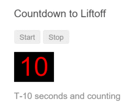
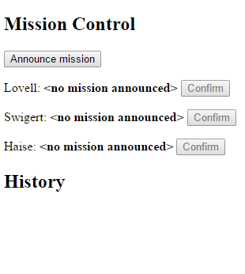

# Exercício 10

## Objetivos

* Demonstrar as formas de interação entre componentes

## Duração

60 minutos

## Preparando o ambiente

Crie uma nova aplicação chamada **exercicio-component-interaction** e deixe-a rodando:

```bash
ng new exercicio-component-interaction
cd exercicio-component-interaction
npm run start
```

O comando `npm run start` iniciará um servidor local para desenvolvimento em "_watch mode_", ou seja, qualquer edição nos arquivos, irá recompilar e recarregar a aplicação no browser. Acesse sua app no endereço local: [http://localhost:4200/](http://localhost:4200/).

## Passando dados do pai para o filho com binding de input

Para demonstrar a interação entre os componentes com o binding de input, vamos criar dois componentes: `HeroChildComponent` e `HeroParentComponent`.

Para criar o componente `HeroChildComponent`, digite o seguinte comando na pasta raiz da aplicação:

```bash
ng generate component hero-child --no-spec --flat --inline-style true --inline-template true
```

Estamos usando a funcionalidade de scaffolding do Angular CLI para criar o esqueleto do componente.

Por padrão, esse comando cria um componente numa subpasta com o mesmo nome do componente, além de criar também os arquivos de testes unitários (`.spec.ts`), CSS (`.component.css`) e template (`.component.html`) para o componente, já registrando-o no módulo `AppModule` da aplicação.

Estamos mudando esse comportamento padrão com as seguintes flags (opcionais):

* `--no-spec`: indica que não queremos a geração do arquivo `.spec.ts` (testes unitários);
* `--flat`: indica que não queremos a geração da subpasta `src/app/hero-child` para o componente;
* `--inline-style true`: indica que não queremos a geração do arquivo `.component.css` para o componente;
* `--inline-template true` indica que não queremos a geração do arquivo `.component.html` para o template do componente.

O resultado esperado, então, é algo como:

```bash
create src/app/hero-child.component.ts (267 bytes)
update src/app/app.module.ts (400 bytes)
```

Para criar o componente pai, repita o processo, mas dessa vez, utilize o nome `hero-parent`:

```bash
ng generate component hero-parent --no-spec --flat --inline-style true --inline-template true
```

Como resultado, o conteúdo do componente `HeroChildComponent` deve ser algo como:

```javascript
import { Component, OnInit } from '@angular/core';

@Component({
  selector: 'app-hero-child',
  template: `
    <p>
      hero-child works!
    </p>
  `,
  styles: []
})
export class HeroChildComponent implements OnInit {

  constructor() { }

  ngOnInit() {
  }

}
```

O conteúdo do componente `HeroParentComponent` deve ser algo como:

```javascript
import { Component, OnInit } from '@angular/core';

@Component({
  selector: 'app-hero-parent',
  template: `
    <p>
      hero-parent works!
    </p>
  `,
  styles: []
})
export class HeroParentComponent implements OnInit {

  constructor() { }

  ngOnInit() {
  }

}
```

E, adicionalmente, o `AppModule` já deve estar declarando os componentes:

```javascript
import { BrowserModule } from '@angular/platform-browser';
import { NgModule } from '@angular/core';

import { AppComponent } from './app.component';
import { HeroChildComponent } from './hero-child.component';  // <-- adicionado pelo Angular CLI
import { HeroParentComponent } from './hero-parent.component';  // <-- adicionado pelo Angular CLI

@NgModule({
  declarations: [
    AppComponent,
    HeroChildComponent,  // <-- adicionado pelo Angular CLI 
    HeroParentComponent, // <-- adicionado pelo Angular CLI
  ],
  imports: [
    BrowserModule
  ],
  providers: [],
  bootstrap: [AppComponent]
})
export class AppModule { }
```

### Criando inputs no `HeroChildComponent`

No componente filho (`HeroChildComponent`), adicione duas novas propriedades de input (marcadas com o decorador `@Input`):

```javascript
@Input() hero: Hero;
@Input('master') masterName: string;
```

O primeiro input, a propriedade `hero`, é do tipo `Hero`. Essa é a mesma classe que usamos no Tour of Heroes anteriormente.

O segundo input, a propriedade `masterName` é uma string comum. A diferença aqui é que o decorador `@Input` define o alias `master` para a propriedade `masterName` do componente.

Crie, então, o arquivo `hero.ts` na pasta `/src/app` com o conteúdo:

```javascript
export class Hero {
  id: number;
  name: string;
}
```

E agora inclua os imports necessários no `HeroChildComponent`:

```javascript
import { Input } from '@angular/core';
import { Hero } from './hero';
```

Modifique o template do componente, para a exibição das propriedades de input:

```javascript
template: `
  <h3>{{hero.name}} says:</h3>
  <p>I, {{hero.name}}, am at your service, {{masterName}}.</p>
`
```

O resultado final do componente deve ser como abaixo:

```javascript
import { Component, Input, OnInit } from '@angular/core';
import { Hero } from './hero';

@Component({
  selector: 'app-hero-child',
  template: `
    <h3>{{hero.name}} says:</h3>
    <p>I, {{hero.name}}, am at your service, {{masterName}}.</p>
  `,
  styles: []
})
export class HeroChildComponent implements OnInit {

  @Input() hero: Hero;
  @Input('master') masterName: string;

  constructor() { }

  ngOnInit() {
  }

}
```

### Fazendo binding dos inputs

Antes de demonstrar o binding das propriedades de input, volte ao `hero.ts` e crie um array de heróis como abaixo.

```javascript
export const HEROES: Hero[] = [
  {id: 10, name: 'Mr. IQ'},
  {id: 11, name: 'Magneta'},
  {id: 12, name: 'Bombasto'}
];
```
Não esqueça de incluir o `export`, para que o array possa ser importado em qualquer outro lugar.

Inclua, agora, as propriedades `heroes` e `master` no `HeroParentComponent` como a seguir:

```javascript
heroes = HEROES; // <-- aqui estamos fazendo uma referência ao array que acabamos de criar
master = 'Master';
```

Inclua então o `import` para o array `HEROES` no `HeroParentComponent`:

```javascript
import { HEROES } from './hero';
```

Queremos então passar os dados das propriedades `heroes` e `master` do componente pai `HeroParentComponent` para as propriedades do componente filho `HeroChildComponent`.

Para isso, O `HeroParentComponent` aninha o componente filho `HeroChildComponent` dentro de um repetidor da diretiva `*ngFor`, fazendo o binding da sua propriedade `master` com o input `master` do componente filho, e o binding de cada instância do herói dessa repetição ao input `hero` do componente filho.

Modifique então o template do componente `HeroParentComponent`: 

```javascript
template: `
  <h2>{{master}} controls {{heroes.length}} heroes</h2>
  <app-hero-child *ngFor="let hero of heroes"
    [hero]="hero"
    [master]="master">
  </app-hero-child>
`
```

O resultado final do componente `HeroParentComponent` é:

```javascript
import { Component, OnInit } from '@angular/core';

import { HEROES } from './hero';

@Component({
  selector: 'app-hero-parent',
  template: `
    <h2>{{master}} controls {{heroes.length}} heroes</h2>
    <app-hero-child *ngFor="let hero of heroes"
      [hero]="hero"
      [master]="master">
    </app-hero-child>
  `,
  styles: []
})
export class HeroParentComponent implements OnInit {

  heroes = HEROES;
  master = 'Master';
  
  constructor() { }

  ngOnInit() {
  }

}
```

Para visualizar o resultado, modifique o conteúdo do arquivo `app.component.html` para:

```html
<h1 id="top">Component Communication Cookbook</h1>

<a href="#parent-to-child">Pass data from parent to child with input binding ("Heroes")</a><br/>

<div id="parent-to-child">
  <app-hero-parent></app-hero-parent>
</div>
<a href="#top" class="to-top">Back to Top</a>
```

A aplicação deve exibir os três heróis do array:


## Interceptando mudanças na propriedade de input com um setter

Vamos agora definir um setter para interceptar o binding da propriedade de input.

Crie o componente `name-child` com o seguinte comando na pasta raiz da aplicação:

```bash
ng generate component name-child --no-spec --flat --inline-style true --inline-template true
```

Crie também o componente `name-parent`:

```bash
ng generate component name-parent --no-spec --flat --inline-style true --inline-template true
```

Como resultado, os componentes `NameChildComponent` e `NameParentComponent` foram criados na pasta `src/app` e o `AppModule` foi modificado para incluir a declaração desses novos componentes:

```javascript
declarations: [
  AppComponent,
  HeroChildComponent,
  HeroParentComponent,
  NameChildComponent,  // <-- incluído
  NameParentComponent, // <-- incluído
],
```

### Definindo uma propriedade via métodos setter e getter

Modifique o componente `NameChildComponent` para o seguinte conteúdo:

```javascript
import { Component, Input, OnInit } from '@angular/core';

@Component({
  selector: 'app-name-child',
  template: '<h3>"{{name}}"</h3>',
  styles: []
})
export class NameChildComponent implements OnInit {

  private _name = '';

  @Input()
  set name(name: string) {
    this._name = (name && name.trim()) || '<no name set>';
  }

  get name(): string { return this._name; }

  constructor() { }

  ngOnInit() {
  }

}
```

Perceba que, apesar de o componente não possuir uma propriedade pública `name`, o template faz uma interpolação para exibir o valor da propriedade `name`.

Ao invés disso, o componente define os métodos setter e getter da propriedade: 

```javascript
set name(name: string) {
  this._name = (name && name.trim()) || '<no name set>';
}

get name(): string { return this._name; }
```

Para o template, essa construção tem o mesmo efeito que criar uma propriedade pública `name` no componente. O valor setado no método setter é guardado na propriedade privada `_name`, e esse valor é devolvido no método getter, quando necessário (para ser exibido na tela, por exemplo).

A diferença é que, com essa construção, o componente pode interceptar o método setter a fim de atribuir um valor padrão para a propriedade privada `_name` caso receba uma string vazia como parâmetro (isto é, caso o parâmetro `name` seja `undefined` ou esteja preenchido somente com espaços em branco).

Para permitir que outros componentes façam o binding com o input `name`, incluímos o decorador `@Input` ao método setter:

```javascript
@Input()
set name(name: string) {
  ...
}
```

### O componente `NameParentComponent`

Mude sua atenção agora para o componente `NameParentComponent`, que criamos anteriormente.

Modifique o template do componente como abaixo:

```javascript
template: `
  <h2>Master controls {{names.length}} names</h2>
  <name-child *ngFor="let name of names" [name]="name"></name-child>
`,
```

Inclua, então, a propriedade `names` referenciada no template:

```javascript
names = ['Mr. IQ', '   ', '  Bombasto  '];
```

O resultado final do componente deve ser como abaixo:

```javascript
import { Component, OnInit } from '@angular/core';

@Component({
  selector: 'app-name-parent',
  template: `
    <h2>Master controls {{names.length}} names</h2>
    <app-name-child *ngFor="let name of names" [name]="name"></app-name-child>
  `,
  styles: []
})
export class NameParentComponent implements OnInit {

  // Displays 'Mr. IQ', '<no name set>', 'Bombasto'
  names = ['Mr. IQ', '   ', '  Bombasto  '];

  constructor() { }

  ngOnInit() {
  }

}
```

Para demonstrar o uso desse componente, modifique o template `app.component.html` para: 

```html
<h1 id="top">Component Communication Cookbook</h1>

<a href="#parent-to-child">Pass data from parent to child with input binding ("Heroes")</a><br/>
<a href="#parent-to-child-setter">Intercept input property changes with a setter ("Master")</a><br/>

<div id="parent-to-child">
  <app-hero-parent></app-hero-parent>
</div>
<a href="#top" class="to-top">Back to Top</a>

<hr>
<div id="parent-to-child-setter">
  <app-name-parent></app-name-parent>
</div>
<a href="#top" class="to-top">Back to Top</a>
```

Você deverá ver algo como:


## Interceptando mudanças na propriedade de input com `ngOnChanges()`

Com o método setter é possível interceptar as mudanças a uma propriedade de input, como vimos no exemplo anterior.

Também é possível interceptar essas mudanças com o método `ngOnChanges()` da interface `OnChanges` do lifecycle hook. A diferença é que, com o método `ngOnChanges()`, é possível observar as mudanças a várias propriedades no mesmo método, de forma que podemos criar uma lógica de interação entre elas.

### Criando o componente `VersionChildComponent`

Crie o componente `VersionChildComponent`:

```bash
ng generate component version-child --no-spec --flat --inline-style true --inline-template true
```

Esse componente é responsável por exibir uma versão no formato "major.minor", bem como um registro de logs das mudanças nessa versão.

Modifique o conteúdo do componente `VersionChildComponent` para:

```javascript
import { Component, Input, SimpleChange, OnChanges, OnInit } from '@angular/core';

@Component({
  selector: 'app-version-child',
  template: `
    <h3>Version {{major}}.{{minor}}</h3>
    <h4>Change log:</h4>
    <ul>
      <li *ngFor="let change of changeLog">{{change}}</li>
    </ul>
  `,
  styles: []
})
export class VersionChildComponent implements OnInit, OnChanges {

  @Input() major: number;
  @Input() minor: number;
  changeLog: string[] = [];
 
  ngOnChanges(changes: {[propKey: string]: SimpleChange}) {
    let log: string[] = [];
    for (let propName in changes) {
      let changedProp = changes[propName];
      let to = JSON.stringify(changedProp.currentValue);
      if (changedProp.isFirstChange()) {
        log.push(`Initial value of ${propName} set to ${to}`);
      } else {
        let from = JSON.stringify(changedProp.previousValue);
        log.push(`${propName} changed from ${from} to ${to}`);
      }
    }
    this.changeLog.push(log.join(', '));
  }

  constructor() { }

  ngOnInit() {
  }

}
```

Em resumo, o componente `VersionChildComponent`:

* define as propriedades `major` e `minor` para guardar a versão, marcando-as com o decorador `@Input`;
* define a propriedade `changeLog` para guardar os registros de log das mudanças;
* exibe as propriedades `major` e `minor` no template via interpolação;
* exibe cada um dos registros de log através de um laço de repetição com a diretiva `*ngFor`;
* implementa o método `ngOnChanges()` para capturar as mudanças às propriedades `major` e `minor`, registrando-as na propriedade `changeLog`.

### Criando o componente `VersionParentComponent`

Crie o componente `VersionParentComponent`:

```bash
ng generate component version-parent --no-spec --flat --inline-style true --inline-template true
```

O componente pai `VersionParentComponent`, além de aninhar o componente filho `VersionChildComponent`, também permite a mudança da versão, disponibilizando um botão para o incremento da versão major e outro botão para o incremento da versão minor.

Modifique o template do componente `VersionParentComponent` para:

```javascript
template: `
  <h2>Source code version</h2>
  <button (click)="newMinor()">New minor version</button>
  <button (click)="newMajor()">New major version</button>
  <app-version-child [major]="major" [minor]="minor"></app-version-child>
`,
```

Inclua as propriedades `major` e `minor` (inicializando-as) e os métodos `newMinor()` e `newMajor()` referenciados no template do componente:

```javascript
major = 1;
minor = 23;

newMinor() {
  this.minor++;
}

newMajor() {
  this.major++;
  this.minor = 0;
}
```

O resultado final do componente `VersionParentComponent` é:

```javascript
import { Component, OnInit } from '@angular/core';

@Component({
  selector: 'app-version-parent',
  template: `
    <h2>Source code version</h2>
    <button (click)="newMinor()">New minor version</button>
    <button (click)="newMajor()">New major version</button>
    <app-version-child [major]="major" [minor]="minor"></app-version-child>
  `,
  styles: []
})
export class VersionParentComponent implements OnInit {

  major = 1;
  minor = 23;

  newMinor() {
    this.minor++;
  }
 
  newMajor() {
    this.major++;
    this.minor = 0;
  }
  
  constructor() { }

  ngOnInit() {
  }

}
```

Inclua então o seguinte trecho no topo do template `app.component.html`: 

```html
<!-- ... -->

<!-- inclua um novo elemento "a" abaixo dos já existentes -->

<a href="#parent-to-child-on-changes">Intercept input property changes with <i>ngOnChanges</i> ("Source code version")</a><br/>

<!-- ... -->

<!-- inclua o seguinte trecho ao final do template -->

<hr>
<div id="parent-to-child-on-changes">
  <app-version-parent></app-version-parent>
</div>
<a href="#top" class="to-top">Back to Top</a>
```

Esse é o resultado esperado:


## Componente pai escutando eventos do componente filho

Até agora demonstramos a interação entre os componentes somente no sentido "do pai para o filho". Vamos agora demonstrar a interação no sentido inverso, isto é, no sentido "do filho para o pai".

### O componente `VoterComponent`

Crie o componente `VoterComponent`:

```bash
ng generate component voter --no-spec --flat --inline-style true --inline-template true
```

Modifique o template do componente para:

```javascript
template: `
  <h4>{{name}}</h4>
  <button (click)="vote(true)"  [disabled]="voted">Agree</button>
  <button (click)="vote(false)" [disabled]="voted">Disagree</button>
`,
```

O template simula uma votação, disponibilizando dois botões para a tomada de decisão.

Em cada um dos botões é feito um binding de evento, de forma que o clique do botão irá invocar o método `vote()` do componente `VoterComponent`, passando como parâmetro o booleano que indica qual foi o voto escolhido. Após a votação, os botões são desabilitados.

Vamos então criar as propriedades e métodos referenciados no template:

```javascript
@Input()  name: string; // <-- não esqueça do import para o símbolo "Input"

voted = false;

vote(agreed: boolean) {
  this.voted = true;
}
```

Para fazer a interação no sentido "do filho para o pai", vamos incluir uma nova propriedade de output do tipo `EventEmitter`. A propriedade deve estar adornada com o decorador `@Output` como abaixo:

```javascript
@Output() onVoted = new EventEmitter<boolean>(); // <-- não esqueça do import para o símbolo "EventEmitter"
```

Com a propriedade `EventEmitter`, o componente filho emite um evento quando algo acontece (no nosso caso, quando o voto é computado):

```javascript
vote(agreed: boolean) {
  this.onVoted.emit(agreed);  // <!-- incluído
  this.voted = true;
}
```

Dessa forma, quando um dos botões é clicado, um evento booleano é emitido para o componente pai, que poderá capturá-lo e atuar conforme a necessidade.

A versão final do componente `VoterComponent` é:

```javascript
import { Component, OnInit, Input, Output, EventEmitter } from '@angular/core';

@Component({
  selector: 'app-voter',
  template: `
    <h4>{{name}}</h4>
    <button (click)="vote(true)"  [disabled]="voted">Agree</button>
    <button (click)="vote(false)" [disabled]="voted">Disagree</button>
  `,
  styles: []
})
export class VoterComponent implements OnInit {

  @Input()  name: string;
  @Output() onVoted = new EventEmitter<boolean>();

  voted = false;
 
  vote(agreed: boolean) {
    this.onVoted.emit(agreed);
    this.voted = true;
  }

  constructor() { }

  ngOnInit() {
  }

}
```

### O componente `VoteTakerComponent`

Crie agora o componente `VoteTakerComponent`:

```bash
ng generate component vote-taker --no-spec --flat --inline-style true --inline-template true
```

Esse componente exibe uma lista de "votantes" (representando pelo componente `VoterComponent`), guardando a quantidade total de votos a favor e contra.

Modifique o template do componente para:

```javascript
template: `
  <h2>Should mankind colonize the Universe?</h2>
  <h3>Agree: {{agreed}}, Disagree: {{disagreed}}</h3>
  <app-voter *ngFor="let voter of voters"
    [name]="voter"
    (onVoted)="onVoted($event)">
  </app-voter>
`,
```

Adicione, então, as propriedades `agreed` e `disagreed`, bem como o array `voters`, que contem os nomes dos "votantes":

```javascript
agreed = 0;
disagreed = 0;
voters = ['Mr. IQ', 'Ms. Universe', 'Bombasto'];
```

Por fim, adicione o método `onVoted()`:

```javascript
onVoted(agreed: boolean) {
  agreed ? this.agreed++ : this.disagreed++;
}
```

Esse método recebe como parâmetro o resultado do voto e incrementa o contador apropriado (a favor ou contra, representado pelas propriedades `agreed` e `disagreed`, respectivamente).

A versão final do componente `VoteTakerComponent` deve ser:

```javascript
import { Component, OnInit } from '@angular/core';

@Component({
  selector: 'app-voter-taker',
  template: `
    <h2>Should mankind colonize the Universe?</h2>
    <h3>Agree: {{agreed}}, Disagree: {{disagreed}}</h3>
    <app-voter *ngFor="let voter of voters"
      [name]="voter"
      (onVoted)="onVoted($event)">
    </app-voter>
  `,
  styles: []
})
export class VoteTakerComponent implements OnInit {

  agreed = 0;
  disagreed = 0;
  voters = ['Mr. IQ', 'Ms. Universe', 'Bombasto'];

  constructor() { }

  ngOnInit() {
  }

  onVoted(agreed: boolean) {
    agreed ? this.agreed++ : this.disagreed++;
  }

}
```

Perceba que o componente pai `VoteTakerComponent` faz um binding com o evento `onVoted()` do componente filho `VoterComponent`, que devolve o valor do voto no *payload* do evento (`$event`).

Para ver o resultado, inclua o seguinte trecho HTML ao arquivo `app.component.html`:

```html
<!-- ... -->

<!-- inclua um novo elemento "a" abaixo dos já existentes -->

<a href="#child-to-parent">Parent listens for child event ("Colonize Universe")</a><br/>

<!-- ... -->

<!-- inclua o seguinte trecho ao final do template -->

<hr>
<div id="child-to-parent">
  <app-vote-taker></app-vote-taker>
</div>
<a href="#top" class="to-top">Back to Top</a>
```

Esse é o resultado esperado:


## Componente pai interagindo com o filho via variável local

Um componente pai **não** pode usar data binding para **ler as propriedades** ou **invocar métodos** de um componente filho.

Para conseguir fazer isso, você pode criar uma variável no template pai para referenciar o elemento filho.

### O componente `CountdownTimerComponent`

Crie agora o componente `CountdownTimerComponent`:

```bash
ng generate component countdown-timer --no-spec --flat --inline-style true --inline-template true
```

Modifique o conteúdo do componente como a seguir:

```javascript
import { Component, OnDestroy, OnInit } from '@angular/core';
 
@Component({
  selector: 'app-countdown-timer',
  template: '<p>{{message}}</p>'
})
export class CountdownTimerComponent implements OnInit, OnDestroy {
 
  intervalId = 0;
  message = '';
  seconds = 11;
 
  clearTimer() { clearInterval(this.intervalId); }
 
  ngOnInit()    { this.start(); }
  ngOnDestroy() { this.clearTimer(); }
 
  start() { this.countDown(); }
  stop()  {
    this.clearTimer();
    this.message = `Holding at T-${this.seconds} seconds`;
  }
 
  private countDown() {
    this.clearTimer();
    this.intervalId = window.setInterval(() => {
      this.seconds -= 1;
      if (this.seconds === 0) {
        this.message = 'Blast off!';
      } else {
        if (this.seconds < 0) { this.seconds = 10; } // reset
        this.message = `T-${this.seconds} seconds and counting`;
      }
    }, 1000);
  }
}
```

O componente `CountdownTimerComponent` repetidamente faz uma contagem regressiva até zero e lança um foguete. Os métodos `start()` e `stop()` controlam o relógio, e o componente também exibe o status da contagem regressiva em seu template.

### O componente `CountdownLocalVarParentComponent`

Crie agora o componente pai `CountdownLocalVarParentComponent`:

```bash
ng generate component countdown-local-var-parent --no-spec --flat --inline-style true --inline-template true
```

O componente não pode fazer um data binding para os métodos `start()` e `stop()` ou para a propriedade `seconds` do componente filho.

Ao invés disso, vamos criar uma variável local (`#timer`) na tag `<countdown-timer>`, que representa o componente filho. Isso nos dá uma referência para o componente filho e a habilidade de acessar qualquer propriedade ou método a partir do template pai.

Modifique, então, o conteúdo do componente `CountdownLocalVarParentComponent` como a seguir:

```javascript
import { Component, OnInit } from '@angular/core';

@Component({
  selector: 'app-countdown-local-var-parent',
  template: `
    <h3>Countdown to Liftoff (via local variable)</h3>
    <button (click)="timer.start()">Start</button>
    <button (click)="timer.stop()">Stop</button>
    <div class="seconds">{{timer.seconds}}</div>
    <app-countdown-timer #timer></app-countdown-timer>
  `,
  styles: [`
    .seconds {
      background-color: black;
      color: red;
      font-size: 3em;
      margin: 0.3em 0;
      text-align: center;
      width: 1.5em;
    }    
  `]
})
export class CountdownLocalVarParentComponent implements OnInit {

  constructor() { }

  ngOnInit() {
  }

}
```

Esse exemplo associa os botões do componente pai aos métodos `start()` e `stop()` do componente filho, bem como faz uma interpolação para exibir a propriedade `seconds` do componente filho no template do componente pai.

Para ver esse exemplo funcionando, adicione o seguinte trecho html ao final do `app.component.html`:

```html
<!-- ... -->

<!-- inclua um novo elemento "a" abaixo dos já existentes -->

<a href="#parent-to-child-local-var">Parent to child via <i>local variable</i>("Countdown to Liftoff")</a><br/>

<!-- ... -->

<!-- inclua o seguinte trecho ao final do template -->

<hr>
<div id="parent-to-child-local-var">
  <app-countdown-local-var-parent></app-countdown-local-var-parent>
</div>
<a href="#top" class="to-top">Back to Top</a>
```

Aqui, vemos os componentes pai e filho trabalhando juntos:



## Componente pai chamando um @ViewChild()

A abordagem de interação entre componentes via variável local é simples e fácil. Mas ela é limitada, pois a ligação entre os componentes pai e filho deve ser feita inteiramente no template do componente pai. O componente pai em si não tem acesso ao componente filho.

Você não consegue usar a técnica da variável local se uma instância da classe do componente pai precisar ler ou escrever valores ou ainda chamar métodos do componente filho.

Quando a classe do componetne pai precisa desse tipo de acesso, injete o componente filho no componente pai na forma de um `ViewChild`.

O exercício a seguir ilustra essa técnica com o mesmo exemplo do "CountdownTimer" que usamos anteriormente para a técnica da interação entre componentes via variável local. A aparência e o comportamento do exemplo é o mesmo. Inclusive, o componente filho `CountdownTimerComponent` é o mesmo. O exemplo serve somente como demonstração.

Crie um novo componente pai `CountdownViewChildParentComponent`:

```bash
ng generate component countdown-view-child-parent --no-spec --flat --inline-style true --inline-template true
```

Esse deve ser o conteúdo do componente `CountdownViewChildParentComponent`:

```javascript
import { AfterViewInit, ViewChild } from '@angular/core';
import { Component }                from '@angular/core';
import { CountdownTimerComponent }  from './countdown-timer.component';

@Component({
  selector: 'countdown-parent-vc',
  template: `
    <h3>Countdown to Liftoff (via ViewChild)</h3>
    <button (click)="start()">Start</button>
    <button (click)="stop()">Stop</button>
    <div class="seconds">{{ seconds() }}</div>
    <app-countdown-timer></app-countdown-timer>
  `,
  styles: [`
    .seconds {
        background-color: black;
        color: red;
        font-size: 3em;
        margin: 0.3em 0;
        text-align: center;
        width: 1.5em;
      }    
  `]
})
export class CountdownViewChildParentComponent implements AfterViewInit {

  @ViewChild(CountdownTimerComponent)
  private timerComponent: CountdownTimerComponent;

  seconds() { return 0; }

  ngAfterViewInit() {
    // Redefine `seconds()` to get from the `CountdownTimerComponent.seconds` ...
    // but wait a tick first to avoid one-time devMode
    // unidirectional-data-flow-violation error
    setTimeout(() => this.seconds = () => this.timerComponent.seconds, 0);
  }

  start() { this.timerComponent.start(); }
  stop() { this.timerComponent.stop(); }
}
```

Dá um pouco mais de trabalho para recuperar a visão do componente filho na classe do componente pai.

Primeiro, vocÊ deve importar as referências para o decorador `ViewChild` e para a interface `AfterViewInit` do lifecycle hook:

```javascript
import { AfterViewInit, ViewChild } from '@angular/core';
```

A seguir, você injeta o componente filho `CountdownTimerComponent` na propriedade privada `timerComponent`, usando o decorador `@ViewChild`:

```javascript
@ViewChild(CountdownTimerComponent)
private timerComponent: CountdownTimerComponent;
```

A variável local `#timer` não existe mais no template do componente pai. Ao invés disso, os botões são associados, via binding de evento, aos métodos `start()` e `stop()` do próprio componente pai. Já a exibição dos segundos da contagem regressiva é associada, via interpolação, ao método `seconds()` do próprio componente pai.

Esses métodos acessam o componente filho diretamente, através da propriedade injetada `timerComponent`.

O método hook `ngAfterViewInit()` é muito importante nesse exemplo.

O componente filho só está disponível após o Angular exibir totalmente a visão do componente pai. A regra do fluxo de dados unidirecional do Angular impede que o componente pai utilize o componente filho no primeiro ciclo de atualização. Por isso, o método `seconds()` retorna inicialmente 0 segundos.

Quando o Angular chama o método `ngAfterViewInit()`, é muito tarde para atualizar a visão do componente pai para exibir os segundos da contagem regressiva. É preciso aguardar um "turno" antes de atualizar os segundos.

Por isso, usamos o método `setTimeout()` a fim de esperar um ciclo de atualização do Angular e, somente então, redefinimos o método `seconds()` para recuperar as atualizações a partir do componente filho, injetado na propriedade `timerComponent`.

Para ver esse exemplo funcionando, adicione o seguinte trecho html ao final do `app.component.html`:

```html
<!-- ... -->

<!-- inclua um novo elemento "a" abaixo dos já existentes -->

<a href="#parent-to-view-child">Parent calls <i>ViewChild</i>("Countdown  to Liftoff")</a><br/>

<!-- ... -->

<!-- inclua o seguinte trecho ao final do template -->

<hr>
<div id="parent-to-view-child">
  <app-countdown-view-child-parent></app-countdown-view-child-parent>
</div>
<a href="#top" class="to-top">Back to Top</a>
```

## Comunicação via serviço

Nessa forma de interação, o componente pai e o componente filho compartilham um serviço cuja interface permite a comunicação bidirecional.

O escopo da instância do serviço deve abranger o componente pai e seus componentes filhos. Componentes foram dessa sub-árvore de componentes não tem acesso ao serviço e a suas comunicações.

### O serviço `MissionService`

Nesse exemplo, o serviço `MissionService` conectar o `MissionControlComponent` aos seus múltiplos componentes filhos `AstronautComponent`.

Crie o serviço `MissionService`:

```bash
ng generate service mission --no-spec
```

Modifique o arquivo `src/app/mission.service.ts` como abaixo:

```javascript
import { Injectable } from '@angular/core';
import { Subject }    from 'rxjs';
 
@Injectable()
export class MissionService {
 
  // Observable string sources
  private missionAnnouncedSource = new Subject<string>();
  private missionConfirmedSource = new Subject<string>();
 
  // Observable string streams
  missionAnnounced$ = this.missionAnnouncedSource.asObservable();
  missionConfirmed$ = this.missionConfirmedSource.asObservable();
 
  // Service message commands
  announceMission(mission: string) {
    this.missionAnnouncedSource.next(mission);
  }
 
  confirmMission(astronaut: string) {
    this.missionConfirmedSource.next(astronaut);
  }
}
```

As propriedades `missionAnnounced$` e `missionConfirmed$` são do tipo `Observable` e representam os fluxos de eventos para missões anunciadas (isto é, missões criadas) e para missões confirmadas (isto é, quando um astronauta aceitou uma nova missão), respectivamente. O componente pai e os seus componentes filhos irão criar assinaturas para observar as mudanças nesses fluxos de eventos.

Os métodos `announceMission()` e `confirmMission()` são responsáveis por criar novas missões e confirmar um astronauta a uma missão, respectivamente, criando um novo evento (`next()`) no `Subject` apropriado.

### O componente `MissionControlComponent`

Crie agora o componente pai `MissionControlComponent`:

```bash
ng generate component mission-control --no-spec --flat --inline-style true --inline-template true
```

O componente pai `MissionControlComponent` provê a instância do serviço `MissionService`, compartilhando-a com seus componentes filhos.

Por isso, inclua o serviço no array `providers` do decorador `@Component`:

```javascript
import { MissionService } from './mission.service'; // <-- não esqueça do import

(...)

@Component({  
  (...)
  providers: [MissionService] // <-- inclua o serviço "MissionService" no array "providers"
})
```

Modifique o template do componente `MissionControlComponent` para:

```javascript
template: `
  <h2>Mission Control</h2>
  <button (click)="announce()">Announce mission</button>
  <app-astronaut *ngFor="let astronaut of astronauts"
    [astronaut]="astronaut">
  </app-astronaut>
  <h3>History</h3>
  <ul>
    <li *ngFor="let event of history">{{event}}</li>
  </ul>
`,
```

Inclua as propriedades referenciadas no template:

```javascript
astronauts = ['Lovell', 'Swigert', 'Haise'];
history: string[] = [];
missions = ['Fly to the moon!',
            'Fly to mars!',
            'Fly to Vegas!'];
nextMission = 0;
```

Inclua também o método `announce()`:

```javascript
announce() {
  let mission = this.missions[this.nextMission++];
  this.missionService.announceMission(mission);
  this.history.push(`Mission "${mission}" announced`);
  if (this.nextMission >= this.missions.length) { this.nextMission = 0; }
}
```

Por fim, crie uma assinatura na propriedade `missionConfirmed$` do serviço `MissionService`, invocando o método `subscribe()`.

A função callback irá receber o astronauta confirmado para a nova missão. Essa é parte da comunicação na direção "do filho para o pai".

```javascript
constructor(private missionService: MissionService) {
  missionService.missionConfirmed$.subscribe(
    astronaut => {
      this.history.push(`${astronaut} confirmed the mission`);
    });
}
```

A versão final do componente `MissionControlComponent` é:

```javascript
import { Component, OnInit } from '@angular/core';
import { MissionService }     from './mission.service';

@Component({
  selector: 'app-mission-control',
  template: `
    <h2>Mission Control</h2>
    <button (click)="announce()">Announce mission</button>
    <app-astronaut *ngFor="let astronaut of astronauts"
      [astronaut]="astronaut">
    </app-astronaut>
    <h3>History</h3>
    <ul>
      <li *ngFor="let event of history">{{event}}</li>
    </ul>
  `,
  styles: [],
  providers: [MissionService]
})
export class MissionControlComponent implements OnInit {

  astronauts = ['Lovell', 'Swigert', 'Haise'];
  history: string[] = [];
  missions = ['Fly to the moon!',
              'Fly to mars!',
              'Fly to Vegas!'];
  nextMission = 0;

  constructor(private missionService: MissionService) {
    missionService.missionConfirmed$.subscribe(
      astronaut => {
        this.history.push(`${astronaut} confirmed the mission`);
      });
  }

  ngOnInit() {
  }

  announce() {
    let mission = this.missions[this.nextMission++];
    this.missionService.announceMission(mission);
    this.history.push(`Mission "${mission}" announced`);
    if (this.nextMission >= this.missions.length) { this.nextMission = 0; }
  }

}
```

### O componente `AstronautComponent`

Crie agora o componente `AstronautComponent`:

```bash
ng generate component astronaut --no-spec --flat --inline-style true --inline-template true
```

O componente `AstronautComponent` também injeta o serviço `MissionService` no seu construtor, como a seguir. A diferença é que cada instância do `AstronautComponent` é também um filho do componente pai `MissionControlComponent` e, portanto, irá injetar a instância do serviço `MissionService` criada pelo componente pai. Por isso, não é necessário adicioná-lo ao array `providers` do decorador `@Component` do `AstronautComponent`.

```javascript
import { MissionService } from './mission.service'; // <!-- não esqueça do import

constructor(
  private missionService: MissionService, // <!-- injete o serviço 
) {}
```

Modifique o template do `AstronautComponent` como a seguir:

```javascript
template: `
  <p>
    {{astronaut}}: <strong>{{mission}}</strong>
    <button
      (click)="confirm()"
      [disabled]="!announced || confirmed">
      Confirm
    </button>
  </p>
`,
```

Crie as propriedades referenciadas:

```javascript
@Input() astronaut: string; // <!-- importe o símbolo "Input" da biblioteca "@angular/core"
mission = '<no mission announced>';
confirmed = false;
announced = false;
```

O método `confirm()` irá usar o serviço `MissionService` para confirmar o astronauta à missão:

```javascript
confirm() {
  this.confirmed = true;
  this.missionService.confirmMission(this.astronaut);
}
```

Por fim, modifique o construtor do componente para criar uma assinatura à propriedade `missionAnnounced$` do serviço `MissionService`.

```javascript
constructor(private missionService: MissionService) {
  this.subscription = missionService.missionAnnounced$.subscribe(
    mission => {
      this.mission = mission;
      this.announced = true;
      this.confirmed = false;
  });
}
```

Note que a assinatura captura o resultado do método `subscribe()` e guarda sua referência na propriedade `subscription` do componente.

Essa referência será utilizada no método hook `ngOnDestroy()` do componente para cancelar a assinatura quando o componente é destruído. Essa é uma forma de prevenir *memory leaks*.

Isso não foi feito no componente pai `MissionControlComponent` porque, como pai, ele controla o ciclo de vida do próprio serviço `MissionService`.

Crie, então, a nova propriedade `subscription`:

```javascript
import { Subscription }   from 'rxjs'; // <-- não esqueça do import

subscription: Subscription;
```

Por fim, crie o método hook `ngOnDestroy()` para cancelar a assinatura:

```javascript
import { OnDestroy } from '@angular/core'; // <-- inclua o import

(...)

export class AstronautComponent implements OnDestroy { // <!-- inclua a interface "OnDestroy" na assinatura da classe
  
  (...)

  ngOnDestroy() {
    // prevent memory leak when component destroyed
    this.subscription.unsubscribe();
  }

}
```

Segue a versão final do componente:

```javascript
import { MissionService } from './mission.service'; // <!-- não esqueça do import
import { Component, Input, OnInit, OnDestroy } from '@angular/core';
import { Subscription }   from 'rxjs'; // <-- não esqueça do import

@Component({
  selector: 'app-astronaut',
  template: `
    <p>
      {{astronaut}}: <strong>{{mission}}</strong>
      <button
        (click)="confirm()"
        [disabled]="!announced || confirmed">
        Confirm
      </button>
    </p>
  `,
  styles: []
})
export class AstronautComponent implements OnInit, OnDestroy {

  @Input() astronaut: string;
  mission = '<no mission announced>';
  confirmed = false;
  announced = false;
  subscription: Subscription;
  
  constructor(private missionService: MissionService) {
    this.subscription = missionService.missionAnnounced$.subscribe(
      mission => {
        this.mission = mission;
        this.announced = true;
        this.confirmed = false;
    });
  }

  ngOnInit() {
  }

  ngOnDestroy() {
    // prevent memory leak when component destroyed
    this.subscription.unsubscribe();
  }

  confirm() {
    this.confirmed = true;
    this.missionService.confirmMission(this.astronaut);
  }

}
```

Para visualizar o resultado, adicione o seguinte trecho html ao final do `app.component.html`:

```html
<!-- ... -->

<!-- inclua um novo elemento "a" abaixo dos já existentes -->
<a href="#bidirectional-service">Parent and children communicate via a service ("Mission Control")</a><br/>

<!-- ... -->

<!-- inclua o seguinte trecho ao final do template -->
<hr>
<div id="bidirectional-service">
  <app-mission-control></app-mission-control>
</div>
<a href="#top" class="to-top">Back to Top</a>

<hr>
```

O conteúdo completo do arquivo `app.component.html` deve estar como:

```html
<h1 id="top">Component Communication Cookbook</h1>

<a href="#parent-to-child">Pass data from parent to child with input binding ("Heroes")</a><br/>
<a href="#parent-to-child-setter">Intercept input property changes with a setter ("Master")</a><br/>
<a href="#parent-to-child-on-changes">Intercept input property changes with <i>ngOnChanges</i> ("Source code version")</a><br/>
<a href="#child-to-parent">Parent listens for child event ("Colonize Universe")</a><br/>
<a href="#parent-to-child-local-var">Parent to child via <i>local variable</i>("Countdown to Liftoff")</a><br/>
<a href="#parent-to-view-child">Parent calls <i>ViewChild</i>("Countdown  to Liftoff")</a><br/>
<a href="#bidirectional-service">Parent and children communicate via a service ("Mission Control")</a><br/>

<div id="parent-to-child">
  <app-hero-parent></app-hero-parent>
</div>
<a href="#top" class="to-top">Back to Top</a>

<hr>
<div id="parent-to-child-setter">
  <app-name-parent></app-name-parent>
</div>
<a href="#top" class="to-top">Back to Top</a>

<hr>
<div id="parent-to-child-on-changes">
  <app-version-parent></app-version-parent>
</div>
<a href="#top" class="to-top">Back to Top</a>

<hr>
<div id="child-to-parent">
  <app-vote-taker></app-vote-taker>
</div>
<a href="#top" class="to-top">Back to Top</a>

<hr>
<div id="parent-to-child-local-var">
  <app-countdown-local-var-parent></app-countdown-local-var-parent>
</div>
<a href="#top" class="to-top">Back to Top</a>

<hr>
<div id="parent-to-view-child">
  <app-countdown-view-child-parent></app-countdown-view-child-parent>
</div>
<a href="#top" class="to-top">Back to Top</a>

<hr>
<div id="bidirectional-service">
  <app-mission-control></app-mission-control>
</div>
<a href="#top" class="to-top">Back to Top</a>

<hr>
```

O log do histórico mostra que a mensagem viaja nas duas direções entre o componente pai `MissionControlComponent` e os componentes filhos `AstronautComponent`, através do serviço:



## Revisando a estrutura da aplicação

Nesse momento, a sua aplicação deve ter a seguinte estrutura:

```
exercicio-component-interaction/
|
|-- node_modules/
|-- src/
|  |-- app/
|  |  |-- app.component.ts
|  |  |-- app.module.ts
|  |  |-- astronaut.component.ts
|  |  |-- countdown-local-var-parent.component.ts
|  |  |-- countdown-timer.component.ts
|  |  |-- countdown-view-child-parent.component.ts
|  |  |-- hero-child.component.ts
|  |  |-- hero-parent.component.ts
|  |  |-- hero.ts
|  |  |-- mission-control.component.ts
|  |  |-- mission.service.ts
|  |  |-- name-child.component.ts
|  |  |-- name-parent.component.ts
|  |  |-- version-child.component.ts
|  |  |-- version-parent.component.ts
|  |  |-- vote-taker.component.ts
|  |  |-- voter.component.ts
|  |-- index.html
|  |-- main.ts
|  |-- styles.css
|  |-- ...
|-- .angular-cli.json
|-- package.json
|-- ...
```

## Resumo

* Adicionamos as dependências necessárias para usar HTTP.
* Refatoramos o `HeroService` para recuperar os heróis a partir de uma API.
* Adicionamos os métodos `post()`, `put()` e `delete()` ao `HeroService`.
* Atualizamos os componentes para permitir a criação, edição e deleção de heróis.
* Configuramos uma API em memória.
* Aprendemos a usar `Observables`.

## Próximo passo

[Exercício 11](exercicio-11.md)
