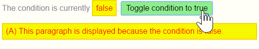

# Exercício 11

## Objetivos

* Criar a nossa própria diretiva estrutural

## Duração

30 minutos

## Preparando o ambiente

Crie uma nova aplicação chamada **exercicio-diretivas-estruturais** e deixe-a rodando:

```bash
ng new exercicio-diretivas-estruturais
cd exercicio-diretivas-estruturais
npm run start
```

O comando `npm run start` iniciará um servidor local para desenvolvimento em "_watch mode_", ou seja, qualquer edição nos arquivos, irá recompilar e recarregar a aplicação no browser. Acesse sua app no endereço local: [http://localhost:4200/](http://localhost:4200/).

## Escrevendo uma diretiva estrutural

Nessa seção, você irá escrever a diretiva estrutural `UnlessDirective`, que faz o oposto da diretiva `NgIf`. A `NgIf` exibe o conteúdo do template quando a condição é `true`. A diretiva `UnlessDirective` irá exibir o conteúdo quando a condição é `false`.

```html
<p *appUnless="condition">Mostre esse texto somente se a condição for falsa.</p>
```

Criar uma diretiva é similar a criar um componente.

* Importe o decorador `Directive ` (ao invés do decorador `Component`).
* Importe os símbolos `Input`, `TemplateRef`, e `ViewContainerRef`; você irá precisar deles para escrever uma diretiva estrutural.
* Aplique o decorador à classe da diretiva.
* Especifique o seletor que irá identificar a diretiva.

Você pode começar como abaixo:

```javascript
import { Directive, Input, TemplateRef, ViewContainerRef } from '@angular/core';

@Directive({ selector: '[appUnless]'})
export class UnlessDirective {
}
```

O seletor da diretiva é tipicamente o nome da diretiva entre colchetes (`[appUnless]`, por exemplo). Os colchetes indicam que o **seletor CSS** é um **atributo** HTML (ao invés de um elemento HTML).

O nome da diretiva deve seguir o padrão **lowerCamelCase** e começar com um prefixo. Não use o prefixo `ng`, pois ele já pertence ao Angular. Escolha um prefixo curto e que se encaixe com você ou com sua empresa. Nesse exemplo, o prefixo é `app`.

O nome da diretiva termina com `Directive`, seguinte o guia de estilos do Angular.

### `TemplateRef` e `ViewContainerRef`

A nossa diretiva estrutural que estamos escrevendo irá criar uma visão (a partir do `<ng-template>` gerado pelo Angular) e inserir essa visão em um container de visão adjacente ao elemento host (no nosso exemplo, o elemento host é o `<p>`).

Você adquire o conteúdo do `<ng-template>` a partir de um `TemplateRef` e acessa o container de visão a partir de um `ViewContainerRef`.

Os dois são injetados no construtor da diretiva como propriedades privadas da classe.

```javascript
constructor(
  private templateRef: TemplateRef<any>,
  private viewContainer: ViewContainerRef) { }
```

### A propriedade `appUnless`

O elemento host espera fazer um binding com os valores `true`/`false` na diretiva `[appUnless]`. Isso significa que a diretiva precisa de uma propriedade `appUnless`, decorada com `@Input`.

```javascript
@Input() set appUnless(condition: boolean) {
  if (!condition && !this.hasView) {
    this.viewContainer.createEmbeddedView(this.templateRef);
    this.hasView = true;
  } else if (condition && this.hasView) {
    this.viewContainer.clear();
    this.hasView = false;
  }
}
```

O Angular seta a propriedade `appUnless` toda vez que a condição é modificada. Como precisamos executar uma lógica quando há uma mudança, criamos um método setter para a propriedade `appUnless`.

* Se a condição é falsa e a visão não foi criada anteriormente, a diretiva cria a visão a partir do template e a adiciona ao container de visão.
* Se a condição é verdadeira e a visão está sendo exibida, a diretiva limpa o container de visão, o que também destrói a visão criada anteriormente.

Ninguém lê a propriedade `appUnless`, por isso, não precisamos de um método getter.

O código completo da diretiva é como abaixo:

```javascript
import { Directive, Input, TemplateRef, ViewContainerRef } from '@angular/core';

/**
 * Adiciona o conteúdo do template ao DOM somente se a condição for falsa.
 */
@Directive({ selector: '[appUnless]'})
export class UnlessDirective {
  private hasView = false;

  constructor(
    private templateRef: TemplateRef<any>,
    private viewContainer: ViewContainerRef) { }

  @Input() set appUnless(condition: boolean) {
    if (!condition && !this.hasView) {
      this.viewContainer.createEmbeddedView(this.templateRef);
      this.hasView = true;
    } else if (condition && this.hasView) {
      this.viewContainer.clear();
      this.hasView = false;
    }
  }
}
```

Adicione essa diretiva ao array `declarations` do `AppModule`.

E, então, crie um template HTML para testá-la.

```html
<h2 id="appUnless">UnlessDirective</h2>
<p>
  A condição atual é
  <span [ngClass]="{ 'a': !condition, 'b': condition, 'unless': true }">{{condition}}</span>.
  <button
    (click)="condition = !condition"
    [ngClass] = "{ 'a': condition, 'b': !condition }" >
    Alterna a condição para {{condition ? 'false' : 'true'}}
  </button>
</p>
<p *appUnless="condition" class="unless a">
  (A) Esse parágrafo é mostrado pois a condição é <strong>falsa</strong>.
</p>
 
<p *appUnless="!condition" class="unless b">
  (B) Embora a condição seja <strong>verdadeira</strong>, esse parágrafo é mostrado pois o <em>appUnless</em> é <strong>falsa</strong>.
</p>
```

Quando a condição é **falsa**, o parágrafo (A) é exibido e o parágrafo (B) desaparece.

Quando a condição é **verdadeira**, o parágrafo (A) é removido e o parágrafo (B) aparece.


Adicione o CSS abaixo no componente principal (`app.component.css`):

```css
button {
  min-width: 100px;
  font-size: 100%;
}

.box {
  border: 1px solid gray;
  max-width: 600px;
  padding: 4px;
}
.choices {
  font-style: italic;
}

code, .code {
  background-color: #eee;
  color: black;
  font-family: Courier, sans-serif;
  font-size: 85%;
}

div.code {
  width: 400px;
}

.heroic {
  font-size: 150%;
  font-weight: bold;
}

hr {
  margin: 40px 0
}

.odd {
  background-color:  palegoldenrod;
}

td, th {
  text-align: left;
  vertical-align: top;
}

p span { color: red; font-size: 70%; }

.unless {
  border: 2px solid;
  padding: 6px;
}

p.unless {
  width: 500px;
}

button.a, span.a, .unless.a {
  color: red;
  border-color: gold;
  background-color: yellow;
  font-size: 100%;
}

button.b, span.b, .unless.b {
  color: black;
  border-color: green;
  background-color: lightgreen;
  font-size: 100%;
}
```



## Revisando a estrutura da aplicação

Nesse momento, a sua aplicação deve ter a seguinte estrutura:

```
exercicio-diretivas-estruturais/
|
|-- node_modules/
|-- src/
|  |-- app/
|  |  |-- app.component.ts
|  |  |-- app.module.ts
|  |  |-- unless.directive.ts
|  |-- index.html
|  |-- main.ts
|  |-- styles.css
|  |-- ...
|-- .angular-cli.json
|-- package.json
|-- ...
```

## Resumo

Aprendemos a criar uma diretiva estrutural customizada.

## Próximo passo

[Exercício 12](exercicio-12.md)
