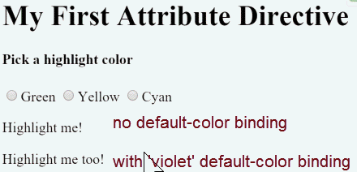

# Exercício 12

## Objetivos

* Criar a nossa própria diretiva de atributo

## Duração

45 minutos

## Preparando o ambiente

Crie uma nova aplicação chamada **exercicio-attribute-directives** e deixe-a rodando:

```bash
ng new exercicio-attribute-directives
cd exercicio-attribute-directives
npm run start
```

O comando `npm run start` iniciará um servidor local para desenvolvimento em "_watch mode_", ou seja, qualquer edição nos arquivos, irá recompilar e recarregar a aplicação no browser. Acesse sua app no endereço local: [http://localhost:4200/](http://localhost:4200/).

## Construindo uma diretiva de atributo

Diretivas de atributos são usadas como atributos de elementos.

A diretiva `NgStyle`, por exemplo, pode mudar vários estilos CSS de um elemento ao mesmo tempo.

Minimamente, uma diretiva de atributo é uma classe anotada com o decorador `@Directive`, que especifica o seletor que identifica a diretiva. A classe deve implementar o comportamento desejado para a diretiva.

Nesse exercício, vamos construir uma diretiva de atributo simples, chamada `appHighlight`, que modifica a cor de background de um elemento quando o usuário passa o mouse por cima desse elemento. 

Você pode aplicar a diretiva como a seguir:

```html
<p appHighlight>Marque me!</p>
```

### Escrevendo a diretiva

Crie o arquivo `src/app/highlight.directive.ts`:

```javascript
import { Directive, ElementRef, Input } from '@angular/core';

@Directive({ selector: '[appHighlight]' })
export class HighlightDirective {
    constructor(el: ElementRef) {
       el.nativeElement.style.backgroundColor = 'yellow';
    }
}
```

Importamos os seguintes símbolos da biblioteca Angular core:

* `Directive` provê a funcionalidade do decorador `@Directive`.
* `ElementRef` é injetado no construtor da diretiva, para que tenhamos acesso ao elemento DOM.
* `Input` permite o binding de propriedade na diretiva.

A propriedade `selector` do decorador `@Directive` identifica a diretiva no template HTML. O seletor utiliza colchetes para indicar que a diretiva é um atributo. Dessa forma, o seletor `[appHighlight]` indica que o Angular deve localizar todos os elementos no template que têm um atributo com nome `appHighlight`.

### Por que não simplesmente chamá-la `highlight`?

Apesar de o nome `highlight` funcionar e ser mais conciso do que o nome `appHighlight`, uma boa prática é sempre usar um prefixo no nome da diretiva. Isso garante que o nome da diretiva não irá conflitar com nomes de atributos padrões HTML ou até mesmo com nomes de outras diretivas customizadas.

Tenha cuidado em não usar o prefixo `ng`, porque esse é o prefixo reservado para o próprio Angular. Para o nosso exemplo, o prefixo `app` é suficiente para distinguir a nossa diretiva customizada.

Abaixo do decorador `@Directive`, vem a classe propriamente dita da diretiva, chamada `HighlightDirective`, que contém a lógica dessa diretiva. Para torná-la acessível a partir de outros componentes, exportamos a classe `HighlightDirective`.

O Angular cria uma nova instância da diretiva para cada elemento que a utiliza, injetando o `ElementRef` no construtor da classe. O `ElementRef` é um serviço que permite o acesso direto ao elemento DOM, a partir da sua propriedade `nativeElement`.

## Usando a diretiva de atributo

Para usar a nova diretiva `HighlightDirective`, crie um template e aplique a diretiva como um atributo de um elemento `<p>`. Em termos do Angular, o elemento `<p>` é o **host** da diretiva.

Escreva, então, o seguinte template no arquivo `app.component.html`:

```html
<h1>Minha primeira Diretiva de Atributo</h1>
<p appHighlight>Marque me!</p>
```

Referencie o template no `AppComponent`:

```javascript      
import { Component } from '@angular/core';

@Component({
  selector: 'app-root',
  templateUrl: './app.component.html'
})
export class AppComponent {
  color: string;
}
```

Em seguida, modifique o `AppModule` para incluir a classe `HighlightDirective` no array `declarations` do decorador `NgModule`. Dessa forma, o Angular irá reconhecer a diretiva quando encontrar um atributo `appHighlight` em um template HTML.
    
```javascript      
import { NgModule } from '@angular/core';
import { BrowserModule } from '@angular/platform-browser';
  
import { AppComponent } from './app.component';
import { HighlightDirective } from './highlight.directive';
  
@NgModule({
  imports: [ BrowserModule ],
  declarations: [
    AppComponent,
    HighlightDirective
  ],
  bootstrap: [ AppComponent ]
})
export class AppModule { }
```

Agora, quando a aplicação suibr, a diretiva `appHighlight` destaca o parágrafo como abaixo:


Em resumo, o Angular achou o atributo `appHighlight` no elemento `<p>` e criou uma instância da classe `HighlightDirective`, injetando a referência para o elemento `<p>` no construtor da diretiva, que, por sua vez, mudou a cor do background para amarelo.

## Respondendo a eventos do usuário

Nesse momento, a diretiva `appHighlight` simplesmente define a cor de um elemento. A diretiva poderia ser mais dinâmica. Ela poderia, por exemplo, detectar quando o usuário passa o mouse por cima do elemento e quando o usuário tira o mouse de cima do elemento para, em resposta a esses eventos, setar ou remover a cor de destaque do elemento.

Comece adicionando o símbolo `HostListener` à lista de símbolos importados. Adicione o símbolo `Input` também, pois iremos precisar dele em breve.

```javascript
import { Directive, ElementRef, HostListener, Input } from '@angular/core';
```

Então, adicione dois métodos com o decorador `HostListener`. Eles serão os handlers dos eventos `mouseenter` e `mouseleave`.

```javascript
@HostListener('mouseenter') onMouseEnter() {
  this.highlight('yellow');
}

@HostListener('mouseleave') onMouseLeave() {
  this.highlight(null);
}

private highlight(color: string) {
  this.el.nativeElement.style.backgroundColor = color;
}
```

O decorador `@HostListener` permite que você escute a eventos do elemento DOM que hospeda a diretiva de atributo. No nosso caso, é o elemento `<p>`.
 

Obviamente, poderia-se acessar o DOM com JavaScript padrão e anexar o observador de eventos manualmente. 
Existe pelo menos três problemas com essas abordagem.

* Você tem que escrever os observadores de eventos corretamente.
* O código deve desanexar o observador quando a diretiva for destroida para evitar vazamentos de memória.
* Conversar diretamento com a API DOM não é uma boa prática.

Os tratadores delegam a um método auxiliar a modificação da cor no elemento DOM, `el`, o qual é declarado e inicializado no construtor.

```javascript
constructor(private el: ElementRef) { }
```

Aqui está a diretiva modificada completa:

```javascript
import { Directive, ElementRef, HostListener, Input } from '@angular/core';
  
@Directive({
  selector: '[appHighlight]'
})
export class HighlightDirective {
  constructor(private el: ElementRef) { }
  
  @HostListener('mouseenter') onMouseEnter() {
    this.highlight('yellow');
  }
  
  @HostListener('mouseleave') onMouseLeave() {
    this.highlight(null);
  }
  
  private highlight(color: string) {
    this.el.nativeElement.style.backgroundColor = color;
  }
```

Execute a aplicação e veja que cor de fundo aparece quando o mouse passa sobre o `<p>` e desaparece quando ele se move fora dele.


## Passe valores para a diretiva com o `@Input`.

Nesse momento a cor de realce está fixa dentro da diretiva. Nessa se
Currently the highlight color is hard-coded within the directive. That's inflexible. Nesta seção, daremos ao desenvolvedor a possibilidade de informar a cor de realce ao usar a diretiva.

Inicie adicionando a propriedade `highlightColor` na classe da diretiva.:

```javascript      
@Input() highlightColor: string;
```

### Ligando-se a uma propriedade `@Input`

Note o decorador `@Input`. Ele adiciona metadados à classe que faz com que a propriedade `highlightColor` esteja disponivel para o *bind* de dados.

Isto é chamado uma propriedade de entrada porque os dados fluem da expressão para a diretiva. Sem o metadado `@Input` o Angular rejeitaria o *bind*; Veja abaixo mais detalhes.

Vamos adicionar ao `AppComponent` variações de uso da diretiva:

```html
<p appHighlight highlightColor="yellow">Realce em amarelo</p>
<p appHighlight [highlightColor]="'orange'">Realce em laranja</p>
```

Adicione a propriedade `color` ao `AppComponent`.

```javascript   
export class AppComponent {
  color = 'yellow';
}
```

Vamos controlar a cor de realce com um *bind* de propriedade.

```html
<p appHighlight [highlightColor]="color">Cor de realce com a propriedade color do componente pai</p>
```

Isto é bom, mas seria melhor aplicar simultaneamente a diretiva e a cor de realce no mesmo atributo. Como abaixo:    

```html
<p [appHighlight]="color">Realce me!</p>
```

O *bind* do atributo `[appHighlight]` tanto aplica a diretiva ao `<p>` como indica a cor de realce com um *bind* de propriedade. Você esta re-usando o seletor da diretiva para as duas ações. Essa é uma sintaxe concisa e compacta.

Você terá que renomear a propriedade da diretiva `highlightColor` para `appHighlight` porque essa é agora o nome da propriedade de *bind*.

```javascript
@Input() appHighlight: string;
```

Isto é desagradável. A palavra, `appHighlight`, é um nome terrível para e não representa o intento da propriedade.

### Criando um apelido para o `@Input`

Felimente você pode nomear o nome da propriedade da diretiva do que desejar e dar um apelido para ser usado no *bind*.

Restaure o nome original e especifique o seletor da diretiva com um argumento do `@Input`.

```javascript
@Input('appHighlight') highlightColor: string;
```    

Dentro da diretiva a propriedade é conhecida como `highlightColor`. Fora da diretiva, onde ele é usado, ele é conhecido como `appHighlight`.

Você consegue o melhor de ambos os mundos: O nome da propriedade que voce gostaria e a sintaxe de *bind* desejada:

```html
<p [appHighlight]="color">Realce me!</p>
```

Agora que você pode usar `highlightColor`, modifique o método `onMouseEnter()` para usá-la. Se algém não informar um valor para a cor de realce, use a cor vermelha por padrão:

```javascript
@HostListener('mouseenter') onMouseEnter() {
  this.highlight(this.highlightColor || 'red');
}
```

Versão final da diretiva.

```javascript
import { Directive, ElementRef, HostListener, Input } from '@angular/core';

@Directive({
  selector: '[appHighlight]'
})
export class HighlightDirective {

  constructor(private el: ElementRef) { }

  @Input('appHighlight') highlightColor: string;

  @HostListener('mouseenter') onMouseEnter() {
    this.highlight(this.highlightColor || 'red');
  }

  @HostListener('mouseleave') onMouseLeave() {
    this.highlight(null);
  }

  private highlight(color: string) {
    this.el.nativeElement.style.backgroundColor = color;
  }
}
```

## Write a harness to try it

Pode ser difícil imaginar como esta diretiva realmente funciona. Nesta seção, você transformará o `AppComponent` para permitir que você escolha a cor de destaque com um botão de opção e vincule sua escolha de cor à diretiva.

Modifique `app.component.html` como segue:

```html
<h1>Minha primeira Diretiva de Atributo</h1>

<h4>Selecione uma cor de marcação:</h4>
<div>
  <input type="radio" name="colors" (click)="color='lightgreen'"> Verde
  <input type="radio" name="colors" (click)="color='yellow'"> Amarela
  <input type="radio" name="colors" (click)="color='cyan'"> Ciano
</div>
<p [appHighlight]="color">Marque me!</p>
```

Altere a propriedade `AppComponent.color` para que ela não tenha um valor inicial.

```javascript
export class AppComponent {
  color: string;
}
```

Veja o uso da diretiva em ação.


## *Bind* a uma segunda propriedade

Nossa diretiva tem apenas uma propriedade parametrizada. Numa aplicação real, pode-se precisar de mais.

Atualmente, a cor *default* — a cor que é usada até que o usuário selecione uma cor — está fixa no código como "vermelha". Vamos possibilitar o desenvolvedor informar essa cor.

Adicione uma segunda propriedade a `HighlightDirective` chamada de `defaultColor`:

```javascript
@Input() defaultColor: string;
```    

Revise o método `onMouseEnter` da diretiva para que ele primeiro tente usar a cor da propriedade `highlightColor`, se ela não estiver definida tente usar a `defaultColor`, e se essa também não estiver definida use a cor "vermelha".

```javascript      
@HostListener('mouseenter') onMouseEnter() {
  this.highlight(this.highlightColor || this.defaultColor || 'red');
}
```

Como fazer o *bind* a uma segunda propriedade quando já se está usando o atributo `appHighlight`?

Assim como componentes, você pode adicionar tantas propriedades quanto você precisa. O desenvolvedor poderia escrever o seguinte código HTML para fazer o *bind* da propriedade `AppComponent.color` bem como a informar a cor 'violeta' como default..

```html
<p [appHighlight]="color" defaultColor="violet">
  Realce me também!
</p>
```

Angular sabe que o *binding* `defaultColor` pertence a `HighlightDirective` porque você a tornou pública com o decorador `@Input`.

Veja como irá funcionar quando você tiver concluído a codificão.



## Revisando a estrutura da aplicação

Nesse momento, a sua aplicação deve ter a seguinte estrutura:

```
exercicio-attribute-directives/
|
|-- node_modules/
|-- src/
|  |-- app/
|  |  |-- app.component.html
|  |  |-- app.component.ts
|  |  |-- app.module.ts
|  |  |-- highlight.directive.ts
|  |-- index.html
|  |-- main.ts
|  |-- styles.css
|  |-- ...
|-- .angular-cli.json
|-- package.json
|-- ...
```

## Resumo

Esta página mostrou como fazer:

* Construir uma diretiva de atributo que modifica o comportamento de um elemento.
* Usar a diretiva num elemento de um template HTML.
* Responder a eventos que mudam o comportamento da diretiva.
* Passar valores a uma diretiva.

## Próximo passo

[Exercício 13](exercicio-13.md)
