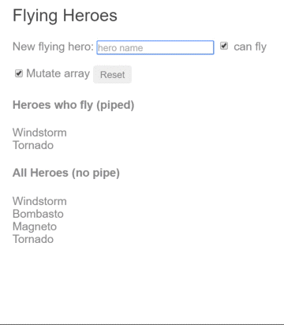

# Exercício 13

## Objetivos

- Criar o nossa próprio pipe

## Duração

30 minutos

## Preparando o ambiente

Crie uma nova aplicação chamada **exercicio-13-pipes** e deixe-a rodando:

```bash
ng new exercicio-13-pipes
cd exercicio-13-pipes
npm run start
```

O comando `npm run start` iniciará um servidor local para desenvolvimento em "_watch mode_", ou seja, qualquer edição nos arquivos, irá recompilar e recarregar a aplicação no browser. Acesse sua app no endereço local: [http://localhost:4200/](http://localhost:4200/).

## Pipes customizados

<!-- Referência: https://angular.io/guide/pipes#custom-pipes -->

Você pode criar o seu próprio pipe customizado. Abaixo temos um pipe customizado chamado `ExponentialStrengthPipe` que pode aumentar os poderes do herói:

```javascript
import { Pipe, PipeTransform } from '@angular/core';
/*
 * Aumenta o valor exponencialmente.
 *
 * Uso:
 *   value | exponentialStrength:exponent
 * Exemplo:
 *   {{ 2 | exponentialStrength:10 }}
 *   resulta em: 1024
*/
@Pipe({ name: 'exponentialStrength' })
export class ExponentialStrengthPipe implements PipeTransform {
  transform(value: number, exponent: string): number {
    const exp = parseFloat(exponent);
    return Math.pow(value, isNaN(exp) ? 1 : exp);
  }
}
```

Essa definição de pipe nos mostra o seguinte:

- Um pipe é uma **classe decorada** por pelos metadados de pipe (`@Pipe({})`).
- A classe pipe implementa o método `transform()` da interface `PipeTransform` que recebe como entrada o valor (`value`) seguido do parâmetro de exponencial (`exponent`) e retorna o valor transformado.
- Existirá um argumento adicional para o método `transform` para cada parâmetro passado ao pipe. No exemplo, o seu pipe tem apenas um parâmetro que é o `exponent`.
- Para informar ao Angular que essa classe é um pipe, você deve aplicar o _decorator_ `@Pipe`, que você deve importar da biblioteca `core` do Angular.
- O _decorator_ `@Pipe` permite você definir um nome para o pipe e esse nome será usado nos templates. Esse nome deve ser um identificador Javascript válido. Conforme o exemplo, o nome do seu pipe é `exponentialStrength`.

Agora, você precisa de um componente para demonstrar o uso do pipe.

```javascript
import { Component } from '@angular/core';

@Component({
  selector: 'power-booster',
  template: `
    <h2>Power Booster</h2>
    <p>Super poder aumentado: {{2 | exponentialStrength: 10}}</p>
  `
})
export class PowerBoosterComponent {}
```


Note o seguinte:

- Você usa o seu pipe customizado da mesma forma que os pipes nativos (_built-in pipes_).
- Você deve incluir o seu pipe nas declaração de _array_ do `AppModule`.

## Calculadora do Aumento de Poder

Não é muito divertio atualizar o template para testar o pipe customizado. Atualize o exemplo para "Calculadora do Aumento de Poder" que irá combinar o uso do pipe com _two-way data binding_ do `ngModel`.

```javascript
import { Component } from '@angular/core';

@Component({
  selector: 'power-boost-calculator',
  template: `
    <h2>Calculadora do Aumento de Poder</h2>
    <div>Poder normal: <input [(ngModel)]="power"></div>
    <div>Fator de Aumento: <input [(ngModel)]="factor"></div>
    <p>
      Supder poder do Herói: {{power | exponentialStrength: factor}}
    </p>
  `
})
export class PowerBoostCalculatorComponent {
  power = 5;
  factor = 1;
}
```


## Pipes e _change detection_

Angular procura por mudanças nos valores no _data-bind_ através de um processo de _change detection_ que executa após **cada evento de DOM**: qualquer uso do teclado, movimento do mouse, _tick_ do _timer_ (do navegador) e respostas do servidor. Isso pode ser **muito custoso**. Angular se esforça para diminuir os custos sempre que possível.

Angular usa um algoritimo simples e rápido de detecção de mudança (_change detection_) quando você usa um pipe.

### Sem pipe

No próximo exemplo, o componente usa a estratégia padrão de _change detection_ para monitorar e atualizar a tela em cada herói da lista de heróis (`heroes` _array_). Veja o template:

```html
Novo herói:
  <input type="text" #box
          (keyup.enter)="addHero(box.value); box.value=''"
          placeholder="Nome do herói">
  <button type="reset" (click)="reset()">Limpar</button>
  <div *ngFor="let hero of heroes">
    {{hero.name}}
  </div>
```

<!-- ATENÇÃO: no tutorial oficial o botão "Reset" vem sem tipo definido. Isso pode gerar problemas, pois o tipo padrão de um botão é "submit" (muito diferente de "reset", não é mesmo ;) -->

A classe complementar do comopnente provê: uma lista de heróis, um método para adicionar um herói à lista e um método para limpar a lista.

```javascript
export class FlyingHeroesComponent {
  heroes: any[] = [];
  canFly = true;

  constructor() {
    this.reset();
  }

  addHero(name: string) {
    name = name.trim();
    if (!name) {
      return;
    }
    let hero = { name, canFly: this.canFly };
    this.heroes.push(hero);
  }

  reset() {
    this.heroes = HEROES.slice();
  }
}
```

Você pode adicionar heróis e o Angular irá atualizar a tela quando você fizer isso.
Se você clicar o botão de "limpar", o Angular irá substituir a lista de heróis por um novo `array` com os heróis originais e irá atualizar a tela.
Se você adicionar a funcionalidade de remover ou alterar um herói, o Angular iria detectar essas mudanças e também iria atualizar a tela.

### FlyingHeroesPipe

Adicione o pipe `FlyingHeroesPipe` ao `*ngFor` para filtrar a lista de heróis e mostrar apenas os heróis que podem voar (`canFly=true`).

```html
<div *ngFor="let hero of (heroes | flyingHeroes)">
  {{hero.name}}
</div>
```

Aqui está a implementação do `FlyingHeroesPipe`, que segue o padrão de pipe customizado conforme descrevemos anteriormente.

```javascript
import { Pipe, PipeTransform } from '@angular/core';

import { Flyer } from './heroes';

@Pipe({ name: 'flyingHeroes' })
export class FlyingHeroesPipe implements PipeTransform {
  transform(allHeroes: Flyer[]) {
    return allHeroes.filter(hero => hero.canFly);
  }
}
```

Repare no comportamento estranho no exemplo ( [live example](https://angular.io/generated/live-examples/pipes/stackblitz.html) / [download example](https://angular.io/generated/zips/pipes/pipes.zip) ):
quando você adiciona heróis que voam, nenhum deles é apresentado na lista de "Heróis que voam"

Apesar de você não conseguir o comportamento que você queria, o Angular não está quebrado. Ele está apenas usando um algoritmo diferente de _change-detection_ que ignora as mudanças na na lista ou em qualquer de seus itens.

Repare como um herói é adicionado:

```javascript
this.heroes.push(hero);
```

Você adiciona um herói na lista de heróis (o `array`). A referência ao `array` não mudou. É o mesmo array. E é só isso que importa pro Angular agora. Partindo dessa perspectiva: mesmo `array`, sem mudanças, sem tela pra atualizar.

Para "consertar" isso, crie um novo `array` como o novo herói e atribua à lista de heróis. Dessa forma, o Angular detecta que a referência ao `array` mudou. Isso executa o `pipe` e atualiza a tela com o novo array (que contém o novo herói).

Se você modifica o _array_, nenhum _pipe_ é invocado e a tela não é atualizada. Se vocẽ substituir o _array_, o _pipe_ é executado e a tela é atualizada. A aplicação "_Flying Heroes_" estende o código com um checkbox e dois exemplos de visualização (com e sem pipe) para te ajudar a perceber esses comportamentos.



Substituindo o _array_ é uma forma eficiente de avisar ao Angular para atualizar a tela. Quando você substitui o _array_? Quando o dado mudar. Essa é uma regra fácil de seguir nesse exemplo onde a única alteração no dado é através da adição de um herói.

Porém, é bem comum você passar por situações nas quais você não sabe quando o dado foi alterado, especialmente em aplicações que alteram o dado de diferentes formas ou em locais diferentes e/ou distantes. Um componente nesse tipo de aplicação normalmente não consegue saber sobre essas mudanças. Além disso, é imprudente deformar o projeto do componente para adaptar um _pipe_. Tente manter a classe do componente independente do HTML. O componente deve desconhecer a existência dos _pipes_.

Para o filtro dos heróis que voam, considere o uso de **pipes impuros**.

## Pipes Puros e Impuros

<!-- Ref.: https://angular.io/guide/pipes#pure-and-impure-pipes -->

Existem duas categorias de pipes: puros e impuros. Pipes são puros por padrão. Todos os pipes que você viu até agora tem sido os puros. Você define um pipe como impuro adicionando uma _flag_ `pure: false` ao seu _decorator_. Você poderia definir o pipe `FlyingHeroesPipe` como impuro da seguinte forma:

```javascript
@Pipe({
  name: 'flyingHeroesImpure',
  pure: false
})
```

Antes de fazer isso, entenda a diferença entre puro e impuro - começando com um pipe puro.

### Pipes Puros

O Angular executa um pipe puro apenas quando ele detecta uma mudança "pura" no valor de entrada (_input_).
Uma mudança pura pode ser tanto uma mudança em uma entrada do "tipo primitivo" (`String`, `Number`, `Boolean`, `Symbol`) quanto uma mudança na referência ao objeto (`Date`, `Array`, `Function`, `Object`).

O Angular ignora as mudanças dentro de objetos compostos. Ou seja, o pipe puro não será executado se você: fizer uma mudança no mês de uma data, adicionar um elemento ao _array_ de entrada, ou atualizar uma propriedade de um objeto de entrada.

Isso pode parecer restritivo mas também é rápido. A verificação da referência a um objeto é muito mais rápida que uma verificação profunda (_deep check_). Então, o Angular consegue rapidamente determinar se pode pular ambas as estapas de execução de pipe e atualização da tela.

Por essa razão, pipes puros são preferíveis quando você pode conviver com a estratégia de detecção de mudanças. Quando você não consegue, você pode usar os pipes impuros.

### Pipes Impuros

O Angular executa um pipe impuro durante todo ciclo de detecção de mudança do componente. Um pipe impuro é chamado com frequência, tão frequente quanto qualquer evento de teclado ou mouse.

Com essa preocupação em mente, implemente funções impuras com muito cuidado. Um pipe custose ou de longa duração pode destruir a experiência do usuário.

### Um pipe impuro do `FlyingHeroesPipe`

Uma simples flag transforma o `FlyingHeroesPipe` em um `FlyingHeroesImpurePipe`.
A implementação completa é a seguinte:

```javascript
@Pipe({
  name: 'flyingHeroesImpure',
  pure: false
})
export class FlyingHeroesImpurePipe extends FlyingHeroesPipe {}
```

Você herda do `FlyingHeroesPipe` pra provar o ponto de que nada mudou internamente. A única diferença é a flag `pure` no metadado.

Esse é um bom candidato a função impura pois a função de transformação é trivial e rápida.

```javascript
return allHeroes.filter(hero => hero.canFly);
```

Você pode derivar o componente `FlyingHeroesImpureComponent` do `FlyingHeroesComponent`.

```html
<div *ngFor="let hero of (heroes | flyingHeroesImpure)">
  {{hero.name}}
</div>
```

A única mudança real é o _pipe_ no template. Você pode confirmar no [exemplo](https://angular.io/generated/live-examples/pipes/stackblitz.html) que a lista de heróis que voam atualiza assim que você adiciona novos heróis ou modifique um herói do _array_.


## Revisando a estrutura da aplicação

Nesse momento, a sua aplicação deve ter a seguinte estrutura:

```
exercicio-13-pipes/
|
|-- node_modules/
|-- src/
|  |-- app/
|  |  |-- app.component.html
|  |  |-- app.component.ts
|  |  |-- app.module.ts
|  |  |-- exponential-strength.pipe.ts
|  |  |-- flying-heroes-impure.component.html
|  |  |-- flying-heroes-impure.component.ts
|  |  |-- flying-heroes-impure.pipe.html
|  |  |-- flying-heroes.component.html
|  |  |-- flying-heroes.component.ts
|  |  |-- flying-heroes.pipe.ts
|  |  |-- heroes.ts
|  |  |-- power-boost-calculator.component.ts
|  |  |-- power-booster.component.ts
|  |-- index.html
|  |-- main.ts
|  |-- styles.css
|  |-- ...
|-- .angular-cli.json
|-- package.json
|-- ...
```

## Outros pipes (ainda não traduzidos)

- [AsyncPipe](https://angular.io/guide/pipes#the-impure-asyncpipe) - Ex.: `message$ | async` - Para trabalhar com Observables.
- [FetchJsonPipe](https://angular.io/guide/pipes#an-impure-caching-pipe) - Um exemplo de como usar pipes impuros para fazer cache de dados de APIs.
- [JsonPipe](https://angular.io/guide/pipes#jsonpipe) - pode ajudar no debug. Ex.: `myData | json`
- Diferente do AngularJS, o Angular (2+) não oferece pipes para filtro/ordenação no `*ngFor`. Saiba os motivos na [referência oficial](https://angular.io/guide/pipes#appendix-no-filterpipe-or-orderbypipe).


## Resumo

Pipes oferecem um ótimo jeito de encapsular e compartilhar transformações comuns de tela-valor. Use eles como estilos, aplicando em expressões do template para enriquecer recursos e usabilidade de suas telas.

Conheça os pipes embutidos do Angular acessando a [Referência da API](https://angular.io/api?type=pipe). Tente escrever pipes customizados e, quem sabe, contribuir com a comunidade.

## Próximo passo

[Exercício 14](exercicio-14.md)
