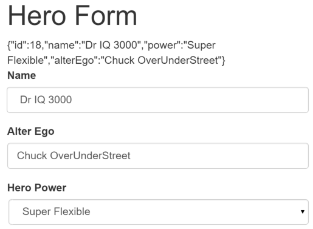

# Exercício 14

## Objetivos

* Construir um formulário com a abordagem *template-driven*, com *two-way data binding*, controle de estado e validações customizadas.

## Duração

45 minutos

## Preparando o ambiente

Crie uma nova aplicação chamada **exercicio-angular-forms** e deixe-a rodando:

```bash
ng new exercicio-angular-forms
cd exercicio-angular-forms
npm run start
```

O comando `npm run start` iniciará um servidor local para desenvolvimento em "_watch mode_", ou seja, qualquer edição nos arquivos, irá recompilar e recarregar a aplicação no browser. Acesse sua app no endereço local: [http://localhost:4200/](http://localhost:4200/).

## Introdução

Você pode construir qualquer formulário na abordagem *template-driven*: você pode fazer binding de elementos de formulários (por exemplo: `<input>`, `<select>`) ao modelo de dados da sua aplicação; você pode especificar regras de validação (e exibir os erros quando alguma regra falhar); você pode habilitar (ou desabilitar) elementos de formulários específicos condicionalmente; e muito mais. O Angular torna ese processo mais fácil, ao tratar muitas das tarefas repetitivas na construção de formulários.

Nesse exercício, iremos construir um formulário como abaixo:


Dois dos três campos desse formulário são de preenchimento obrigatório. Campos obrigatórios são marcados com uma barra verde à esquerda, para facilitar sua identificação.

Se você apagar o nome do herói, o formulário irá exibir um erro de validação:


Observe que o botão "Submit" está desabilitado, e que a cor da barra à esquerda do campo obrigatório muda de verde para vermelho.

Você irá construir esse formulário seguindo os passos:

* Criar a classe de modelo `Hero`
* Criar o componente que controla o formulário
* Criar o template inicial do formulário
* Fazer o binding entre os elementos do formulário e as propriedades do componente com `ngModel`
* Adicionar um atributo `name` para cada elemento do formulário
* Adicionar CSS para um feedback visual
* Exibir e esconder mensagens de erro de validação
* Tratar submissão de formulário com `ngSubmit`
* Desabilitar o botão de submissão do formulário até que o formulário esteja válido

## Crie a classe de modelo `Hero`

Na medida em que o usuário preenche o formulário, você irá capturar as mudanças e atualizar uma instância de um modelo de dados. Então, para criar uma estrutura inicial do formulário, precisamos saber como é a estrutura desse modelo de dados.

Uma classe de modelo pode ser simples como uma "sacola de propriedades", que guarda fatos sobre uma entidade da sua aplicação. Essa é uma boa descrição para a classe `Hero` com seus três campos obrigatórios (`id`, `name` e `power`) e um campo opcional (`alterEgo`).

Usando o Angular CLI, gere uma nova classe chamada `Hero`:

```bash
ng generate class Hero
```

O conteúdo da classe deve ser como abaixo:

```javascript
export class Hero {

  constructor(
    public id: number,
    public name: string,
    public power: string,
    public alterEgo?: string
  ) {  }

}
```

É um modelo anêmico, com poucos requisitos e nenhum comportamento. Perfeito para o nosso exercício.

O compilador TypeScript gera uma propriedade pública para cada um dos parâmetros públicos do construtor, e automaticamente atribui o valor do parâmetro à propriedade correspondente.

O parâmetro `alterEgo` é opcional, então o construtor permite que você omita esse parâmetro na construção de uma nova instância (note o ponto de interrogação "?" no parâmetro `alterEgo?`)

Você pode, então, criar um novo herói na seguinte forma:

```javascript
const myHero =  new Hero(42, 'SkyDog', 'Fetch any object at any distance', 'Leslie Rollover');
console.log('My hero is called ' + myHero.name); // "My hero is called SkyDog"
```

## Crie o componente que controla o formulário

Um formulário Angular possui duas partes: um template (baseado em HTML) e uma classe de componente para tratar os dados do formulário e a interação do usuário programaticamente.

Usando o Angular CLI, gere um novo componente chamado `HeroForm`:

```bash
ng generate component HeroForm
```

O conteúdo deve ser o seguinte:

```javascript
import { Component } from '@angular/core';

import { Hero }    from '../hero';

@Component({
  selector: 'app-hero-form',
  templateUrl: './hero-form.component.html',
  styleUrls: ['./hero-form.component.css']
})
export class HeroFormComponent {

  powers = ['Really Smart', 'Super Flexible',
            'Super Hot', 'Weather Changer'];

  model = new Hero(18, 'Dr IQ', this.powers[0], 'Chuck Overstreet');

  submitted = false;

  onSubmit() { this.submitted = true; }

  // TODO: remover isso when we're done
  get diagnostic() { return JSON.stringify(this.model); }
}
```

Não há nada de especial sobre esse componente; nada relacionado a formulários e nada que o diferencie dos outros componentes que já escrevemos em exercícios anteriores.

Já cobrimos os seguintes conceitos anteriormente:

* O código importa a biblioteca `@angular/core` e a classe `Hero` que acabamos de criar.
* O seletor `hero-form` do decorador `@Component` significa que você pode usar esse componente em um template com a tag customizada `<hero-form>`.
* A propriedade `templateUrl` aponta para um arquivo separado do template HTML.
* Definimos dados de teste para o `model` e `powers`, para facilitar a demonstração.
* Adicionamos uma propriedade de diagnóstico para retornar a representação JSON do modelo. Ela irá nos ajudar durante a construção do formulário, mas pode ser apagada posteriormente.

## Revise o arquivo `app.module.ts`

O arquivo `app.module.ts` define o módulo raiz da aplicação. Nesse módulo, você identifica os módulos externos que você irá usar na sua aplicação e declara os componentes que pertencem ao seu módulo, tal como o `HeroFormComponent`.

Para utilizar as diretivas específicas de formulários na abordagem *template-driven*, você precisa adicionar o módulo `FormsModule` (da biblioteca `@angular/forms`) ao array `imports` do módulo da sua aplicação.

Atualize o arquivo `app.module.ts` como a seguir:

```javascript
import { NgModule }      from '@angular/core';
import { BrowserModule } from '@angular/platform-browser';
import { FormsModule }   from '@angular/forms';

import { AppComponent }  from './app.component';
import { HeroFormComponent } from './hero-form/hero-form.component';

@NgModule({
  imports: [
    BrowserModule,
    FormsModule
  ],
  declarations: [
    AppComponent,
    HeroFormComponent
  ],
  providers: [],
  bootstrap: [ AppComponent ]
})
export class AppModule { }
```

São duas alterações:

* Você importou o símbolo `FormsModule`.
* Você adicionou o `FormsModule` à lista de `imports` definida no decorador `@NgModule`. Isso dá à aplicação o acesso a todas as funcionalidades de formulários da abordagem *template-driven* (incluindo a diretiva `ngModel`).

## Revise o arquivo `app.component.html`

O componente `AppComponent` é o componente raiz da aplicação. Ele irá usar o novo componente `HeroFormComponent`.

Troque o conteúdo do template do `AppComponent` pelo seguinte:

```html
<app-hero-form></app-hero-form>
```

## Crie o template inicial do formulário

Modifique o conteúdo do arquivo `hero-form.component.html` para ficar como abaixo:

```html
<div class="container">
    <h1>Hero Form</h1>
    <form>
      <div class="form-group">
        <label for="name">Nome</label>
        <input id="name" type="text" class="form-control" required>
      </div>

      <div class="form-group">
        <label for="alterEgo">Alter Ego</label>
        <input id="alterEgo" type="text" class="form-control">
      </div>

      <button type="submit" class="btn btn-success">Submit</button>

    </form>
</div>
```

Estamos usando HTML5 puro. Estamos representando dois dos campos da classe de modelo `Hero` (`name` e `alterEgo`) como elementos `<input>`.

O elemento `<input>` para a propriedade `name` possui o atributo HTML `required`; o elemento `<input>` para a propriedade `alterEgo` não possui esse atributo, pois ele é opcional.

Ao final do formulário, adicionamos o botão do tipo `submit`.

Perceba que você não está usando nada do Angular ainda. Não há bindings ou diretivas extras, somente layout.

As classes CSS `container`, `form-group`, `form-control` e `btn` são da biblioteca [Bootstrap](https://www.getbootstrap.com/). Essas classes são puramente visuais, e não afetam o **funcionamento** do formulário de nenhuma forma.

Para adicionar a folha de estilos do Bootstrap, abra o arquivo `styles.css` e adicione a seguinte linha:

```css
@import url('https://unpkg.com/bootstrap@3.3.7/dist/css/bootstrap.min.css');
```


!!! success "DICA: bootstrap"

    A forma descrita acima **não é** recomendada para projetos reais.
    O melhor jeito de instalar o bootstrap em projetos angular está descrito na [wiki do Angular CLI](https://github.com/angular/angular-cli/wiki/stories-include-bootstrap).


## Adicione poderes com `*ngFor`

O herói precisa escolher um super-poder a partir de uma lista fixa de poderes pré-aprovados pela Agência de RH. Você mantém essa lista internamente no `HeroFormComponent`.

Você vai adicionar um `<select>` ao formulário e fazer o binding das opções com a lista de super-poderes usando a diretiva `ngFor`. Já vimos como fazer isso em um exercício anterior, então adicione o seguinte trecho HTML abaixo do `form-group` para a propriedade `alterEgo`:

```html
<div class="form-group">
  <label for="power">Hero Power</label>
  <select id="power" class="form-control" required>
    <option *ngFor="let pow of powers" [value]="pow">{{pow}}</option>
  </select>
</div>
```

Esse código repete a tag `<option>` para cada poder na lista de super-poderes. A variável de template `pow` guarda um poder diferente em cada iteração; você exibe o nome do super-poder usando a sintaxe de interpolação (`{{pow}}`).

## **Two-way data binding** com `ngModel`

Se você rodar a aplicação agora, verá algo como:


Ainda não estamos vendo os dados do herói que definimos no componente, pois não fizemos os bindings dos elementos HTML com a propriedade `hero` do componente.

Para fazer o binding dos elementos do formulário com o modelo de dados, vamos usar a sintaxe `[(ngModel)]`.

Modifique o `<input>` para o nome do herói como abaixo:

```html
<input type="text" id="name" name="name" required class="form-control"
       [(ngModel)]="model.name">
TODO: remover isso: {{model.name}}
```

Defina uma variável de template para o formulário. Atualize a tag `<form>` com `#heroForm="ngForm"` como abaixo:

```html
<form #heroForm="ngForm">
```

A variável `heroForm` agora é uma referência para a diretiva `NgForm` que governa o formulário como um todo.

## A diretiva `NgForm`

O Angular automaticamente cria e liga uma diretiva `NgForm` ao elemento `<form>`.

A diretiva `NgForm` é um "suplemento" ao elemento de formulário, adicionando novas funcionalidades, guardando a referência dos controles que você criou para os elementos HTML com a diretiva `ngModel`, monitorando as propriedades e o status de validação desses controles, e o status de validação do formulário como um todo.

Se você rodar a aplicação agora e começar a digitar no campo do nome do herói, adicionando e removendo caracteres, você irá ver o resultado na mensagem de diagnóstico:


O diagnóstico é uma evidência de que as mudanças nos valores do `<input>` estão atualizando o modelo, e vice-versa. Isso é o *two-way data binding*.

Note que você também adicionou um atributo `name` ao elemento `<input>` com o valor `"name"`. A definição desse atributo é um pré-requisito quando você usa a diretiva `[(ngModel)]` em um formulário.

Internamente, para cada elemento HTML com `[(ngModel)]`, o Angular cria uma instância do tipo `FormControl` e a registra à diretiva `NgForm`, usando o nome definido no atributo `name`.

Adicione, agora, bindings `[(ngModel)]` para o `alterEgo` e `power`. O formulário deve ser algo como:

```html
{{diagnostic}}
<div class="form-group">
  <label for="name">Nome</label>
  <input id="name" name="name"
         type="text" class="form-control"
         required
         [(ngModel)]="model.name">
</div>

<div class="form-group">
  <label for="alterEgo">Alter Ego</label>
  <input id="alterEgo" name="alterEgo"
         type="text" class="form-control"
         [(ngModel)]="model.alterEgo">
</div>

<div class="form-group">
  <label for="power">Hero Power</label>
  <select id="power" name="power"
          class="form-control"
          required
          [(ngModel)]="model.power">
    <option *ngFor="let pow of powers" [value]="pow">{{pow}}</option>
  </select>
</div>
```

Note que:

* Substituímos a mensagem de diagnóstico específica para o nome do herói, por uma mensagem de diagnóstico "global", que serve para todo o modelo.
* Cada elemento `<input>` tem uma propriedade `id` que é usada pelo elemento `<label>`.
* Cada elemento `<input>` tem uma propriedade `name` que é obrigatória para a construção de formulários com a diretiva `ngModel`.

Execute a aplicação novamente e verifique as mudanças ao modelo do herói:



A mensagem de diagnóstico no topo do formulário confirma que todas as suas mudanças são refletidas no modelo. Se quiser, você já pode apagar o binding `{{diagnostic}}`, pois ele já serviu o seu propósito.

## Mantendo controle do estado e da validação com `ngModel`

Ao usar a diretiva `ngModel` em um formulário, você ganha mais do que somente o *two-way data binding*. 

A diretiva não só controla o estado do elemento, mas também adiciona (e remove) classes CSS especiais que refletem o estado do elemento. Você pode usar essas classes CSS para modificar a aparência do elemento:

Estado | `true` | `false`
-- | -- | --
O controle foi visitado? | `ng-touched` | `ng-untouched`
O valor do controle foi modificado? | `ng-dirty` | `ng-pristine`
O valor do controle é válido? | `ng-valid` | `ng-invalid`

Temporariamente, adicione uma variável de referência (`#spy`) para inspecionar as classes CSS do elemento `<input>` do nome do herói como abaixo:

```html
<input type="text" class="form-control" id="name"
  required
  [(ngModel)]="model.name" name="name"
  #spy>
<br>TODO: remover isso: {{spy.className}}
```

Agora, execute a aplicação e siga precisamente os seguintes passos:

1. Olhe o formulário e não toque em nada.
2. Clique dentro do `<input>` do nome do herói e então clique fora do `<input>`.
3. Adicione barras (`/`) ao final do nome.
4. Apague o nome.

O efeito esperado é como abaixo:


Você deve ver as seguintes transições nas classes CSS:


O par `ng-valid`/`ng-invalid` é o mais interessante, porque você quer mostrar um feedback visual para quando os valores estiverem inválido. Você também quer marcar os campos obrigatórios. Para criar esse feedback, vamos adiciona regras para as classes CSS `ng-*`.

Se quiser, você pode apagar a variável de referência `#spy`, pois ela já serviu o seu propósito.

## Adicione CSS para feedback visual

Queremos marcar os elementos do formulário de acordo com o estado e o status da validação, como abaixo:


Para conseguir esse efeito, crie um novo arquivo `forms.css` na pasta `src/assets` com o seguinte conteúdo:

```css
.ng-valid[required], .ng-valid.required  {
  border-left: 5px solid #42A948; /* green */
}

.ng-invalid:not(form)  {
  border-left: 5px solid #a94442; /* red */
}
```

Atualize o `<head>` do arquivo `index.html` para incluir o arquivo `forms.css`.

```html
<link rel="stylesheet" href="assets/forms.css">
```

## Exibindo mensagens de erro de validação

Você pode melhorar esse formulário.

O `<input>` para o nome do herói é obrigatório e, se você apagar o seu conteúdo, a barra muda de verde para vermelho. Isso mostra que algo está errado, mas não diz exatamente o que o usuário deve fazer para consertar o erro.

Quando o usuário apagar o nome, o formulário deveria mostrar uma mensagem como abaixo:


Para fazer isso, siga os seguintes passos:

* Adicione uma variável de referência para o `<input>`
* Adicione um novo elemento `<div>` com a mensagem `O campo "nome" é obrigatório` logo abaixo do `<input>`. Esse novo `<div>` só deve ser exibido quando o controle estiver inválido.

O template, então, deverá ser algo como:

```html
<label for="name">Nome</label>
<input type="text"
       id="name" name="name"
       required
       class="form-control"
       [(ngModel)]="model.name"
       #name="ngModel">
<div [hidden]="name.valid || name.pristine"
     class="alert alert-danger">
  O campo "nome" é obrigatório
</div>
```

Para acessar o controle associado ao `<input>`, você precisa de uma variável de referência. Aqui, você criou a variável de referência `name` e atribuiu o valor `ngModel` (`#name="ngModel"`).

Por que `"ngModel"`? A propriedade `exportAs` de uma diretiva define como fazer o link entre uma variável de referência para a diretiva. O valor da propriedade `exportAs` da diretiva `ngModel` é também `ngModel`.

Você controla a visibilidade da mensagem de erro com um binding entre a propriedade `hidden` do `<div>` e as propriedades `valid` e `pristine` da variável de referência `name`.

```html
<div [hidden]="name.valid || name.pristine"
     class="alert alert-danger">
```

Nesse exemplo, você esconde a mensagem de erro se o controle estiver válido (`valid`) ou "limpo" (`pristine`). O estado _pristine_ signifca que o usuário ainda não modificou o valor do controle.

A experiência do usuário é uma decisão do desenvolvedor. Se você ignorar o estado `pristine`, a mensagem de erro de validação só seria escondida quando o controle estivesse válido. Se você chegar nesse componente com um novo herói (vazio) ou um herói inválido, você iria ver a mensagem de erro imediatamente, antes de fazer qualquer coisa.

A propriedade `alterEgo` do herói é opcional. Não há nada para fazer com o elemento `<input>` associado.

A seleção do super-poder é obrigatória. Você pode adicionar a mesma lógica de tratamento de erro para o elemento `<select>` se você quiser, mas não é obrigatório, já que o próprio elemento `<select>` se encarrega de exibir somente opções de poderes válidos.

Agora, você irá adicionar um novo herói nesse formulário. Inclua um novo botão ao final do formulário como abaixo:

```html
<button type="button" class="btn btn-default" (click)="newHero()">Novo Herói</button>
```

O botão faz um binding do evento `click` com o método `newHero()`. Adicione, então o novo método ao componente:

```javascript
newHero() {
  this.model = new Hero(42, '', '');
}
```

Execute a aplicação novamente e clique no botão "Novo Herói". O formulário é limpado. Os campos obrigatórios são marcados em vermelho, como esperado. As mensagens de erro estão escondidas porque o formulário está _pristine_, já que você não mudou nenhum elemento do formulário (mudamos somente o modelo de dados).

Agora, informe um nome qualquer e clique no botão "Novo Herói" novamente. Agora, a aplicação exibe a mensagem de nome obrigatório. Você não quer mensagens de erro quando criamos um novo herói (vazio). Por que a aplicação está exibindo o erro?

Inspecionar o elemento nas ferramentas do desenvolvedor do navegador irá revelar que o `<input>` associado ao nome do herói não está mais _pristine_. O formulário "lembra" que você informou um nome antes de clicar no botão "Novo Herói". Trocar o objeto `hero` não restaurou o estado _pristine_ do controle.

Você precisa restaurar o estado imperativamente, o que você pode fazer chamando o método `reset()` do formulário após a chamada ao método `newHero()`:

```html
<button type="button" class="btn btn-default" (click)="newHero(); heroForm.reset()">Novo Herói</button>
```

Agora, ao clicar no botão "Novo Herói", tanto o formulário quanto o estado do formulário são resetados.

## Submetendo o formulário com `ngSubmit`

Após preencher o formulário, o usuário deve poder submetê-lo.

O botão "Submit" ao final do formulário não faz nada por si só. No entanto, como é um botão de submissão (`type="submit"`), ao ser clicado, ele irá disparar a submissão do formulário.

A submissão do formulário, nesse momento, não faz nada. Para fazer alguma coisa, crie um binding ligando o evento `ngSubmit` com o método `onSubmit()` do componente:

```html
<form (ngSubmit)="onSubmit()" #heroForm="ngForm">
```

Para desabilitar o botão de submissão enquanto o formulário como um todo estiver inválido, vamos usar a variável de referência `#heroForm` que definimos anteriormente. O código é o seguinte:

```html
<button type="submit" class="btn btn-success" [disabled]="!heroForm.form.valid">Submit</button>
```

Se você rodar a aplicação agora e apagar o nome do herói, você irá violar a regra `required` do elemento `<input>` (o que fica visualmente claro por conta da mensagem de erro de validação), e o botão "Submit" irá ser desabilitado.

## Revisando a estrutura da aplicação

Nesse momento, a sua aplicação deve ter a seguinte estrutura:

```
exercicio-angular-forms/
|
|-- node_modules/
|-- src/
|  |-- app/
|  |  |-- hero-form/
|  |  |  |-- hero-form.component.css
|  |  |  |-- hero-form.component.html
|  |  |  |-- hero-form.component.ts
|  |  |  app.component.css
|  |  |  app.component.html
|  |  |  app.component.ts
|  |  |  app.module.ts
|  |  |  hero.ts
|  |-- assets/
|  |  |-- forms.css
|  |-- index.html
|  |-- main.ts
|  |-- styles.css
|  |-- ...
|-- .angular-cli.json
|-- package.json
|-- ...
```

## Resumo

Nesse exercício, aprendemos a:

* Construir um template de formulário na abordagem _template-driven_.
* Usar a sintaxe `[(ngModel)]` para *two-way data binding*.
* Usar classes CSS especiais para prover um feedback visual sobre a validação dos elementos de formulário.
* Usar variáveis de referência de template para inspecionar e usar propriedades dos elementos de formulário.
* Habilitar/desabilitar o botão de submissão do formulário de acordo com o status de validação do formulário.
* Tratar a submissão do formulário.

## Próximo passo

[Exercício 15](exercicio-15.md)
