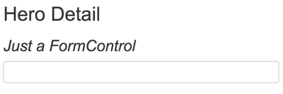
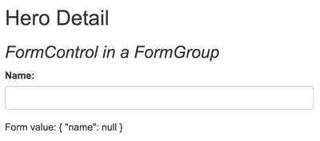
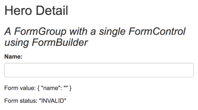
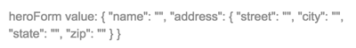
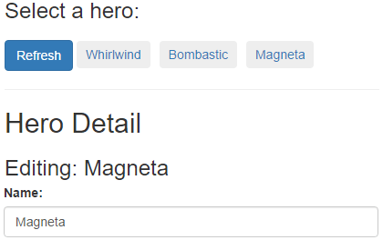
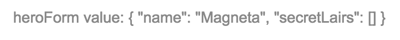
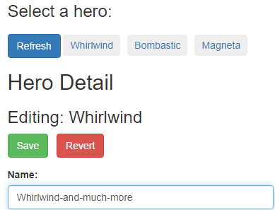

# Exercício 15

## Objetivos

* Construir um formulário com a abordagem *reactive*, com *two-way data binding*, controle de estado e validações customizadas.

## Duração

45 minutos

## Preparando o ambiente

Crie uma nova aplicação chamada **exercicio-angular-reactive-forms** e deixe-a rodando:

```bash
ng new exercicio-angular-reactive-forms
cd exercicio-angular-reactive-forms
npm run start
```

O comando `npm run start` iniciará um servidor local para desenvolvimento em "_watch mode_", ou seja, qualquer edição nos arquivos, irá recompilar e recarregar a aplicação no browser. Acesse sua app no endereço local: [http://localhost:4200/](http://localhost:4200/).

## Introdução

O Angular oferece duas abordagens para a construção de formulários: a abordagem *reactive* e a abordagem *template-driven*. As duas tecnologias pertencem à biblioteca `@angular/forms` e compartilham um conjunto comum de classes de controle de formulários.

No entanto, elas divergem na filosofia, no estilo e na técnica de programação. Elas até tem seus módulos distintos: o `ReactiveFormsModule` (abordagem *reactive*) e o `FormsModule` (abordagem *template-driven*).

### A abordagem `reactive`

A abordagem *reactive* facilita o uso do estilo de programação "reativo", que favorece o controle explícito do fluxo de dados entre um modelo de dados não-UI (geralmente, recuperados a partir de um servidor backend), e um modelo de dados de formulários orientado à UI (que retém os estados e valores dos controles HTML da tela). A abordagem *reactive* facilita, então, a implementação, os testes e as validações nesse padrão de programação "reativo".

Nos formulários reativos, você cria, na classe do seu componente, uma árvore de objetos de controle de formulários (ex: `FormControl`), fazendo o binding desses objetos com os elementos nativos HTML de controle de formulários (ex: `<input>`, `<form>`) no template do componente.

Você cria e manipula os objetos de controle de formulários diretamente na classe do seu componente. Como o componente tem acesso imediato tanto ao modelo de dados quanto ao modelo de formulário, você pode atualizar os valores do modelo de formulário a partir do modelo de dados e vice-versa.

Seguindo o paradigma reativo de programação, o componente preserva a imutabilidade do modelo de dados, tratando-o como uma fonte de valores "originais" e imutáveis. Ao invés de atualizar o modelo de dados diretamente, o componente extrai as mudanças do usuário e as direciona para um componente ou um serviço externo, que, por sua vez, faz alguma coisa com esses dados (por exemplo: "salva" os dados), retornando um novo estado do modelo de dados que reflete essas mudanças.

Usar as diretivas da abordagem *reativa* não obriga você a seguir todos os princípios desse padrão de programação; a ideia é facilitar a implementação de seus componentes caso você opte por usar esse paradigma.

### A abordagem *template-driven*

Os formulários *template-driven* tem uma abordagem completamente diferente.

* Você faz um binding dos controle de formulários nativos HTML (como o `<input>` e o `<select>`) no template diretamente com o modelo de dados no componente, usando diretivas como o `ngModel`.
* Você não cria objetos de controle de formulários no seu componente (como o `FormControl`). As diretivas Angular vão criar esses objetos para você automaticamente.
* Você não atualiza os valores do modelo de formulários explicitamente. A diretiva `ngModel` faz isso para você.
* O Angular atualiza o modelo de dados (que é mutável) na medida em que as mudanças acontecem (como, por exemplo, quando o usuário digita um valor em um `<input>`).

Em outras palavras, o controle do fluxo de dados entre o modelo de dados e o modelo de formulário é feito pelo próprio Angular. Isso significa que você vai escrever menos código, mas isso pode complicar o desenvolvimento de cenários mais complexos.

### Qual abordagem é a melhor?

**Nenhuma** das duas abordagens é a melhor. As duas técnicas representam paradigmas diferentes, com suas próprias forças e fraquezas. Escolha a abordagem que é melhor para você. Você pode até escolher usar as duas abordagens na mesma aplicação.

## Crie um modelo de dados

O objetivo desse exercício é criar um componente para a edição de um herói usando a abordagem *reactive*. Para isso, vamos precisar de uma classe que representa o herói e de alguns dados para edição.

Usando o Angular CLI, gere uma nova classe com o nome `data-model`:

```bash
ng generate class data-model
```

Copie o conteúdo abaixo:

```javascript
export class Hero {
  id = 0;
  name = '';
  addresses: Address[];
}

export class Address {
  street = '';
  city   = '';
  state  = '';
  zip    = '';
}

export const heroes: Hero[] = [
  {
    id: 1,
    name: 'Whirlwind',
    addresses: [
      {street: '123 Main',  city: 'Anywhere', state: 'CA',  zip: '94801'},
      {street: '456 Maple', city: 'Somewhere', state: 'VA', zip: '23226'},
    ]
  },
  {
    id: 2,
    name: 'Bombastic',
    addresses: [
      {street: '789 Elm',  city: 'Smallville', state: 'OH',  zip: '04501'},
    ]
  },
  {
    id: 3,
    name: 'Magneta',
    addresses: [ ]
  },
];

export const states = ['CA', 'MD', 'OH', 'VA'];
```

Esse arquivo exporta duas classes e duas constantes. As classes `Address` e `Hero` definem o modelo de dados da aplicação. As constantes `heroes` e `states` fornecem dados para os testes.

## Crie o componente 

Gere um novo componente chamado `HeroDetail`:

```bash
ng generate component HeroDetail
```

Inclua o `import` abaixo:

```javascript
import { FormControl } from '@angular/forms';
```

Em seguida, atualize o `HeroDetailComponent` incluindo um `FormControl`. `FormControl` é uma diretiva que permite a criação e a gestão de instâncias de objetos de controle de formulários diretamente.

```javascript
export class HeroDetailComponent1 {
  name = new FormControl();
}
```

Nesse trecho, você está criando uma propriedade do tipo `FormControl` com o nome `name`. Logo mais, iremos fazer um binding dessa propriedade com um elemento HTML `<input>` no template do componente.

O construtor de um `FormControl` aceita três parâmetros (opcionais): o valor inicial do objeto, um array de validadores e um array de validadores assíncronos.

No nosso exemplo, o objeto não possui dados iniciais nem validações. No entanto, em aplicações reais, a maioria dos controles de formulários possuem ambos.

## Crie o template

Agora, atualize o template do componente como abaixo:

```html
<h2>Hero Detail</h2>
<h3><i>Just a FormControl</i></h3>
<label class="center-block">Name:
  <input class="form-control" [formControl]="name">
</label>
```

Para avisar ao Angular que esse é o input que você quer associar ao `FormControl` que criamos no componente, você precisa usar o binding `[formControl]="name"`.

> **Observação**:
>
> A classe CSS `form-control` pertence à biblioteca [Bootstrap](https://getbootstrap.com/) (e não ao Angular), e serve somente para definir estilos do `<input>`, sem nenhum impacto sobre a lógica do formulário.

## Importe o módulo `ReactiveFormsModule`

O template do componente `HeroDetailComponent` usa a diretiva `formControlName` do módulo `ReactiveFormsModule`.

Atualize, então, o `app.module.ts` como abaixo:

* Adicione um `import` JavaScript para usar o simbolo `ReactiveFormsModule`.
* Adicione o módulo `ReactiveFormsModule` na lista de imports do módulo `AppModule`.

```javascript
import { NgModule }            from '@angular/core';
import { BrowserModule }       from '@angular/platform-browser';
import { ReactiveFormsModule } from '@angular/forms';  // <-- #1 import module

import { AppComponent }        from './app.component';
import { HeroDetailComponent } from './hero-detail/hero-detail.component'; // <-- #1 import component

@NgModule({
  imports: [
    BrowserModule,
    ReactiveFormsModule // <-- #2 add to @NgModule imports
  ],
  declarations: [
    AppComponent,
    HeroDetailComponent,
  ],
  bootstrap: [ AppComponent ]
})
export class AppModule { }
```

## Exiba o componente `HeroDetailComponent`

Modifique o template do `AppComponent` para exibir o componente `HeroDetailComponent`.

```html
<div class="container">
  <h1>Reactive Forms</h1>
  <app-hero-detail></app-hero-detail>
</div>
```

### Classes de formulário essenciais

Leia um pouco sobre as classes de formulário essenciais da biblioteca `@angular/forms`:

Nome | Descrição
-- | --
`AbstractControl` | É a classe abstrata base para as classes concretas: `FormControl`, `FormGroup` e `FormArray`. Provê propriedades e comportamentos comuns às três classes.
`FormControl` | Gerencia o valor e validação de um controle de formulário individual. Corresponde a um elemento de formulário HTML (como um `<input> `ou um `<select>`, por exemplo).
`FormGroup` | Gerencia o valor e validação de um grupo de instâncias do tipo `AbstractControl`. Dentre as propriedades do grupo, são incluídos os controles "filhos".
`FormArray` | Gerencia o valor e validação de um array (indexado numericamente) de instâncias do tipo `AbstractControl`.

Vamos aprender mais sobre elas no decorrer desse exercício.

### Adicione estilos do Bootstrap

No template dos componentes `AppComponent` e `HeroDetailComponent`, nós usamos classes CSS da biblioteca Bootstrap. Adicione, então, as folhas de estilo CSS do Bootstrap ao arquivo `styles.css` como abaixo:

```css
@import url('https://unpkg.com/bootstrap@3.3.7/dist/css/bootstrap.min.css');
```

Agora que o CSS está configurado, o navegador deve exibir algo como:



## Adicione um `FormGroup`

Normalmente, se você possui múltiplos `FormControl`s, você os registra dentro de um `FormGroup` pai. Para criar um `FormGroup`, adicione o `import` abaixo ao arquivo `hero-detail.component.ts`:

```javascript
import { Component }              from '@angular/core';
import { FormControl, FormGroup } from '@angular/forms';
```    

Na classe, empacote o `FormControl` dentro do `FormGroup` (de nome `heroForm`) como a seguir:

```javascript
export class HeroDetailComponent {
  heroForm = new FormGroup ({
    name: new FormControl()
  });
}
```

Agora que você modificou a classe do componente, precisamos refatorar o template. Troque o conteúdo do arquivo `hero-detail.component.html` pelo seguinte:

```html
<h2>Hero Detail</h2>
<h3><i>FormControl in a FormGroup</i></h3>
<form [formGroup]="heroForm" novalidate>
  <div class="form-group">
    <label class="center-block">Name:
      <input class="form-control" formControlName="name">
    </label>
  </div>
</form>
```    

Note que o `<input>` está dentro de um elemento `<form>`.

> **Observação**:
> 
> O atributo `novalidate` do elemento `<form>` previne que o navegador tente fazer validações nativas do HTML

A diretiva `formGroup` é uma diretiva do módulo `ReactiveFormsModule` que recebe uma instância do tipo `FormGroup` e o associa a um elemento HTML. Nesse caso, a diretiva associa o `heroForm` que criamos no componente ao elemento `<form>`.

Agora que o `FormControl` faz parte de um `FormGroup`, é preciso usar a sintaxe `formControlName="name"` para associar o `FormControl` ao elemento HTML `<input>`. Essa sintqxe indica que o objeto de controle de formulário (isto é, o `FormControl`) deve ser procurado dentro do `FormGroup` pai do elemento (nesse caso, o `heroForm`).

> **Observação**:
>
> Assim como a classe CSS `form-control`, a classe CSS `form-group` pertence à biblioteca [Bootstrap](https://getbootstrap.com/) (e não ao Angular), e serve somente para definir estilos do `<form>`, sem nenhum impacto sobre a lógica do formulário.

Ok, o formulário está estiloso. Mas, para onde vai o valor informado pelo usuário no `<input>`?

## O modelo do formulário

O valor informado pelo usuário é guardado no **modelo do formulário** por trás do `FormControl`.

Para ver o modelo do formulário, adicione as seguintes linhas ao final do template `hero-detail.component.html`:

```html
<p>Form value: {{ heroForm.value | json }}</p>
```

A expressão `heroForm.value` retorna o **modelo do formulário**. Usando o `JsonPipe`, esse modelo é impresso no formato JSON:



O valor inicial da propriedade `name` é uma string vazia. Se você começar a digitar um valor no `<input>`, você irá ver as mudanças sendo refletidas no modelo do formulário.

## Introdução ao `FormBuilder`

Em aplicações reais, os formulários crescem rapidamente. Para facilitar o desenvolvimento e a manutenção dos formulários, usamos o `FormBuilder`.

A classe `FormBuilder` ajuda a reduzir a repetição ao gerenciar os detalhes de construção de controles para você.

Para usar o `FormBuilder`, você precisa importá-lo no `hero-detail.component.ts`:

```javascript
import { Component }              from '@angular/core';
import { FormBuilder, FormGroup } from '@angular/forms';
```

Vamos então refatorar o `HeroDetailComponent` para torná-lo um pouco mais simples e mais fácil de ler:

* Defina o tipo da propriedade `heroForm` explicitamente; ela será inicializada depois.
* Injete a classe `FormBuilder` no construtor.
* Adicione um novo método (`createForm`) que usa o `FormBuilder` para inicializar o `heroForm`.
* Chame o método `createForm` no construtor.

O componente `HeroDetailComponent` deve ser algo como:

```javascript
export class HeroDetailComponent {
  heroForm: FormGroup; // <--- heroForm is of type FormGroup

  constructor(private fb: FormBuilder) { // <--- inject FormBuilder
    this.createForm();
  }

  createForm() {
    this.heroForm = this.fb.group({
      name: '', // <--- the FormControl called "name"
    });
  }
}
```

O `FormBuilder.group` é um método que cria um `FormGroup`, e recebe como parâmetro um objeto cujas chaves são os nomes dos `FormControl`s e cujos valores são as definições desses `FormControl`s. Nesse exemplo, o controle `name` é definido por seu valor inicial (uma string vazia).

Definir um grupo de controles em um único objeto é uma forma compacta e legível de definir os `FormControl`s do seu componente (bem mais simples do que uma série equivalente de linhas `new FormControl(...)`).

### A validação `Validators.required`

Apesar de esse exercício não aprofundar em validações, podemos demonstrar a simplicidade de se usar o `Validators.required` com a abordagem *reactive*.

Primeiro, importe o símbolo `Validators`.

```javascript
import { Component }                          from '@angular/core';
import { FormBuilder, FormGroup, Validators } from '@angular/forms';
```

Para tornar o controle `name` obrigatório, troque a propriedade `name` no `FormGroup` por um array. O primeiro item do array é o valor inicial do `FormControl`; o segundo item do array é a função de validação `Validators.required`:

```javascript
this.heroForm = this.fb.group({
  name: ['', Validators.required ],
});
```

> **Observação**:
>
> Para implementar a validação de formulários na abordagem *reactive*, você só precisa definir as funções de validações (que são simples funções JavaScripts); na abordagem *template-driven*, você precisa empacotar as funções de validações em diretivas.

Atualize a mensagem de diagnóstico ao final do template para exibir também o status da validação do formulário, como abaixo:

```html
<p>Form value: {{ heroForm.value | json }}</p>
<p>Form status: {{ heroForm.status | json }}</p>
```

O navegador deve exibir algo como:



A função `Validators.required` está funcionando como esperado. O status é `INVALID` porque o `<input>` não possui nenhum valor. Digite algo na caixa de entrada e veja o status mudar para `VALID`.

### Mais `FormControl`s

Um herói possui mais que um nome. Um herói possui um endereço, um super-poder e, às vezes, um sidekick.

O usuário irá seleciona o estado (propriedade do endereço do herói) a partir de uma caixa de seleção (`<select>`). Para popular os elementos `<option>` com os estados que definimos no modelo de dados, importe os `states` do arquivo `data-model.ts` como abaixo:


```javascript
import { Component }                          from '@angular/core';
import { FormBuilder, FormGroup, Validators } from '@angular/forms';

import { states } from '../data-model';
```

Defina a propriedade `states` e adicione os `FormControl`s relacionados ao endereço como abaixo:

```javascript
export class HeroDetailComponent {
  heroForm: FormGroup;
  states = states;

  constructor(private fb: FormBuilder) {
    this.createForm();
  }

  createForm() {
    this.heroForm = this.fb.group({
      name: ['', Validators.required ],
      street: '',
      city: '',
      state: '',
      zip: '',
      power: '',
      sidekick: ''
    });
  }
}
```

Mofique, então, o `hero-detail.component.html` para incluir os elementos HTML correspondentes:

```html
<h2>Hero Detail</h2>
<h3><i>A FormGroup with multiple FormControls</i></h3>
<form [formGroup]="heroForm" novalidate>
  <div class="form-group">
    <label class="center-block">Name:
      <input class="form-control" formControlName="name">
    </label>
  </div>
  <div class="form-group">
    <label class="center-block">Street:
      <input class="form-control" formControlName="street">
    </label>
  </div>
  <div class="form-group">
    <label class="center-block">City:
      <input class="form-control" formControlName="city">
    </label>
  </div>
  <div class="form-group">
    <label class="center-block">State:
      <select class="form-control" formControlName="state">
          <option *ngFor="let state of states" [value]="state">{{state}}</option>
      </select>
    </label>
  </div>
  <div class="form-group">
    <label class="center-block">Zip Code:
      <input class="form-control" formControlName="zip">
    </label>
  </div>
  <div class="form-group radio">
    <h4>Super power:</h4>
    <label class="center-block"><input type="radio" formControlName="power" value="flight">Flight</label>
    <label class="center-block"><input type="radio" formControlName="power" value="x-ray vision">X-ray vision</label>
    <label class="center-block"><input type="radio" formControlName="power" value="strength">Strength</label>
  </div>
  <div class="checkbox">
    <label class="center-block">
      <input type="checkbox" formControlName="sidekick">I have a sidekick.
    </label>
  </div>
</form>


<p>Form value: {{ heroForm.value | json }}</p>
```

> **Observação**:
>
> Lembrete: você pode ignorar as menções às classes CSS `form-group`, `form-control`, `center-block`, e `checkbox` do Bootstrap. Preste atenção às diretivas `[formGroup]` e `formControlName`. Elas são diretivas Angular que ligam os controles HTML às propriedades `FormGroup` e `FormControl` do componente.

A nova versão do template inclui novos `<input>` do tipo `text`, um `<select>` para o estado, um `<input>` do tipo `radio` para o super-poder e um `<input>` do tipo `checkbox` para o sidekick.

> **Observação**:
>
> Você deve fazer o binding `[value]="state"` no elemento `<option>`. Se você não fizer esse binding, o `<select>` irá mostrar a primeira opção da lista de estados do modelo de dados.

O componente define as propriedades de controle sem levar em conta a sua representação no template; isto é, o estado, o super-poder e o sidekick são definidos da mesma forma como você definiu o controle para o nome do herói. O binding das propriedades com os elementos HTML também é feita da mesma forma: com a diretiva `formControlName`.

### `FormGroup`s aninhados

O formulário está ficando muito grande. Você pode agrupar os `FormControl`s relacionados em um `FormGroup` aninhado. As propriedades `street`, `city`, `state` e `zip` são propriedades que formariam um bom `FormGroup` de endereço. Aninhar grupos e controles dessa forma permite que você espelhe a estrutura do modelo de dados e ajuda a manter a validação e o estado de um conjunto de controles relacionados.

Você usou o `FormBuilder` para criar um `FormGroup` chamado `heroForm`. Use o `FormBuilder` novamente para criar um `FormGroup` filho que encapsula os controles relacionados ao endereço; atribua o resultado a uma nova propriedade `address`:

```javascript
export class HeroDetailComponent {
  heroForm: FormGroup;
  states = states;

  constructor(private fb: FormBuilder) {
    this.createForm();
  }

  createForm() {
    this.heroForm = this.fb.group({ // <-- the parent FormGroup
      name: ['', Validators.required ],
      address: this.fb.group({ // <-- the child FormGroup
        street: '',
        city: '',
        state: '',
        zip: ''
      }),
      power: '',
      sidekick: ''
    });
  }
}
```

Como fizemos alterações aos controles de formulários na classe do componente, precisamos fazer os ajustes correspondentes no template do componente.

No arquivo `hero-detail.component.html`, mova os `FormControl`s relacionados ao endereço para dentro de uma `<div>`. Adicione uma diretiva `formGroupName` à nova `<div>` com o valor `address`. Essa é a propriedade `address` (`FormGroup` "filho") do `heroForm` (`FormGroup` "pai").

Para tornar essa mudança visualmente óbvia, inclua um `<h4>` como abaixo:

```html
<div formGroupName="address" class="well well-lg">
  <h4>Secret Lair</h4>
  <div class="form-group">
    <label class="center-block">Street:
      <input class="form-control" formControlName="street">
    </label>
  </div>
  <div class="form-group">
    <label class="center-block">City:
      <input class="form-control" formControlName="city">
    </label>
  </div>
  <div class="form-group">
    <label class="center-block">State:
      <select class="form-control" formControlName="state">
        <option *ngFor="let state of states" [value]="state">{{state}}</option>
      </select>
    </label>
  </div>
  <div class="form-group">
    <label class="center-block">Zip Code:
      <input class="form-control" formControlName="zip">
    </label>
  </div>
</div>
```

Após essas mudanças, o modelo do formulário (impresso no formato JSON ao final da página) mostra a nova propriedade `address`:



## Inspecionando as propriedades do `FormControl`

Nesse momento, você está mostrando todo o modelo do formulário na página. Às vezes você está interessado somente no estado de um `FormControl` em particular.

Você pode inspecionar um `FormControl` individual dentro de um formulário ao extraí-lo com o método `.get()`. Você pode fazer isso dentro da classe do componente ou diretamente no template, com uma interpolação como abaixo:

```html
<p>Name value: {{ heroForm.get('name').value }}</p>
```

Para recuperar o estado de um `FormControl` que está dentro de um `FormGroup`, use a notação de ponto (`.`) para chegar no controle que você quer inspecionar:

```html
<p>Street value: {{ heroForm.get('address.street').value}}</p>
```

Você pode usar essa técnica para exibir qualquer uma  propriedades de um `FormControl`. Segue abaixo algumas propriedades interessantes:

Propriedade | Descrição
-- | --
`myControl.value` | o valor do `FormControl`.
`myControl.status` | o status de validação do `FormControl`. Valores possíveis: `VALID`, `INVALID`, `PENDING`, ou `DISABLED`.
`myControl.pristine` | `true` se o usuário não fez nenhuma mudança ao elemento UI. É oposto à propriedade `myControl.dirty`.
`myControl.untouched` | `true` se o usuário ainda não "entrou" no elemento UI e disparou seu evento `blur`. É oposto à propriedade `myControl.touched`.

Visite a referência da API do Angular para aprender mais sobre as outras propriedades do FormControl (e AbstractControl).

## O modelo de dados e o modelo de formulário

Nesse momento, o formulário está exibindo valores vazios. O componente `HeroDetailComponent` deveria exibir valores de um herói (possivelmente, recuperado a partir de um servidor remoto).

Nessa aplicação, o `HeroDetailComponent` irá recuperar o herói a partir de um componente pai `HeroListComponent`.

O herói recuperado do componente pai é o modelo de dados; a estrutura de `FormControl`s é o modelo de formulário.

O componente precisa copia o valor do herói do modelo de dados para o modelo de formulário. Isso tem duas implicações:

1. O desenvolvedor precisa entender como mapear as propriedades do modelo de dados para as propriedades do modelo de formulário.
2. As mudanças fluem dos elementos DOM para o modelo de formulário, **e não para o modelo de dados**. O modelo de formulário nunca atualiza o modelo de dados.

As estruturas do modelo de formulário e do modelo de dados não precisam ser idênticas. Frequentemente, você apresenta somente um subconjunto do modelo de dados na tela. Mas tudo fica mais simples se a estrutura do modelo de formulário for parecida à estrutura do modelo de dados.

No `HeroDetailComponent`, os dois modelos são bem parecidos.

Relembre a definição do `Hero` no arquivo `data-model.ts`:

```javascript
export class Hero {
  id = 0;
  name = '';
  addresses: Address[];
}

export class Address {
  street = '';
  city   = '';
  state  = '';
  zip    = '';
}
```

A definição do `FormGroup` é como abaixo:

```javascript
this.heroForm = this.fb.group({
  name: ['', Validators.required ],
  address: this.fb.group({
    street: '',
    city: '',
    state: '',
    zip: ''
  }),
  power: '',
  sidekick: ''
});
```

Existem duas diferenças significativas entre esses dois modelos:

1. A classe `Hero` tem uma propriedade `id`. O modelo de formulário não possui essa propriedade, porque geralmente você não apresenta a chave primário aos usuários.
2. A classe `Hero` tem um array de endereços. O modelo de formulário apresenta somente um único endereço (uma escolha que vamos revisitar a seguir).

De qualquer forma, os dois modelos são bem próximos e você irá ver como esse alinhamento facilita a cópia das propriedades do modelo de dados para o modelo de formulário com os métodos `patchValue` e `setValue`.

Refatore a definição do `FormGroup` `address` como abaixo (para brevidade e maior clareza):

```javascript
this.heroForm = this.fb.group({
  name: ['', Validators.required ],
  address: this.fb.group(new Address()), // <-- a FormGroup with a new address
  power: '',
  sidekick: ''
});
```

Atualize os `import`s para referenciar as classes `Hero` e `Address`:

```javascript
import { Address, Hero, states } from '../data-model';
```

## Popule o modelo de formulário com os métodos `setValue` e `patchValue`

Anteriomente, você criou um controle e o inicializou ao mesmo tempo. Você pode inicilizar (ou resetar) os valores de um controle mais tarde com os métodos `setValue` e `patchValue`.

### `setValue`

Com o método `setValue`, você atribui um valor para cada `FormControl` de uma única vez, ao passar um objeto de dados cujas propriedades coincidem com o modelo de formulário por trás do `FormGroup`:
      
```javascript
this.heroForm.setValue({
  name:    this.hero.name,
  address: this.hero.addresses[0] || new Address()
});
```

O método `setValue` checa todo o objeto de dados antes de atribuir qualquer valor ao modelo de formulário.

O método não irá aceitar um objeto de dados que não coincide com a estrutura do `FormGroup` ou se faltar um valor para qualquer um dos controles do grupo. O método `setValue` irá retornar uma mensagem de erro nesse caso.

Note que por pouco não usamos o próprio herói como um argumtento para o método `setValue`, porque a sua estrutura é quase que similar à estrutura do `FormGroup`.

No entanto, como só podemos exibir um único endereço do herói (e, como temos que prever a possibilidade de o herói não ter nenhum endereço), é usada a atribuição condicional na propriedade `address`:

```javascript
address: this.hero.addresses[0] || new Address()
```

### `patchValue`

Com o método `patchValue`, você pode atribuir valores para controles específicos de um `FormGroup` ao fornecer um objeto com pares chave/valor somente para os controles de interesse.

O exemplo a seguir modifica somente o controle `name` do formulário:

```javascript
this.heroForm.`patchValue`({
  name: this.hero.name
});
```

Com `patchValue` você tem uma maior flexibilidade para tratar modelos de dados e formulários divergentes; no entanto, ao contrário do `setValue`, o método `patchValue` não checa a falta de valores para controles e não devolve mensagens de erros.

### Quando setar o valor do modelo de formulário (`ngOnChanges`)

Agora você sabe como setar os valores do modelo de formulário. Mas quando você deve setá-los? A resposta depende de quando o componente recupera os valores do modelo de dados.

O componente `HeroDetailComponent` é aninhado a um componente pai `HeroListComponent` (que iremos discutir a seguir). O componente `HeroListComponent` exibe os nomes dos heróis. Quando o usuário clica em um herói da lista, o componente `HeroListComponent` passa o herói selecionado para o `HeroDetailComponent` usando um binding de propriedade:

```html
<nav>
  <a *ngFor="let hero of heroes | async" (click)="select(hero)">{{hero.name}}</a>
</nav>

<div *ngIf="selectedHero">
  <app-hero-detail [hero]="selectedHero"></app-hero-detail>
</div>
```

Nessa abordagem, o valor do herói no `HeroDetailComponent` irá mudar sempre que usuário selecionar um novo herói. Você deve chamar o método `setValue` no método `ngOnChanges`, que é chamado pelo Angular sempre que uma propriedade de input do componente é alterada. 

Para fazer isso, importe os símbolos `OnChanges` e `Input` no arquivo `hero-detail.component.ts`.

```javascript
import { Component, Input, OnChanges }             from '@angular/core';
```

Adicione a propriedade de input `hero`:
      
```javascript
@Input() hero: Hero;
```

Adicione o método `ngOnChanges`:

```javascript
ngOnChanges() {
  this.heroForm.setValue({
    name:    this.hero.name,
    address: this.hero.addresses[0] || new Address()
  });
}
```

### Resetando o formulário

Você deve resetar o formulário quando a propriedade de input `hero` mudar. Dessa forma, os valores e o status de validação dos controles associados ao herói anterior serão restaurados ao estado `pristine`.

Você poderia chamar o método `reset` no topo do método `ngOnChanges` como a seguir:

```javascript
this.heroForm.reset();
```

No entanto, o método `reset` recebe um parâmetro opcional de forma que você pode restaurar o formulário e inicializar os valores dos controles ao mesmo tempo. Internamente, o método `reset` passa o argumento para o método `setValue`. O método `ngOnChanges` ficaria, então, como abaixo:

```javascript
ngOnChanges() {
  this.heroForm.reset({
    name: this.hero.name,
    address: this.hero.addresses[0] || new Address()
  });
}
```

### Crie o componente `HeroListComponent` e o serviço `HeroService`

O componente `HeroDetailComponent` é um componente filho do `HeroListComponent` em uma visão do tipo mestre/detalhe. Juntos, eles forma a seguinte visão:



O componente `HeroListComponent` usa o serviço `HeroService` para recuperar os heróis a partir de um servidor e, então, apresenta esses heróis para o usuário em uma série de botões.

O `HeroService` emula um serviço HTTP. Ele retorna um `Observable` de heróis que são resolvidos após um pequeno delay, para simular a latência de rede e indicar visualmente a natureza assíncrona da aplicação.

Quando o usuário clica em um herói, o componente seta a propriedade `selectedHero`, que faz um binding com a propriedade de input `hero` do componente `HeroDetailComponent`. O componente `HeroDetailComponent` detecta a mudança na propriedade `hero` e reseta o formulário com os dados do herói selecionado.

Um botão "Refresh" limpa a lista de heróis e o herói selecionado antes de recuperar a lista novamente.

Os detalhes de implementação do `HeroListComponent` e `HeroService` não são relevantes para esse exercício (e reusam conceitos que já foram abordados em exercícios anteriores). Por isso, não vamos abordar em detalhes essa implementação.

Para dar continuidade ao exercício, crie o componente `HeroListComponent` e o serviço `HeroService` como a seguir:

* `hero-list.component.ts`:

```javascript
import { Component, OnInit } from '@angular/core';
import { Observable, pipe }        from 'rxjs';
import { finalize } from 'rxjs/operators';

import { Hero }        from '../data-model';
import { HeroService } from '../hero.service';

@Component({
  selector: 'app-hero-list',
  templateUrl: './hero-list.component.html'
})
export class HeroListComponent implements OnInit {
  heroes: Observable<Hero[]>;
  isLoading = false;
  selectedHero: Hero;

  constructor(private heroService: HeroService) { }

  ngOnInit() { this.getHeroes(); }

  getHeroes() {
    this.isLoading = true;
    this.heroes = this.heroService.getHeroes()
      .pipe(
            // Todo: error handling
            finalize(() => this.isLoading = false)
      );
    this.selectedHero = undefined;
  }

  select(hero: Hero) { this.selectedHero = hero; }
}
```

* `hero-list.component.html`:
 
```html
<h3 *ngIf="isLoading"><i>Loading heroes ... </i></h3>
<h3 *ngIf="!isLoading">Select a hero:</h3>

<nav>
  <button (click)="getHeroes()" class="btn btn-primary">Refresh</button>
  <a *ngFor="let hero of heroes | async" (click)="select(hero)">{{hero.name}} </a>
</nav>

<div *ngIf="selectedHero">
  <hr>
  <h2>Hero Detail</h2>
  <h3>Editing: {{selectedHero.name}}</h3>
  <app-hero-detail [hero]="selectedHero"></app-hero-detail>
</div>
```

* `hero.service.ts`:

```javascript
import { Injectable } from '@angular/core';

import { Observable, of } from 'rxjs';
import { delay } from 'rxjs/operators';

import { Hero, heroes } from './data-model';

@Injectable()
export class HeroService {

  delayMs = 500;

  // Fake server get; assume nothing can go wrong
  getHeroes(): Observable<Hero[]> {
    return of(heroes)
      .pipe(
        delay(this.delayMs) // simulate latency with delay
      );
  }

  // Fake server update; assume nothing can go wrong
  updateHero(hero: Hero): Observable<Hero>  {
    const oldHero = heroes.find(h => h.id === hero.id);
    const newHero = Object.assign(oldHero, hero); // Demo: mutate cached hero
    return of(newHero)
      .pipe(
        delay(this.delayMs) // simulate latency with delay
      );
  }
}
```

Não se esqueça de incluir o componente `HeroListComponent` ao array `declarations` e o `HeroService` ao array `providers` do módulo `AppModule`.

## Usando o `FormArray` para apresentar um array de `FormGroup`s

Até agora, você trabalhou com `FormControl`s e `FormGroup`s. Um `FormGroup` é um objeto cujas propriedades são `FormControl`s ou outros `FormGroup`s.

Algumas vezes, você precisa apresentar um número arbitrário de controles ou grupos. Por exemplo, um herói pode ter nenhum, um ou um número qualquer de endereços.

A propriedade `Hero.addresses` é um array de instâncias do tipo `Address`. Um `FormGroup` pode exibir somente um endereço. No entanto, um `FormArray` pode exibir um array de `FormGroup`s.

Para usar a classe `FormArray`, importe-a no arquivo `hero-detail.component.ts`:

```javascript
import { Component, Input, OnChanges }                   from '@angular/core';
import { FormArray, FormBuilder, FormGroup, Validators } from '@angular/forms';

import { Address, Hero, states } from '../data-model';
```

Para trabalhar com um `FormArray`, você faz o seguinte:

1. Defina os itens (`FormControl`s ou `FormGroup`s) no array.
2. Inicialize o array com os itens criados a partir do modelo de dados.
3. Adicione e remova itens conforme a necesssidade.

Nesse exercício, você define um `FormArray`para o `Hero.addresses` e permite ao usuário adicionar ou modificar endereços.

Para isso, você precisa redefinir o modelo do formulário no componente `HeroDetailComponent`, que atualmente somente exibe o primeiro endereço do herói em um `FormGroup`:

```javascript
this.heroForm = this.fb.group({
  name: ['', Validators.required ],
  address: this.fb.group(new Address()), // <-- a FormGroup with a new address
  power: '',
  sidekick: ''
});
```

### Covis secretos

Pela perspectiva do usuário, os heróis não possuem endereços. Endereços são para meros mortais. Heróis possuem covis secretos!

Modifique a definição do `FormGroup` com uma propriedade `secretLairs` do tipo `FormArray`:

```javascript
createForm() {
  this.heroForm = this.fb.group({
    name: ['', Validators.required ],
    secretLairs: this.fb.array([]), // <-- secretLairs as an empty FormArray
    power: '',
    sidekick: ''
  });
}
```

Alterar o nome da propriedade no modelo de formulário traz à tona uma importante observação: o modelo de formulário não precisa ser exatamente igual ao modelo de dados. As necessidades de apresentação normalmente são diferentes das necessidades do modelo de dados. A abordagem *reactive* enfatiza e facilita essa distinção.

### Inicializar o `secretLairs`

Para popular (e repopular) o `FormArray` `secretLairs` a partir dos endereços de um herói, crie o método `setAddresses` como a seguir.

O método `setAddresses` substitui a instância do `secretLairs` por uma nova instância de um `FormArray`, inicializada a partir de um array de `FormGroup`s de endereços do herói.

```javascript
setAddresses(addresses: Address[]) {
  const addressFormGroups = addresses.map(address => this.fb.group(address));
  const addressFormArray = this.fb.array(addressFormGroups);
  this.heroForm.setControl('secretLairs', addressFormArray);
}
```

Modifique então o método `ngOnChanges` para adicionar a chamada ao novo método `setAddresses` e para remover a definição da propriedade `address`:

```javascript
ngOnChanges() {
  this.heroForm.reset({
    name: this.hero.name,
  });
  this.setAddresses(this.hero.addresses);
}
```

Note que o `FormArray` é substituído com o método `FormGroup.setControl`, e não com o `setValue`. Nós estamos mudando um controle, e não o valor de um controle.

Note também que o `secretLairs` contém `FormGroup`s (modelo de formulário) e não instâncias de `Address` (modelo de dados).

### Recupere o `FormArray`

O componente `HeroDetailComponent` deve ser capaz de exibir, adicionar e remover itens do `secretLairs`.

Use o método `FormGroup.get` para recuperar uma referência para o `FormArray`. Empacote essa expressão em um método getter `secretLairs` para reuso e clareza:

```javascript
get secretLairs(): FormArray {
  return this.heroForm.get('secretLairs') as FormArray;
};
```

### Exiba o `FormArray`

O template HTML atual exibe somente um único endereço. Vamos refatorá-lo para exibir todos os endereços de um herói.

Para fazer isso, basicamente vamos criar um novo `<div>` sobre o `<div>` que empacota o endereço (que criamos anteriormente), e fazer uma iteração no novo `<div>` com a diretiva `*ngFor` para cada endereço do herói.

O truque é saber como escrever o `*ngFor`. São três pontos chaves:

1. Adicione outro `<div>` sobre o `<div>` com o `*ngFor`, e use a diretiva `formArrayName` com o valor `secretLairs`. Esse passo estabelece o `FormArray` `secretLairs` como o contexto para os controles no template interno do `*ngFor`.
2. A fonte de itens para a iteração é o `FormArray.controls` e não o `FormArray` por si próprio. Cada controle é um `FormGroup` de endereço, exatamente como na versão anterior do template.
3. Cada `FormGroup` da iteração precisa de um `formGroupName` único, que precisa ser o índice do `FormGroup` no `FormArray`. Você irá reusar o índice para compor um label para cada endereço.

Esse é o esqueleto da seção de covis secretos no template HTML:

```html
<div formArrayName="secretLairs" class="well well-lg">
  <div *ngFor="let address of secretLairs.controls; let i=index" [formGroupName]="i" >
    <!-- The repeated address template -->
  </div>
</div>
```

E esse é o template completo para a seção de covis secretos:

```html
<div formArrayName="secretLairs" class="well well-lg">
  <div *ngFor="let address of secretLairs.controls; let i=index" [formGroupName]="i" >
    <!-- The repeated address template -->
    <h4>Address #{{i + 1}}</h4>
    <div style="margin-left: 1em;">
      <div class="form-group">
        <label class="center-block">Street:
          <input class="form-control" formControlName="street">
        </label>
      </div>
      <div class="form-group">
        <label class="center-block">City:
          <input class="form-control" formControlName="city">
        </label>
      </div>
      <div class="form-group">
        <label class="center-block">State:
          <select class="form-control" formControlName="state">
            <option *ngFor="let state of states" [value]="state">{{state}}</option>
          </select>
        </label>
      </div>
      <div class="form-group">
        <label class="center-block">Zip Code:
          <input class="form-control" formControlName="zip">
        </label>
      </div>
    </div>
    <br>
    <!-- End of the repeated address template -->
  </div>
</div>
```

### Adicionando um novo covil secreto

Crie o método `addLair` que adiciona um novo `FormGroup` de endereço ao `FormArray` `secretLairs`:

```javascript
addLair() {
  this.secretLairs.push(this.fb.group(new Address()));
}
```    

Inclua um novo botão ao formulário para que usuário possa adicionar um novo covil secreto. Faça o binding ao novo método `addLair`:

```html
<button (click)="addLair()" type="button">Add a Secret Lair</button>
```

De volta ao navegador, selecione o herói "Magneta". O herói "Magneta" não possui um endereço, como você pode ver na mensagem de diagnóstico ao final do formulário.



Clique no botão "Add a Secret Lair". Uma nova seção de endereço aparece. Muito bem!

### Removendo um covil secreto

Esse exemplo mostra como adicionar endereços, mas não mostra como removê-los. Como tarefa de casa, escreva um método `removeLair` e adicione um botão para apagar um endereço.

## Salvando dados do formulário

O componente `HeroDetailComponent` captura as mudanças do usuário, mas não faz nada com essas mudanças.

Em aplicações reais, você provavelmente irá salvar essas mudanças e você também gostaria de reverter mudanças que não foram salvas.

Após implementar essas funcionalidades, o formulário irá parecer como abaixo:



### Salvar

Nesse exercício, quando o usuário submeter o formulário, o componente `HeroDetailComponent` irá passar uma instância de um herói para o método `updateHero` do `HeroService`.

```javascript
onSubmit() {
  this.hero = this.prepareSaveHero();
  this.heroService.updateHero(this.hero).subscribe(/* error handling */);
  this.ngOnChanges();
}
```

Crie o método `prepareSaveHero` que irá criar um novo herói a partir da combinação dos valores originais do herói (`this.hero`) e de valores do modelo do formulário (`this.heroForm.value`):

```javascript
prepareSaveHero(): Hero {
  const formModel = this.heroForm.value;

  // deep copy of form model lairs
  const secretLairsDeepCopy: Address[] = formModel.secretLairs.map(
    (address: Address) => Object.assign({}, address)
  );

  // return new `Hero` object containing a combination of original hero value(s)
  // and deep copies of changed form model values
  const saveHero: Hero = {
    id: this.hero.id,
    name: formModel.name as string,
    // addresses: formModel.secretLairs // <-- bad!
    addresses: secretLairsDeepCopy
  };
  return saveHero;
}
```

### Revertando mudanças não salvas

O usuário cancela mudanças e reverte o formulário para o estado original ao clicar no botão "Revert".

Reverter ao estado original é fácil. Simplesmente re-execute o método `ngOnChanges` que constrói o modelo do formulário a partir do herói selecionado (modelo de dados).

```javascript
revert() { this.ngOnChanges(); }
```

### Botões

Adicione os botões "Save" e "Revert" no topo do template do componente:

```html
<form [formGroup]="heroForm" (ngSubmit)="onSubmit()" novalidate>
  <div style="margin-bottom: 1em">
    <button type="submit"
            [disabled]="heroForm.pristine" class="btn btn-success">Save</button> &nbsp;
    <button type="reset" (click)="revert()"
            [disabled]="heroForm.pristine" class="btn btn-danger">Revert</button>
  </div>

  <!-- Hero Detail Controls -->
  <div class="form-group radio">
    <h4>Super power:</h4>
    <label class="center-block"><input type="radio" formControlName="power" value="flight">Flight</label>
    <label class="center-block"><input type="radio" formControlName="power" value="x-ray vision">X-ray vision</label>
    <label class="center-block"><input type="radio" formControlName="power" value="strength">Strength</label>
  </div>
  <div class="checkbox">
    <label class="center-block">
      <input type="checkbox" formControlName="sidekick">I have a sidekick.
    </label>
  </div>
</form>
```

Os botões são desabilitados enquanto o usuário não "sujar" o formulário (isto é, enquanto naõ mudar o valor em qualquer um dos `FormControl`).

Clicar em um botão de tipo "submit" irá levantar o evento `ngSubmit`, que chama o método `onSubmit` do compoennte. Clicar no botão "Revert" irá chamar o método `revert`. Agora, os usuários podem salvar ou reverter as mudanças.

Esse é o final do exercício.

O arquivo `hero-detail.component.ts` deve ser algo como:

```javascript
import { Component, Input, OnChanges }       from '@angular/core';
import { FormArray, FormBuilder, FormGroup } from '@angular/forms';

import { Address, Hero, states } from '../data-model';
import { HeroService }           from '../hero.service';

@Component({
  selector: 'app-hero-detail',
  templateUrl: './hero-detail.component.html',
  styleUrls: ['./hero-detail.component.css']
})
export class HeroDetailComponent implements OnChanges {
  @Input() hero: Hero;

  heroForm: FormGroup;
  states = states;

  constructor(
    private fb: FormBuilder,
    private heroService: HeroService) {

    this.createForm();
  }

  createForm() {
    this.heroForm = this.fb.group({
      name: '',
      secretLairs: this.fb.array([]),
      power: '',
      sidekick: ''
    });
  }

  ngOnChanges() {
    this.heroForm.reset({
      name: this.hero.name
    });
    this.setAddresses(this.hero.addresses);
  }

  get secretLairs(): FormArray {
    return this.heroForm.get('secretLairs') as FormArray;
  };

  setAddresses(addresses: Address[]) {
    const addressFGs = addresses.map(address => this.fb.group(address));
    const addressFormArray = this.fb.array(addressFGs);
    this.heroForm.setControl('secretLairs', addressFormArray);
  }

  addLair() {
    this.secretLairs.push(this.fb.group(new Address()));
  }

  onSubmit() {
    this.hero = this.prepareSaveHero();
    this.heroService.updateHero(this.hero).subscribe(/* error handling */);
    this.ngOnChanges();
  }

  prepareSaveHero(): Hero {
    const formModel = this.heroForm.value;

    // deep copy of form model lairs
    const secretLairsDeepCopy: Address[] = formModel.secretLairs.map(
      (address: Address) => Object.assign({}, address)
    );

    // return new `Hero` object containing a combination of original hero value(s)
    // and deep copies of changed form model values
    const saveHero: Hero = {
      id: this.hero.id,
      name: formModel.name as string,
      // addresses: formModel.secretLairs // <-- bad!
      addresses: secretLairsDeepCopy
    };
    return saveHero;
  }

  revert() { this.ngOnChanges(); }

}
```

O arquivo `hero-detail.component.html` deve ser algo como:

```html
<form [formGroup]="heroForm" (ngSubmit)="onSubmit()" novalidate>
  <div style="margin-bottom: 1em">
    <button type="submit"
            [disabled]="heroForm.pristine" class="btn btn-success">Save</button> &nbsp;
    <button type="reset" (click)="revert()"
            [disabled]="heroForm.pristine" class="btn btn-danger">Revert</button>
  </div>

  <!-- Hero Detail Controls -->
  <div class="form-group">
      <label class="center-block">Name:
        <input class="form-control" formControlName="name">
      </label>
  </div>

  <div formArrayName="secretLairs" class="well well-lg">
    <div *ngFor="let address of secretLairs.controls; let i=index" [formGroupName]="i" >
      <!-- The repeated address template -->
      <h4>Address #{{i + 1}}</h4>
      <div style="margin-left: 1em;">
        <div class="form-group">
          <label class="center-block">Street:
            <input class="form-control" formControlName="street">
          </label>
        </div>
        <div class="form-group">
          <label class="center-block">City:
            <input class="form-control" formControlName="city">
          </label>
        </div>
        <div class="form-group">
          <label class="center-block">State:
            <select class="form-control" formControlName="state">
              <option *ngFor="let state of states" [value]="state">{{state}}</option>
            </select>
          </label>
        </div>
        <div class="form-group">
          <label class="center-block">Zip Code:
            <input class="form-control" formControlName="zip">
          </label>
        </div>
      </div>
      <br>
      <!-- End of the repeated address template -->
    </div>
    <button (click)="addLair()" type="button">Add a Secret Lair</button>
  </div>
  <div class="form-group radio">
    <h4>Super power:</h4>
    <label class="center-block"><input type="radio" formControlName="power" value="flight">Flight</label>
    <label class="center-block"><input type="radio" formControlName="power" value="x-ray vision">X-ray vision</label>
    <label class="center-block"><input type="radio" formControlName="power" value="strength">Strength</label>
  </div>
  <div class="checkbox">
    <label class="center-block">
      <input type="checkbox" formControlName="sidekick">I have a sidekick.
    </label>
  </div>
</form>

<p>heroForm value: {{ heroForm.value | json}}</p>

```

## Revisando a estrutura da aplicação

Nesse momento, a sua aplicação deve ter a seguinte estrutura:

```
exercicio-angular-reactive-forms/
|
|-- node_modules/
|-- src/
|  |-- app/
|  |  |-- hero-detail/
|  |  |   |-- hero-detail.component.css
|  |  |   |-- hero-detail.component.html
|  |  |   |-- hero-detail.component.ts
|  |  |-- hero-list/
|  |  |   |-- hero-list.component.css
|  |  |   |-- hero-list.component.html
|  |  |   |-- hero-list.component.ts
|  |  |-- app.component.css
|  |  |-- app.component.html
|  |  |-- app.component.ts
|  |  |-- app.module.ts
|  |  |-- data-model.ts
|  |  |-- hero.service.ts
|  |-- index.html
|  |-- main.ts
|  |-- styles.css
|  |-- ...
|-- .angular-cli.json
|-- package.json
|-- ...
```

## Resumo

Nesse exercício, aprendemos a:

* Criar um template na abordagem *reactive*.
* Como usar o `FormBuilder` para simplificar a construção do formulário.
* Agrupar `FormControl`s em um `FormGroup`.
* Inspecionar as propriedades de um `FormControl`.
* Setar dados com os métodos `patchValue` e `setValue`.
* Adicionar grupos dinamicamente com um `FormArray`.
* Salvar mudanças a um formulário.
